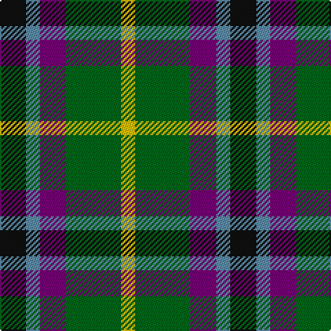

In pattern [KBBGY](/patterns/kbbgy/).

This was sourced from house-of-tartan.  It is a [5 stripes tartan](/stripes/stripes5/).

Original link http://www.house-of-tartan.scotland.net/house/TartanViewjs.asp?colr=Def&tnam=1025

## Thread count
K/19 B10 P19 G40 Y/10

## Palette
Each colour and its ΔE from the base-6 reference it is a variant of.

| Colour | Shade | Base | ΔE (OKLab) |
|---|---|---|---|
| B | <code style="background-color:#5C8CA8;">#5C8CA8</code> `#5C8CA8` | B <code style="background-color:#2A418A;">#2A418A</code> | 0.23 |
| G | <code style="background-color:#006818;">#006818</code> `#006818` | G <code style="background-color:#006100;">#006100</code> | 0.02 |
| K | <code style="background-color:#101010;">#101010</code> `#101010` | K <code style="background-color:#000000;">#000000</code> | 0.17 |
| P | <code style="background-color:#780078;">#780078</code> `#780078` | B <code style="background-color:#2A418A;">#2A418A</code> | 0.17 |
| Y | <code style="background-color:#E8C000;">#E8C000</code> `#E8C000` | Y <code style="background-color:#F2BF00;">#F2BF00</code> | 0.02 |

# Sample pattern

## Nearest tartans

The nearest existing variants by ΔTartan distance.

1. [Gala Water Old](/setts/s5/k19b10ba19g40y10-b3c82af-ba5a008c-g005020-k101010-ye8c000/) — ΔT 0.64
1. [Gallowater, Old](/setts/s5/k19b10ba19g40y10-b5480b0-ba800080-g008000-k000000-yf0c000/) — ΔT 0.75
1. [Inspiration](/setts/s5/r10b24y22ba42ya10-b5f749c-ba14283c-rc8002c-yc4bc68-yae0a126/) — ΔT 0.93
1. [Friebe (2014)](/setts/s5/g30ga36b46w8r16-b1c1c50-g649848-ga23321b-rb62531-wf9f5ef/) — ΔT 1.03
1. [Creek Indian Nation](/setts/s5/b24g48y12b12r24-b2c2c80-g006818-rc80000-ye8c000/) — ΔT 1.04
1. [Russell (Clan)](/setts/s6/k6g20k20r6b16w6-b2c2c80-g006818-k101010-rc80000-wfcfcfc/) — ΔT 1.06
1. [Gallowater, Original](/setts/s6/r20k34b20ba34g80y20-b2888c4-ba780078-g006818-k101010-rc80000-ye8c000/) — ΔT 1.07
1. [Davidson of Tulloch](/setts/s5/r4b20k10g24w4-b2c2c80-g289c18-k101010-rc80000-wfcfcfc/) — ΔT 1.13
1. [Mitchell Family Tartan Tartan Number: 2142. Earliest known date: 1816-20 Named in honour of General Billy Mitchell when it was adopted as the tartan of the United States Air Force pipe band. The sett is also known as Russell, Hunter and Galbraith. The earliest reference to the tartan is in the collection of the Highland Society of London where it is labelled Galbraith. See products available Copyright © Blair Urquhart, Comrie, 2015](/setts/s6/k6g16k16r4b16w4-b2c2c80-g006818-k101010-rc80000-we0e0e0/) — ΔT 1.14
1. [CSCA (Corporate)](/setts/s8/g10r8g38k20g16w8b36r8-b2c2c80-g006818-k101010-rc80000-wfcfcfc/) — ΔT 1.19

## Neighbour map

Every grey dot is one of 15726 variants placed by the first two principal components of the ΔTartan feature space (44% of its variance). Red is this tartan; blue dots are its nearest — click one to open its page.

<svg viewBox="0 0 640 380" role="img" style="max-width:100%;height:auto;border:1px solid #e0e0e0;border-radius:4px;display:block" xmlns="http://www.w3.org/2000/svg"><image href="/nn/cloud.v1.png" width="640" height="380"/><a href="/setts/s5/k19b10ba19g40y10-b3c82af-ba5a008c-g005020-k101010-ye8c000/"><circle cx="111.2" cy="259.8" r="4" fill="#3465a4"><title>Gala Water Old</title></circle></a><a href="/setts/s5/k19b10ba19g40y10-b5480b0-ba800080-g008000-k000000-yf0c000/"><circle cx="85.1" cy="246.6" r="4" fill="#3465a4"><title>Gallowater, Old</title></circle></a><a href="/setts/s5/r10b24y22ba42ya10-b5f749c-ba14283c-rc8002c-yc4bc68-yae0a126/"><circle cx="96.7" cy="246.9" r="4" fill="#3465a4"><title>Inspiration</title></circle></a><a href="/setts/s5/g30ga36b46w8r16-b1c1c50-g649848-ga23321b-rb62531-wf9f5ef/"><circle cx="88.9" cy="249.1" r="4" fill="#3465a4"><title>Friebe (2014)</title></circle></a><a href="/setts/s5/b24g48y12b12r24-b2c2c80-g006818-rc80000-ye8c000/"><circle cx="143.7" cy="273.0" r="4" fill="#3465a4"><title>Creek Indian Nation</title></circle></a><a href="/setts/s6/k6g20k20r6b16w6-b2c2c80-g006818-k101010-rc80000-wfcfcfc/"><circle cx="64.9" cy="257.0" r="4" fill="#3465a4"><title>Russell (Clan)</title></circle></a><a href="/setts/s6/r20k34b20ba34g80y20-b2888c4-ba780078-g006818-k101010-rc80000-ye8c000/"><circle cx="72.4" cy="222.4" r="4" fill="#3465a4"><title>Gallowater, Original</title></circle></a><a href="/setts/s5/r4b20k10g24w4-b2c2c80-g289c18-k101010-rc80000-wfcfcfc/"><circle cx="116.7" cy="224.9" r="4" fill="#3465a4"><title>Davidson of Tulloch</title></circle></a><a href="/setts/s6/k6g16k16r4b16w4-b2c2c80-g006818-k101010-rc80000-we0e0e0/"><circle cx="91.9" cy="254.3" r="4" fill="#3465a4"><title>Mitchell Family Tartan Tartan Number: 2142. Earliest known date: 1816-20 Named in honour of General Billy Mitchell when it was adopted as the tartan of the United States Air Force pipe band. The sett is also known as Russell, Hunter and Galbraith. The earliest reference to the tartan is in the collection of the Highland Society of London where it is labelled Galbraith. See products available Copyright © Blair Urquhart, Comrie, 2015</title></circle></a><a href="/setts/s8/g10r8g38k20g16w8b36r8-b2c2c80-g006818-k101010-rc80000-wfcfcfc/"><circle cx="138.1" cy="223.4" r="4" fill="#3465a4"><title>CSCA (Corporate)</title></circle></a><circle cx="107.0" cy="255.2" r="5" fill="#c00000"/></svg>

ID: /setts/s5/k19b10ba19g40y10-b5c8ca8-ba780078-g006818-k101010-ye8c000/
