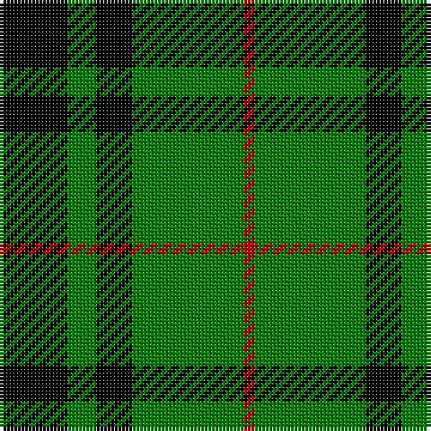

This page is one **sett** — a single exact thread-count. It belongs to the [tartan](/tartans/k19g8k10g31r3/)
(the same proportion at any scale), whose colour order is pattern [KGKGR](/stripes/kgkgr/).

Sourced from weddslist.  It is a [5 stripe tartan](/stripes/stripes5/).

Original link http://www.weddslist.com/cgi-bin/tartans/pg.pl?source=sts

2 attestations — the source records this cloth was collapsed from (oldest owns this page)

<ul>
<li>undated — MacArthur-Fox (weddslist, <a href="http://www.weddslist.com/cgi-bin/tartans/pg.pl?source=sts">record</a>)</li>
<li>undated — MacArthur-Fox Family Tartan Tartan Number: 1088. Earliest known date: 1986 This is the older of the two MacArthur setts, which links the clan with the Campbells. See products available Copyright © Blair Urquhart, Comrie, 2015 (house-of-tartan, <a href="http://www.house-of-tartan.scotland.net/house/TartanViewjs.asp?colr=Def&tnam=1088">record</a>)</li>
</ul>

## Thread count
K/19 G8 K10 G31 R/3

## Palette

Palette: <strong>Ingles Buchan</strong> <small style="color:#888">(1 of 3 colours)</small>
<table><thead><tr><th>Colour</th><th>Threads</th><th>Shade</th><th>Base</th><th>OKLCh</th></tr></thead><tbody><tr><td>K/</td><td style="text-align:right;font-variant-numeric:tabular-nums">19</td><td><code style="background-color:#000000;">#000000</code> <small style="color:#888">#000000</small></td><td>K <code style="background-color:#000000;">#000000</code></td><td><small style="color:#888">oklch(0.0% 0.000 0.0)</small></td></tr><tr><td>G</td><td style="text-align:right;font-variant-numeric:tabular-nums">8</td><td><code style="background-color:#008000;">#008000</code> <small style="color:#888">#008000</small></td><td>G <code style="background-color:#006100;">#006100</code></td><td><small style="color:#888">oklch(52.0% 0.177 142.5)</small></td></tr><tr><td>K</td><td style="text-align:right;font-variant-numeric:tabular-nums">10</td><td><code style="background-color:#000000;">#000000</code> <small style="color:#888">#000000</small></td><td>K <code style="background-color:#000000;">#000000</code></td><td><small style="color:#888">oklch(0.0% 0.000 0.0)</small></td></tr><tr><td>G</td><td style="text-align:right;font-variant-numeric:tabular-nums">31</td><td><code style="background-color:#008000;">#008000</code> <small style="color:#888">#008000</small></td><td>G <code style="background-color:#006100;">#006100</code></td><td><small style="color:#888">oklch(52.0% 0.177 142.5)</small></td></tr><tr><td>R/</td><td style="text-align:right;font-variant-numeric:tabular-nums">3</td><td><code style="background-color:#C00000;">#C00000</code> <small style="color:#888">#C00000</small></td><td>R <code style="background-color:#CC0000;">#CC0000</code></td><td><small style="color:#888">oklch(50.7% 0.208 29.2)</small></td></tr></tbody></table>

# Sample pattern

## Nearest tartans

The nearest existing variants by ΔTartan distance, with this tartan at the top so the swatches line up against it.

ΔTartan

Tartan

Sett

—

<a href="/ttd/edit/#slug=k19g8k10g31r3">MacArthur-Fox</a> <a class="nn-out" href="/setts/s5/k19g8k10g31r3/" title="open its dictionary page">↗</a>

0.58

<a href="/ttd/edit/#slug=k32g6k12g30ly3">MacArthur</a> <a class="nn-out" href="/setts/s5/k32g6k12g30ly3/" title="open its dictionary page">↗</a>

0.86

<a href="/ttd/edit/#slug=k4g33k33ly4~x2">Wallace, hunting</a> <a class="nn-out" href="/setts/s4/k4g33k33ly4~x2/" title="open its dictionary page">↗</a>

1.05

<a href="/ttd/edit/#slug=g7k1g7t1k6t1~x4">Innes, Georgina (Portrait)</a> <a class="nn-out" href="/setts/s6/g7k1g7t1k6t1~x4/" title="open its dictionary page">↗</a>

1.09

<a href="/ttd/edit/#slug=g7k1g7t1k6t1~x2">Innes</a> <a class="nn-out" href="/setts/s6/g7k1g7t1k6t1~x2/" title="open its dictionary page">↗</a>

1.09

<a href="/ttd/edit/#slug=k1g8k8ly1~x4">Wallace Htg (Clan)</a> <a class="nn-out" href="/setts/s4/k1g8k8ly1~x4/" title="open its dictionary page">↗</a>

1.15

<a href="/ttd/edit/#slug=g30k12g6k6db2k5~x2">Fife, Duchess of..</a> <a class="nn-out" href="/setts/s6/g30k12g6k6db2k5~x2/" title="open its dictionary page">↗</a>

1.16

<a href="/ttd/edit/#slug=g8k8ly1k8g8k1~x4">Wallace Hunting</a> <a class="nn-out" href="/setts/s6/g8k8ly1k8g8k1~x4/" title="open its dictionary page">↗</a>

1.20

<a href="/ttd/edit/#slug=r2g12k12g1k12g2~x2">Gunn</a> <a class="nn-out" href="/setts/s6/r2g12k12g1k12g2~x2/" title="open its dictionary page">↗</a>

1.22

<a href="/ttd/edit/#slug=k30db7g36k5~x2">Innes, hunting</a> <a class="nn-out" href="/setts/s4/k30db7g36k5~x2/" title="open its dictionary page">↗</a>

1.28

<a href="/ttd/edit/#slug=k32dg6k12dg30ly3">MacArthur</a> <a class="nn-out" href="/setts/s5/k32dg6k12dg30ly3/" title="open its dictionary page">↗</a>

## Neighbour map

Every grey dot is one of 14359 variants placed by the first two principal components of the ΔTartan feature space (44% of its variance). Red is this tartan; blue dots are its nearest — click one to open its page.

<svg viewBox="0 0 640 380" role="img" style="max-width:100%;height:auto;border:1px solid #e0e0e0;border-radius:4px;display:block" xmlns="http://www.w3.org/2000/svg"><image href="/nn/cloud.v1.png" width="640" height="380"/><a href="/setts/s5/k32g6k12g30ly3/"><circle cx="292.2" cy="246.2" r="4" fill="#3465a4"><title>MacArthur</title></circle></a><a href="/setts/s4/k4g33k33ly4~x2/"><circle cx="273.1" cy="257.0" r="4" fill="#3465a4"><title>Wallace, hunting</title></circle></a><a href="/setts/s6/g7k1g7t1k6t1~x4/"><circle cx="310.5" cy="256.9" r="4" fill="#3465a4"><title>Innes, Georgina (Portrait)</title></circle></a><a href="/setts/s6/g7k1g7t1k6t1~x2/"><circle cx="297.9" cy="251.0" r="4" fill="#3465a4"><title>Innes</title></circle></a><a href="/setts/s4/k1g8k8ly1~x4/"><circle cx="280.5" cy="263.2" r="4" fill="#3465a4"><title>Wallace Htg (Clan)</title></circle></a><a href="/setts/s6/g30k12g6k6db2k5~x2/"><circle cx="343.6" cy="211.8" r="4" fill="#3465a4"><title>Fife, Duchess of..</title></circle></a><a href="/setts/s6/g8k8ly1k8g8k1~x4/"><circle cx="265.1" cy="269.5" r="4" fill="#3465a4"><title>Wallace Hunting</title></circle></a><a href="/setts/s6/r2g12k12g1k12g2~x2/"><circle cx="323.6" cy="234.5" r="4" fill="#3465a4"><title>Gunn</title></circle></a><a href="/setts/s4/k30db7g36k5~x2/"><circle cx="243.2" cy="272.5" r="4" fill="#3465a4"><title>Innes, hunting</title></circle></a><a href="/setts/s5/k32dg6k12dg30ly3/"><circle cx="310.7" cy="255.6" r="4" fill="#3465a4"><title>MacArthur</title></circle></a><circle cx="294.1" cy="249.6" r="5" fill="#c00000"/></svg>

ID: /setts/s5/k19g8k10g31r3/
