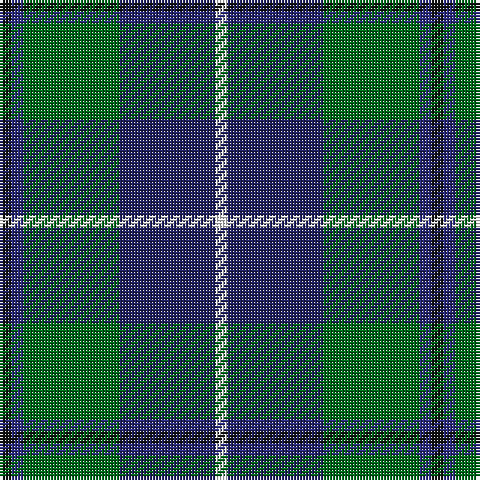

In pattern [KBGBW](/patterns/kbgbw/).

This was sourced from register-of-tartans.  It is a [5 stripes tartan](/stripes/stripes5/).

Original link https://www.tartanregister.gov.uk/tartanDetails.aspx?ref=4811

## Thread count
K/4 DB4 G32 DBa32 W/4

## Palette
Each colour and its ΔE from the base-6 reference it is a variant of.

| Colour | Shade | Base | ΔE (OKLab) |
|---|---|---|---|
| DB | <code style="background-color:#2C2C80;">#2C2C80</code> `#2C2C80` | B <code style="background-color:#2A418A;">#2A418A</code> | 0.06 |
| DBa | <code style="background-color:#202060;">#202060</code> `#202060` | B <code style="background-color:#2A418A;">#2A418A</code> | 0.11 |
| G | <code style="background-color:#006818;">#006818</code> `#006818` | G <code style="background-color:#006100;">#006100</code> | 0.02 |
| K | <code style="background-color:#101010;">#101010</code> `#101010` | K <code style="background-color:#000000;">#000000</code> | 0.17 |
| W | <code style="background-color:#FCFCFC;">#FCFCFC</code> `#FCFCFC` | W <code style="background-color:#F7F7F7;">#F7F7F7</code> | 0.01 |

# Sample pattern

## Nearest tartans

The nearest existing variants by ΔTartan distance.

1. [Turnbull Hunting Clan Tartan Tartan Number: 1265. Earliest known date: pre 2003 An unusual dress tartan having no white. See products available Copyright © Blair Urquhart, Comrie, 2015](/setts/s5/k7y3g28b28w3x2~b2c2c80-g006818-k101010-we0e0e0-ye8c000/) — ΔT 0.46
1. [Turnbull Hunting (1983) #2](/setts/s5/k2y1g10b10w1x6~b2c2c80-g006818-k101010-wfcfcfc-ye8c000/) — ΔT 0.51
1. [Gamba (Commemorative)](/setts/s5/g5r3ga30b30w3x2~b2c2c80-g003820-ga006818-rc80000-wfcfcfc/) — ΔT 0.52
1. [Highlander Highland Laddie](/setts/s5/k7r3g30b28w3x2~b1c0070-g006818-k101010-r880000-wc0c0c0/) — ΔT 0.53
1. [Turnbull Hunting (Name)](/setts/s5/r2y1g10b10w1x6~b2c2c80-g006818-rc80000-we0e0e0-ye8c000/) — ΔT 0.75
1. [Irving of Glentulchan Family Tartan Tartan Number: 1460. Earliest known date: 1987 Glentulchan is situated north of Perth on the river Almond. The sett combines elements of the Irvine and the Malcolm tartans. The design by John Irving, Glenalmond, was accredited by the Scottish Tartans Society in 1987. See products available Copyright © Blair Urquhart, Comrie, 2015](/setts/s6/r1g9b9k1b1w1x6~b2c2c80-g006818-k101010-rc80000-we0e0e0/) — ΔT 0.77
1. [Carmichael](/setts/s6/k5g32b32r3b3y3x2~b2c2c80-g006818-k000000-rc80000-ye8c000/) — ΔT 0.78
1. [Highlander, Highland Laddie Kilts](/setts/s5/k7r3g29b29w3x2~b304080-g008000-k000000-r802040-we0e0e0/) — ΔT 0.80
1. [DeLoughery (Personal)](/setts/s6/b20k6y4b3g20w2x2~b38409c-g006818-k101010-wfcfcfc-ya08858/) — ΔT 0.80
1. [Douglas](/setts/s5/k1b1g8ba8w1x4~b5480b0-ba304080-g008000-k000000-we0e0e0/) — ΔT 0.81

## Neighbour map

Every grey dot is one of 15726 variants placed by the first two principal components of the ΔTartan feature space (44% of its variance). Red is this tartan; blue dots are its nearest — click one to open its page.

<svg viewBox="0 0 640 380" role="img" style="max-width:100%;height:auto;border:1px solid #e0e0e0;border-radius:4px;display:block" xmlns="http://www.w3.org/2000/svg"><image href="/nn/cloud.v1.png" width="640" height="380"/><a href="/setts/s5/k7y3g28b28w3x2~b2c2c80-g006818-k101010-we0e0e0-ye8c000/"><circle cx="200.9" cy="209.4" r="4" fill="#3465a4"><title>Turnbull Hunting Clan Tartan Tartan Number: 1265. Earliest known date: pre 2003 An unusual dress tartan having no white. See products available Copyright © Blair Urquhart, Comrie, 2015</title></circle></a><a href="/setts/s5/k2y1g10b10w1x6~b2c2c80-g006818-k101010-wfcfcfc-ye8c000/"><circle cx="212.1" cy="203.0" r="4" fill="#3465a4"><title>Turnbull Hunting (1983) #2</title></circle></a><a href="/setts/s5/g5r3ga30b30w3x2~b2c2c80-g003820-ga006818-rc80000-wfcfcfc/"><circle cx="233.1" cy="207.1" r="4" fill="#3465a4"><title>Gamba (Commemorative)</title></circle></a><a href="/setts/s5/k7r3g30b28w3x2~b1c0070-g006818-k101010-r880000-wc0c0c0/"><circle cx="218.8" cy="211.1" r="4" fill="#3465a4"><title>Highlander Highland Laddie</title></circle></a><a href="/setts/s5/r2y1g10b10w1x6~b2c2c80-g006818-rc80000-we0e0e0-ye8c000/"><circle cx="217.9" cy="201.2" r="4" fill="#3465a4"><title>Turnbull Hunting (Name)</title></circle></a><a href="/setts/s6/r1g9b9k1b1w1x6~b2c2c80-g006818-k101010-rc80000-we0e0e0/"><circle cx="250.3" cy="194.5" r="4" fill="#3465a4"><title>Irving of Glentulchan Family Tartan Tartan Number: 1460. Earliest known date: 1987 Glentulchan is situated north of Perth on the river Almond. The sett combines elements of the Irvine and the Malcolm tartans. The design by John Irving, Glenalmond, was accredited by the Scottish Tartans Society in 1987. See products available Copyright © Blair Urquhart, Comrie, 2015</title></circle></a><a href="/setts/s6/k5g32b32r3b3y3x2~b2c2c80-g006818-k000000-rc80000-ye8c000/"><circle cx="247.5" cy="186.4" r="4" fill="#3465a4"><title>Carmichael</title></circle></a><a href="/setts/s5/k7r3g29b29w3x2~b304080-g008000-k000000-r802040-we0e0e0/"><circle cx="194.8" cy="203.9" r="4" fill="#3465a4"><title>Highlander, Highland Laddie Kilts</title></circle></a><a href="/setts/s6/b20k6y4b3g20w2x2~b38409c-g006818-k101010-wfcfcfc-ya08858/"><circle cx="203.4" cy="200.0" r="4" fill="#3465a4"><title>DeLoughery (Personal)</title></circle></a><a href="/setts/s5/k1b1g8ba8w1x4~b5480b0-ba304080-g008000-k000000-we0e0e0/"><circle cx="206.9" cy="210.0" r="4" fill="#3465a4"><title>Douglas</title></circle></a><circle cx="215.7" cy="214.7" r="5" fill="#c00000"/></svg>

ID: /setts/s5/k1b1g8ba8w1x4~b2c2c80-ba202060-g006818-k101010-wfcfcfc/
