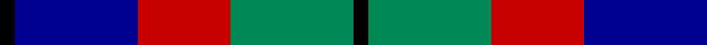
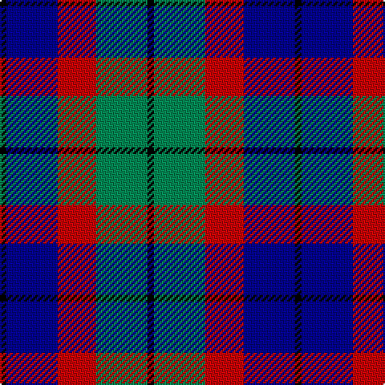

In pattern [KBRGK](/patterns/kbrgk/).

This was sourced from tartans-authority.  It is a [5 stripes tartan](/stripes/stripes5/).

Original link http://www.tartansauthority.com/tartan-ferret/display/3614/

## Thread count
K/4 DB32 R24 G32 K/4

## Palette
Each colour and its ΔE from the base-6 reference it is a variant of.

| Colour | Shade | Base | ΔE (OKLab) |
|---|---|---|---|
| DB | <code style="background-color:#000090;">#000090</code> `#000090` | B <code style="background-color:#2A418A;">#2A418A</code> | 0.13 |
| G | <code style="background-color:#008854;">#008854</code> `#008854` | G <code style="background-color:#006100;">#006100</code> | 0.13 |
| K | <code style="background-color:#000000;">#000000</code> `#000000` | K <code style="background-color:#000000;">#000000</code> | 0.00 |
| R | <code style="background-color:#C80000;">#C80000</code> `#C80000` | R <code style="background-color:#CC0000;">#CC0000</code> | 0.01 |

# Sample pattern

## Nearest tartans

The nearest existing variants by ΔTartan distance.

1. [Herd/Hurd](/setts/s6/b3g12k13w2b13w3x2~b2c2c80-g006818-k101010-wfcfcfc/) — ΔT 0.77
1. [Edinburgh International Conference Centre](/setts/s6/r4b19r3k20ra24b3x2~b304080-k000000-r806050-ra906030/) — ΔT 1.00
1. [Unidentified No 26](/setts/s6/w4b4g22k20b20w3~b2c4084-g005020-k101010-we0e0e0/) — ΔT 1.07
1. [Oceanic (Corporate?)](/setts/s7/y8k4r39k37b36k6b7~b003c64-k101010-r888888-ye8c000/) — ΔT 1.07
1. [Gordon of Esslemont](/setts/s7/y6g3y3g22k23b23k4x2~b5a008c-g005020-k101010-ye8c000/) — ΔT 1.09
1. [MacCorquodale](/setts/s7/r7k4b28k24ba24k4b4x2~b2888c4-ba5c8ca8-k101010-rc80000/) — ΔT 1.11
1. [Greyhound Grenadiers (Corporate)](/setts/s7/b9k7r5ra1r5k1r2x4~b1c0070-k101010-r888888-rac80000/) — ΔT 1.11
1. [Wilson's No 148](/setts/s5/k4b3g13ba12w2x2~b5480b0-ba800080-g008000-k000000-we0e0e0/) — ΔT 1.16
1. [Thorntons Law Corporate Tartan Tartan Number: 6862. Earliest known date: 2005 Thorntons WS is a Dundee based solictors, estate agents and investment consultants. See products available Copyright © Blair Urquhart, Comrie, 2015](/setts/s4/b10g10r5w1x2~b1c0070-g00ac94-rc80030-we0e0e0/) — ΔT 1.19
1. [Wilson's, No 176](/setts/s5/k4b3g12ba13y2x2~b5480b0-ba800080-g008000-k000000-yf0c000/) — ΔT 1.19

## Neighbour map

Every grey dot is one of 15726 variants placed by the first two principal components of the ΔTartan feature space (44% of its variance). Red is this tartan; blue dots are its nearest — click one to open its page.

<svg viewBox="0 0 640 380" role="img" style="max-width:100%;height:auto;border:1px solid #e0e0e0;border-radius:4px;display:block" xmlns="http://www.w3.org/2000/svg"><image href="/nn/cloud.v1.png" width="640" height="380"/><a href="/setts/s6/b3g12k13w2b13w3x2~b2c2c80-g006818-k101010-wfcfcfc/"><circle cx="122.5" cy="236.2" r="4" fill="#3465a4"><title>Herd/Hurd</title></circle></a><a href="/setts/s6/r4b19r3k20ra24b3x2~b304080-k000000-r806050-ra906030/"><circle cx="150.3" cy="222.6" r="4" fill="#3465a4"><title>Edinburgh International Conference Centre</title></circle></a><a href="/setts/s6/w4b4g22k20b20w3~b2c4084-g005020-k101010-we0e0e0/"><circle cx="146.4" cy="236.8" r="4" fill="#3465a4"><title>Unidentified No 26</title></circle></a><a href="/setts/s7/y8k4r39k37b36k6b7~b003c64-k101010-r888888-ye8c000/"><circle cx="169.8" cy="207.7" r="4" fill="#3465a4"><title>Oceanic (Corporate?)</title></circle></a><a href="/setts/s7/y6g3y3g22k23b23k4x2~b5a008c-g005020-k101010-ye8c000/"><circle cx="145.4" cy="215.8" r="4" fill="#3465a4"><title>Gordon of Esslemont</title></circle></a><a href="/setts/s7/r7k4b28k24ba24k4b4x2~b2888c4-ba5c8ca8-k101010-rc80000/"><circle cx="146.5" cy="219.1" r="4" fill="#3465a4"><title>MacCorquodale</title></circle></a><a href="/setts/s7/b9k7r5ra1r5k1r2x4~b1c0070-k101010-r888888-rac80000/"><circle cx="182.5" cy="220.5" r="4" fill="#3465a4"><title>Greyhound Grenadiers (Corporate)</title></circle></a><a href="/setts/s5/k4b3g13ba12w2x2~b5480b0-ba800080-g008000-k000000-we0e0e0/"><circle cx="129.5" cy="217.2" r="4" fill="#3465a4"><title>Wilson's No 148</title></circle></a><a href="/setts/s4/b10g10r5w1x2~b1c0070-g00ac94-rc80030-we0e0e0/"><circle cx="169.3" cy="240.9" r="4" fill="#3465a4"><title>Thorntons Law Corporate Tartan Tartan Number: 6862. Earliest known date: 2005 Thorntons WS is a Dundee based solictors, estate agents and investment consultants. See products available Copyright © Blair Urquhart, Comrie, 2015</title></circle></a><a href="/setts/s5/k4b3g12ba13y2x2~b5480b0-ba800080-g008000-k000000-yf0c000/"><circle cx="132.8" cy="217.2" r="4" fill="#3465a4"><title>Wilson's, No 176</title></circle></a><circle cx="139.2" cy="233.1" r="5" fill="#c00000"/></svg>

ID: /setts/s5/k1b8r6g8k1x4~b000090-g008854-k000000-rc80000/
