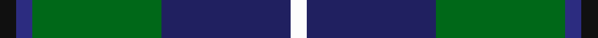

In pattern [KBGBW](/stripes/kbgbw/).

This was sourced from register-of-tartans.  It is a [5 stripe tartan](/stripes/stripes5/).

Original link https://www.tartanregister.gov.uk/tartanDetails.aspx?ref=4811

## Register references

External register numbers recorded for this tartan.

- Scottish Register of Tartans: [4811](https://www.tartanregister.gov.uk/tartanDetails.aspx?ref=4811)
- Scottish Tartans Authority (ITI): 1032
- Scottish Tartans World Register: 1032

## Thread count
K/4 DB4 G32 DBa32 W/4

## Palette
Each colour and the base-6 reference it is a variant of.

| Colour | Shade | Base |
|---|---|---|
| DB | <code style="background-color:#2C2C80;">#2C2C80</code> `oklch(35.0% 0.138 276.6)` <small>#2C2C80</small> | B <code style="background-color:#2A418A;">#2A418A</code> |
| DBa | <code style="background-color:#202060;">#202060</code> `oklch(28.9% 0.111 276.9)` <small>#202060</small> | B <code style="background-color:#2A418A;">#2A418A</code> |
| G | <code style="background-color:#006818;">#006818</code> `oklch(45.0% 0.142 145.0)` <small>#006818</small> | G <code style="background-color:#006100;">#006100</code> |
| K | <code style="background-color:#101010;">#101010</code> `oklch(17.3% 0.000 89.9)` <small>#101010</small> | K <code style="background-color:#000000;">#000000</code> |
| W | <code style="background-color:#FCFCFC;">#FCFCFC</code> `oklch(99.1% 0.000 89.9)` <small>#FCFCFC</small> | W <code style="background-color:#F7F7F7;">#F7F7F7</code> |

# Sample pattern

## Nearest tartans

The nearest existing variants by ΔTartan distance.

1. [Turnbull Hunting (1983) #2](/setts/s5/k2ly1g10db10w1~x6/) — ΔT 0.51
1. [Highlander Highland Laddie](/setts/s5/k7r3g30db28lb3~x2/) — ΔT 0.53
1. [Turnbull Hunting (Name)](/setts/s5/r2ly1g10db10w1~x6/) — ΔT 0.75
1. [Carmichael](/setts/s6/k5g32db32r3db3ly3~x2/) — ΔT 0.78
1. [Highlander, Highland Laddie Kilts](/setts/s5/k7m3g29db29w3~x2/) — ΔT 0.79
1. [DeLoughery (Personal)](/setts/s6/db20k6lo4db3g20w2~x2/) — ΔT 0.80
1. [Douglas](/setts/s5/k1t1g8db8w1~x4/) — ΔT 0.81
1. [Bath](/setts/s5/k4b2g13db13w2~x4/) — ΔT 0.87
1. [Turnbull Hunting](/setts/s5/r7ly3dg28db28w3~x2/) — ΔT 0.88
1. [Douglas Clan Tartan Tartan Number: 1032. Earliest known date: 1831 Wilson's sent a list of tartans to Logan about 1830 stating that 'No 148' had been sold as Douglas for a 'considerable' time. Logan included the Douglas tartan even though he said that no family tartans appeared in his book. The distinction between clans and families is obscure. There are many historic references to the 'Border Clans' which would certainly describe the Douglas'. There is also a black and grey sett for the clan which first appeared in the Vestiarium Scoticum in 1842. The present chiefship is vacant on account of the compound surnames of the eligible claimants. Lord Lyon will not recognise 'double barrel' names. See products available Copyright © Blair Urquhart, Comrie, 2015](/setts/s5/k3db3g23db21w2~x2/) — ΔT 0.88

## Neighbour map

Every grey dot is one of 14299 variants placed by the first two principal components of the ΔTartan feature space (44% of its variance). Red is this tartan; blue dots are its nearest — click one to open its page.

<svg viewBox="0 0 640 380" role="img" style="max-width:100%;height:auto;border:1px solid #e0e0e0;border-radius:4px;display:block" xmlns="http://www.w3.org/2000/svg"><image href="/nn/cloud.v1.png" width="640" height="380"/><a href="/setts/s5/k2ly1g10db10w1~x6/"><circle cx="215.6" cy="204.5" r="4" fill="#3465a4"><title>Turnbull Hunting (1983) #2</title></circle></a><a href="/setts/s5/k7r3g30db28lb3~x2/"><circle cx="222.4" cy="213.7" r="4" fill="#3465a4"><title>Highlander Highland Laddie</title></circle></a><a href="/setts/s5/r2ly1g10db10w1~x6/"><circle cx="220.9" cy="202.5" r="4" fill="#3465a4"><title>Turnbull Hunting (Name)</title></circle></a><a href="/setts/s6/k5g32db32r3db3ly3~x2/"><circle cx="250.9" cy="188.4" r="4" fill="#3465a4"><title>Carmichael</title></circle></a><a href="/setts/s5/k7m3g29db29w3~x2/"><circle cx="198.4" cy="204.9" r="4" fill="#3465a4"><title>Highlander, Highland Laddie Kilts</title></circle></a><a href="/setts/s6/db20k6lo4db3g20w2~x2/"><circle cx="206.8" cy="203.1" r="4" fill="#3465a4"><title>DeLoughery (Personal)</title></circle></a><a href="/setts/s5/k1t1g8db8w1~x4/"><circle cx="210.4" cy="211.7" r="4" fill="#3465a4"><title>Douglas</title></circle></a><a href="/setts/s5/k4b2g13db13w2~x4/"><circle cx="170.3" cy="235.6" r="4" fill="#3465a4"><title>Bath</title></circle></a><a href="/setts/s5/r7ly3dg28db28w3~x2/"><circle cx="224.8" cy="218.4" r="4" fill="#3465a4"><title>Turnbull Hunting</title></circle></a><a href="/setts/s5/k3db3g23db21w2~x2/"><circle cx="258.6" cy="212.6" r="4" fill="#3465a4"><title>Douglas Clan Tartan Tartan Number: 1032. Earliest known date: 1831 Wilson's sent a list of tartans to Logan about 1830 stating that 'No 148' had been sold as Douglas for a 'considerable' time. Logan included the Douglas tartan even though he said that no family tartans appeared in his book. The distinction between clans and families is obscure. There are many historic references to the 'Border Clans' which would certainly describe the Douglas'. There is also a black and grey sett for the clan which first appeared in the Vestiarium Scoticum in 1842. The present chiefship is vacant on account of the compound surnames of the eligible claimants. Lord Lyon will not recognise 'double barrel' names. See products available Copyright © Blair Urquhart, Comrie, 2015</title></circle></a><circle cx="219.2" cy="217.1" r="5" fill="#c00000"/></svg>

ID: /setts/s5/k1db1g8db8w1~x4/
