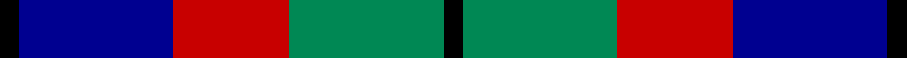

This page is one **sett** — a single exact thread-count. It belongs to the [tartan](/tartans/k1db8r6g8k1/)
(the same proportion at any scale), whose colour order is pattern [KBRGK](/stripes/kbrgk/).

Sourced from tartans-authority.  It is a [5 stripe tartan](/stripes/stripes5/).

Original link http://www.tartansauthority.com/tartan-ferret/display/3614/

## Thread count
K/4 DB32 R24 G32 K/4

## Palette

Palette: <strong>Tartan Register</strong> <small style="color:#888">(2 of 4 colours)</small>
<table><thead><tr><th>Colour</th><th>Threads</th><th>Shade</th><th>Base</th><th>OKLCh</th></tr></thead><tbody><tr><td>K/</td><td style="text-align:right;font-variant-numeric:tabular-nums">4</td><td><code style="background-color:#000000;">#000000</code> <small style="color:#888">#000000</small></td><td>K <code style="background-color:#000000;">#000000</code></td><td><small style="color:#888">oklch(0.0% 0.000 0.0)</small></td></tr><tr><td>DB</td><td style="text-align:right;font-variant-numeric:tabular-nums">32</td><td><code style="background-color:#000090;">#000090</code> <small style="color:#888">#000090</small></td><td>B <code style="background-color:#2A418A;">#2A418A</code></td><td><small style="color:#888">oklch(29.5% 0.205 264.1)</small></td></tr><tr><td>R</td><td style="text-align:right;font-variant-numeric:tabular-nums">24</td><td><code style="background-color:#C80000;">#C80000</code> <small style="color:#888">#C80000</small></td><td>R <code style="background-color:#CC0000;">#CC0000</code></td><td><small style="color:#888">oklch(52.3% 0.215 29.2)</small></td></tr><tr><td>G</td><td style="text-align:right;font-variant-numeric:tabular-nums">32</td><td><code style="background-color:#008854;">#008854</code> <small style="color:#888">#008854</small></td><td>G <code style="background-color:#006100;">#006100</code></td><td><small style="color:#888">oklch(55.2% 0.129 158.0)</small></td></tr><tr><td>K/</td><td style="text-align:right;font-variant-numeric:tabular-nums">4</td><td><code style="background-color:#000000;">#000000</code> <small style="color:#888">#000000</small></td><td>K <code style="background-color:#000000;">#000000</code></td><td><small style="color:#888">oklch(0.0% 0.000 0.0)</small></td></tr></tbody></table>

# Sample pattern

## Nearest tartans

The nearest existing variants by ΔTartan distance, with this tartan at the top so the swatches line up against it.

ΔTartan

Tartan

Sett

—

<a href="/ttd/edit/#slug=k1db8r6g8k1~x4">Edinburgh Tattoo 50th (Commemorative</a> <a class="nn-out" href="/setts/s5/k1db8r6g8k1~x4/" title="open its dictionary page">↗</a>

0.77

<a href="/ttd/edit/#slug=db3g12k13w2db13w3~x2">Herd/Hurd</a> <a class="nn-out" href="/setts/s6/db3g12k13w2db13w3~x2/" title="open its dictionary page">↗</a>

1.00

<a href="/ttd/edit/#slug=o4db19o3k20o24db3~x2">Edinburgh International Conference Centre</a> <a class="nn-out" href="/setts/s6/o4db19o3k20o24db3~x2/" title="open its dictionary page">↗</a>

1.07

<a href="/ttd/edit/#slug=ly8k4o39k37dt36k6dt7">Oceanic (Corporate?)</a> <a class="nn-out" href="/setts/s7/ly8k4o39k37dt36k6dt7/" title="open its dictionary page">↗</a>

1.07

<a href="/ttd/edit/#slug=w4db4dg22k20db20w3">Unidentified No 26</a> <a class="nn-out" href="/setts/s6/w4db4dg22k20db20w3/" title="open its dictionary page">↗</a>

1.09

<a href="/ttd/edit/#slug=ly6dg3ly3dg22k23dp23k4~x2">Gordon of Esslemont</a> <a class="nn-out" href="/setts/s7/ly6dg3ly3dg22k23dp23k4~x2/" title="open its dictionary page">↗</a>

1.11

<a href="/ttd/edit/#slug=db9k7o5r1o5k1o2~x4">Greyhound Grenadiers (Corporate)</a> <a class="nn-out" href="/setts/s7/db9k7o5r1o5k1o2~x4/" title="open its dictionary page">↗</a>

1.11

<a href="/ttd/edit/#slug=r7k4t28k24t24k4t4~x2">MacCorquodale</a> <a class="nn-out" href="/setts/s7/r7k4t28k24t24k4t4~x2/" title="open its dictionary page">↗</a>

1.16

<a href="/ttd/edit/#slug=k4t3g13p12w2~x2">Wilson's No 148</a> <a class="nn-out" href="/setts/s5/k4t3g13p12w2~x2/" title="open its dictionary page">↗</a>

1.19

<a href="/ttd/edit/#slug=k4t3g12p13ly2~x2">Wilson's, No 176</a> <a class="nn-out" href="/setts/s5/k4t3g12p13ly2~x2/" title="open its dictionary page">↗</a>

1.20

<a href="/ttd/edit/#slug=p3k1p8k6g8k1w2~x2">Baillie</a> <a class="nn-out" href="/setts/s7/p3k1p8k6g8k1w2~x2/" title="open its dictionary page">↗</a>

## Neighbour map

Every grey dot is one of 14299 variants placed by the first two principal components of the ΔTartan feature space (44% of its variance). Red is this tartan; blue dots are its nearest — click one to open its page.

<svg viewBox="0 0 640 380" role="img" style="max-width:100%;height:auto;border:1px solid #e0e0e0;border-radius:4px;display:block" xmlns="http://www.w3.org/2000/svg"><image href="/nn/cloud.v1.png" width="640" height="380"/><a href="/setts/s6/db3g12k13w2db13w3~x2/"><circle cx="126.3" cy="236.3" r="4" fill="#3465a4"><title>Herd/Hurd</title></circle></a><a href="/setts/s6/o4db19o3k20o24db3~x2/"><circle cx="153.4" cy="222.8" r="4" fill="#3465a4"><title>Edinburgh International Conference Centre</title></circle></a><a href="/setts/s7/ly8k4o39k37dt36k6dt7/"><circle cx="173.1" cy="209.2" r="4" fill="#3465a4"><title>Oceanic (Corporate?)</title></circle></a><a href="/setts/s6/w4db4dg22k20db20w3/"><circle cx="150.1" cy="239.6" r="4" fill="#3465a4"><title>Unidentified No 26</title></circle></a><a href="/setts/s7/ly6dg3ly3dg22k23dp23k4~x2/"><circle cx="148.7" cy="217.0" r="4" fill="#3465a4"><title>Gordon of Esslemont</title></circle></a><a href="/setts/s7/db9k7o5r1o5k1o2~x4/"><circle cx="185.6" cy="220.7" r="4" fill="#3465a4"><title>Greyhound Grenadiers (Corporate)</title></circle></a><a href="/setts/s7/r7k4t28k24t24k4t4~x2/"><circle cx="150.1" cy="220.7" r="4" fill="#3465a4"><title>MacCorquodale</title></circle></a><a href="/setts/s5/k4t3g13p12w2~x2/"><circle cx="132.5" cy="215.8" r="4" fill="#3465a4"><title>Wilson's No 148</title></circle></a><a href="/setts/s5/k4t3g12p13ly2~x2/"><circle cx="135.6" cy="215.8" r="4" fill="#3465a4"><title>Wilson's, No 176</title></circle></a><a href="/setts/s7/p3k1p8k6g8k1w2~x2/"><circle cx="148.2" cy="207.3" r="4" fill="#3465a4"><title>Baillie</title></circle></a><circle cx="142.5" cy="232.3" r="5" fill="#c00000"/></svg>

ID: /setts/s5/k1db8r6g8k1~x4/
