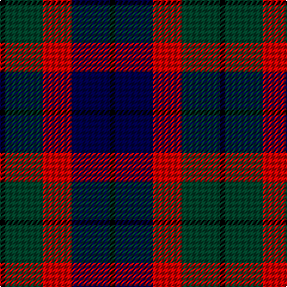

This page is one **sett** — a single exact thread-count. It belongs to the [tartan](/tartans/k1dg8r6db8k1/)
(the same proportion at any scale), whose colour order is pattern [KBRGK](/stripes/kbrgk/).

Sourced from register-of-tartans.  It is a [5 stripe tartan](/stripes/stripes5/).

Original link https://www.tartanregister.gov.uk/tartanDetails.aspx?ref=4960

2 attestations — the source records this cloth was collapsed from (oldest owns this page)

<ul>
<li>undated — Edinburgh Military Tattoo 50th (register-of-tartans, <a href="https://www.tartanregister.gov.uk/tartanDetails.aspx?ref=4960">record</a>)</li>
<li>undated — Edinburgh Military Tattoo 50th Military Tartan Tartan Number: 3614. Earliest known date: 1998 Based on a Wilsons of Bannockburn sett, designed by Peter MacDonald in 1998 for the Edinburgh Military Tattoo to celebrate their 50th anniversary in 2000. The colours depict the three military forces - Navy, Army & Air Force with the black from Edinburgh's heraldic arms. Launched on June 16th 1999 in time for the final Tattoo of the 20th century. See products available Copyright © Blair Urquhart, Comrie, 2015 (house-of-tartan, <a href="http://www.house-of-tartan.scotland.net/house/TartanViewjs.asp?colr=Def&tnam=3614">record</a>)</li>
</ul>

## Register references

External register numbers recorded for this tartan.

- Scottish Register of Tartans: [4960](https://www.tartanregister.gov.uk/tartanDetails.aspx?ref=4960)
- Scottish Tartans Authority (ITI): 3614

## Thread count
K/4 DG32 R24 DB32 K/4

## Palette

Palette: <strong>Tartan Register</strong>
<table><thead><tr><th>Colour</th><th>Threads</th><th>Shade</th><th>Base</th><th>OKLCh</th></tr></thead><tbody><tr><td>K/</td><td style="text-align:right;font-variant-numeric:tabular-nums">4</td><td><code style="background-color:#000000;">#000000</code> <small style="color:#888">#000000</small></td><td>K <code style="background-color:#000000;">#000000</code></td><td><small style="color:#888">oklch(0.0% 0.000 0.0)</small></td></tr><tr><td>DG</td><td style="text-align:right;font-variant-numeric:tabular-nums">32</td><td><code style="background-color:#004028;">#004028</code> <small style="color:#888">#004028</small></td><td>G <code style="background-color:#006100;">#006100</code></td><td><small style="color:#888">oklch(32.8% 0.073 160.8)</small></td></tr><tr><td>R</td><td style="text-align:right;font-variant-numeric:tabular-nums">24</td><td><code style="background-color:#C80000;">#C80000</code> <small style="color:#888">#C80000</small></td><td>R <code style="background-color:#CC0000;">#CC0000</code></td><td><small style="color:#888">oklch(52.3% 0.215 29.2)</small></td></tr><tr><td>DB</td><td style="text-align:right;font-variant-numeric:tabular-nums">32</td><td><code style="background-color:#000048;">#000048</code> <small style="color:#888">#000048</small></td><td>B <code style="background-color:#2A418A;">#2A418A</code></td><td><small style="color:#888">oklch(18.2% 0.126 264.1)</small></td></tr><tr><td>K/</td><td style="text-align:right;font-variant-numeric:tabular-nums">4</td><td><code style="background-color:#000000;">#000000</code> <small style="color:#888">#000000</small></td><td>K <code style="background-color:#000000;">#000000</code></td><td><small style="color:#888">oklch(0.0% 0.000 0.0)</small></td></tr></tbody></table>

# Sample pattern

## Nearest tartans

The nearest existing variants by ΔTartan distance, with this tartan at the top so the swatches line up against it.

ΔTartan

Tartan

Sett

—

<a href="/ttd/edit/#slug=k1dg8r6db8k1~x4">Edinburgh Military Tattoo 50th</a> <a class="nn-out" href="/setts/s5/k1dg8r6db8k1~x4/" title="open its dictionary page">↗</a>

0.71

<a href="/ttd/edit/#slug=o4db19o3k20o24db3~x2">Edinburgh International Conference Centre</a> <a class="nn-out" href="/setts/s6/o4db19o3k20o24db3~x2/" title="open its dictionary page">↗</a>

0.99

<a href="/ttd/edit/#slug=k3dg17ly2k18dp17dg3~x2">Wilson's No.100</a> <a class="nn-out" href="/setts/s6/k3dg17ly2k18dp17dg3~x2/" title="open its dictionary page">↗</a>

1.05

<a href="/ttd/edit/#slug=ly6dg3ly3dg22k23dp23k4~x2">Gordon of Esslemont</a> <a class="nn-out" href="/setts/s7/ly6dg3ly3dg22k23dp23k4~x2/" title="open its dictionary page">↗</a>

1.06

<a href="/ttd/edit/#slug=dp20k5k19g19ly2~x2">Martin Hunting</a> <a class="nn-out" href="/setts/s5/dp20k5k19g19ly2~x2/" title="open its dictionary page">↗</a>

1.11

<a href="/ttd/edit/#slug=dp27db4k27g27lo4~x2">Selkirk (Personal)</a> <a class="nn-out" href="/setts/s5/dp27db4k27g27lo4~x2/" title="open its dictionary page">↗</a>

1.12

<a href="/ttd/edit/#slug=r8dg20k20db20k3r8~x2">Atholl Highlanders (Military)</a> <a class="nn-out" href="/setts/s6/r8dg20k20db20k3r8~x2/" title="open its dictionary page">↗</a>

1.18

<a href="/ttd/edit/#slug=dp3k1dp8k6dg8k1w2~x2">Baillie (Highland Society)</a> <a class="nn-out" href="/setts/s7/dp3k1dp8k6dg8k1w2~x2/" title="open its dictionary page">↗</a>

1.19

<a href="/ttd/edit/#slug=dg3k20k20r20k3r3~x2">Unidentified #65</a> <a class="nn-out" href="/setts/s6/dg3k20k20r20k3r3~x2/" title="open its dictionary page">↗</a>

1.20

<a href="/ttd/edit/#slug=k2g10t2k9dp8g2~x2">Lennie Family Tartan Tartan Number: 725. Earliest known date: 1819 Wilson's No 231. See products available Copyright © Blair Urquhart, Comrie, 2015</a> <a class="nn-out" href="/setts/s6/k2g10t2k9dp8g2~x2/" title="open its dictionary page">↗</a>

1.22

<a href="/ttd/edit/#slug=ly5g16k16db16k2db2~x2">Hudson Valley Reg. Police P &amp; D (Cor</a> <a class="nn-out" href="/setts/s6/ly5g16k16db16k2db2~x2/" title="open its dictionary page">↗</a>

## Neighbour map

Every grey dot is one of 14299 variants placed by the first two principal components of the ΔTartan feature space (44% of its variance). Red is this tartan; blue dots are its nearest — click one to open its page.

<svg viewBox="0 0 640 380" role="img" style="max-width:100%;height:auto;border:1px solid #e0e0e0;border-radius:4px;display:block" xmlns="http://www.w3.org/2000/svg"><image href="/nn/cloud.v1.png" width="640" height="380"/><a href="/setts/s6/o4db19o3k20o24db3~x2/"><circle cx="153.4" cy="222.8" r="4" fill="#3465a4"><title>Edinburgh International Conference Centre</title></circle></a><a href="/setts/s6/k3dg17ly2k18dp17dg3~x2/"><circle cx="204.3" cy="239.3" r="4" fill="#3465a4"><title>Wilson's No.100</title></circle></a><a href="/setts/s7/ly6dg3ly3dg22k23dp23k4~x2/"><circle cx="148.7" cy="217.0" r="4" fill="#3465a4"><title>Gordon of Esslemont</title></circle></a><a href="/setts/s5/dp20k5k19g19ly2~x2/"><circle cx="138.1" cy="228.6" r="4" fill="#3465a4"><title>Martin Hunting</title></circle></a><a href="/setts/s5/dp27db4k27g27lo4~x2/"><circle cx="136.1" cy="243.2" r="4" fill="#3465a4"><title>Selkirk (Personal)</title></circle></a><a href="/setts/s6/r8dg20k20db20k3r8~x2/"><circle cx="124.3" cy="262.1" r="4" fill="#3465a4"><title>Atholl Highlanders (Military)</title></circle></a><a href="/setts/s7/dp3k1dp8k6dg8k1w2~x2/"><circle cx="177.2" cy="225.7" r="4" fill="#3465a4"><title>Baillie (Highland Society)</title></circle></a><a href="/setts/s6/dg3k20k20r20k3r3~x2/"><circle cx="165.0" cy="226.5" r="4" fill="#3465a4"><title>Unidentified #65</title></circle></a><a href="/setts/s6/k2g10t2k9dp8g2~x2/"><circle cx="165.7" cy="261.8" r="4" fill="#3465a4"><title>Lennie Family Tartan Tartan Number: 725. Earliest known date: 1819 Wilson's No 231. See products available Copyright © Blair Urquhart, Comrie, 2015</title></circle></a><a href="/setts/s6/ly5g16k16db16k2db2~x2/"><circle cx="151.5" cy="238.7" r="4" fill="#3465a4"><title>Hudson Valley Reg. Police P &amp; D (Cor</title></circle></a><circle cx="167.8" cy="245.7" r="5" fill="#c00000"/></svg>

ID: /setts/s5/k1dg8r6db8k1~x4/
