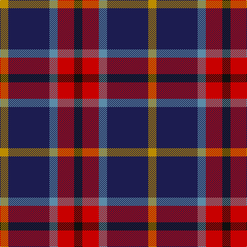

In pattern [KRBBY](/patterns/krbby/).

This was sourced from tartans-authority.  It is a [5 stripes tartan](/stripes/stripes5/).

Original link http://www.tartansauthority.com/tartan-ferret/display/10211/

## Thread count
DY/16 DB80 B16 R32 K/16

## Palette
Each colour and its ΔE from the base-6 reference it is a variant of.

| Colour | Shade | Base | ΔE (OKLab) |
|---|---|---|---|
| B | <code style="background-color:#5C8CA8;">#5C8CA8</code> `#5C8CA8` | B <code style="background-color:#2A418A;">#2A418A</code> | 0.23 |
| DB | <code style="background-color:#1C1C50;">#1C1C50</code> `#1C1C50` | B <code style="background-color:#2A418A;">#2A418A</code> | 0.14 |
| DY | <code style="background-color:#BC8C00;">#BC8C00</code> `#BC8C00` | Y <code style="background-color:#F2BF00;">#F2BF00</code> | 0.16 |
| K | <code style="background-color:#101010;">#101010</code> `#101010` | K <code style="background-color:#000000;">#000000</code> | 0.17 |
| R | <code style="background-color:#C80000;">#C80000</code> `#C80000` | R <code style="background-color:#CC0000;">#CC0000</code> | 0.01 |

# Sample pattern

## Nearest tartans

The nearest existing variants by ΔTartan distance.

1. [Fife (McGill)](/setts/s6/b31ba4b6k19r20y4~b2c2c80-ba5c8ca8-k101010-rc80000-ye8c000~x2/) — ΔT 0.97
1. [Fife](/setts/s6/b31ba4b6k19r20y4~b304080-ba5480b0-k000000-rc00000-yf0c000~x2/) — ΔT 1.15
1. [Clerk](/setts/s6/b5k1g1k1r3k1~b2c4084-g005020-k101010-rdc0000~x4/) — ΔT 1.18
1. [Novotel, The](/setts/s5/k3r11ka26g11ra3~g503c14-k101010-ka000028-rdc0000-rafa4b00~x2/) — ΔT 1.23
1. [Stovell (2015)](/setts/s6/b15r6g8k2w2k2~b202060-g005020-k101010-rb03000-wf8f4d0~x6/) — ΔT 1.25
1. [Clerk Family Tartan Tartan Number: 326. Earliest known date: 1847 Also referred to as Clark. See products available Copyright © Blair Urquhart, Comrie, 2015](/setts/s6/b5k1g1k1r3k1~b2c2c80-g006818-k101010-rc80000~x4/) — ΔT 1.25
1. [Dunbog Primary School Corporate Tartan Tartan Number: 954. Earliest known date: 1985 C. Armstrong is a pupil at the school. See products available Copyright © Blair Urquhart, Comrie, 2015](/setts/s6/r12b3g5ba16y2g2~b2c2c80-ba202060-g006818-rc80000-ye8c000~x2/) — ΔT 1.26
1. [University of Notre Dame](/setts/s6/r5b35k25b8y10r5~b2c2c80-k101010-rc80000-yfccc00~x2/) — ΔT 1.28
1. [Wilson's, No 111](/setts/s5/b19w2g12ba3k4~b800080-ba5480b0-g008000-k000000-we0e0e0~x2/) — ΔT 1.31
1. [Clerk](/setts/s6/b5k1g1k1r3k1~b304080-g008000-k000000-rc00000~x4/) — ΔT 1.33

## Neighbour map

Every grey dot is one of 15726 variants placed by the first two principal components of the ΔTartan feature space (44% of its variance). Red is this tartan; blue dots are its nearest — click one to open its page.

<svg viewBox="0 0 640 380" role="img" style="max-width:100%;height:auto;border:1px solid #e0e0e0;border-radius:4px;display:block" xmlns="http://www.w3.org/2000/svg"><image href="/nn/cloud.v1.png" width="640" height="380"/><a href="/setts/s6/b31ba4b6k19r20y4~b2c2c80-ba5c8ca8-k101010-rc80000-ye8c000~x2/"><circle cx="186.3" cy="208.9" r="4" fill="#3465a4"><title>Fife (McGill)</title></circle></a><a href="/setts/s6/b31ba4b6k19r20y4~b304080-ba5480b0-k000000-rc00000-yf0c000~x2/"><circle cx="168.7" cy="203.7" r="4" fill="#3465a4"><title>Fife</title></circle></a><a href="/setts/s6/b5k1g1k1r3k1~b2c4084-g005020-k101010-rdc0000~x4/"><circle cx="193.3" cy="241.2" r="4" fill="#3465a4"><title>Clerk</title></circle></a><a href="/setts/s5/k3r11ka26g11ra3~g503c14-k101010-ka000028-rdc0000-rafa4b00~x2/"><circle cx="213.1" cy="209.6" r="4" fill="#3465a4"><title>Novotel, The</title></circle></a><a href="/setts/s6/b15r6g8k2w2k2~b202060-g005020-k101010-rb03000-wf8f4d0~x6/"><circle cx="179.4" cy="208.4" r="4" fill="#3465a4"><title>Stovell (2015)</title></circle></a><a href="/setts/s6/b5k1g1k1r3k1~b2c2c80-g006818-k101010-rc80000~x4/"><circle cx="198.0" cy="243.9" r="4" fill="#3465a4"><title>Clerk Family Tartan Tartan Number: 326. Earliest known date: 1847 Also referred to as Clark. See products available Copyright © Blair Urquhart, Comrie, 2015</title></circle></a><a href="/setts/s6/r12b3g5ba16y2g2~b2c2c80-ba202060-g006818-rc80000-ye8c000~x2/"><circle cx="178.3" cy="198.5" r="4" fill="#3465a4"><title>Dunbog Primary School Corporate Tartan Tartan Number: 954. Earliest known date: 1985 C. Armstrong is a pupil at the school. See products available Copyright © Blair Urquhart, Comrie, 2015</title></circle></a><a href="/setts/s6/r5b35k25b8y10r5~b2c2c80-k101010-rc80000-yfccc00~x2/"><circle cx="218.2" cy="223.1" r="4" fill="#3465a4"><title>University of Notre Dame</title></circle></a><a href="/setts/s5/b19w2g12ba3k4~b800080-ba5480b0-g008000-k000000-we0e0e0~x2/"><circle cx="206.5" cy="193.6" r="4" fill="#3465a4"><title>Wilson's, No 111</title></circle></a><a href="/setts/s6/b5k1g1k1r3k1~b304080-g008000-k000000-rc00000~x4/"><circle cx="169.6" cy="234.6" r="4" fill="#3465a4"><title>Clerk</title></circle></a><circle cx="203.6" cy="229.4" r="5" fill="#c00000"/></svg>

ID: /setts/s5/k1r2b1ba5y1~b5c8ca8-ba1c1c50-k101010-rc80000-ybc8c00~x16/
