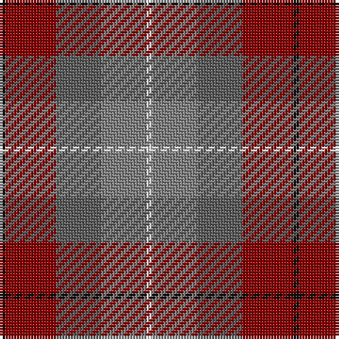

In pattern [KRBGW](/patterns/krbgw/).

This was sourced from tartans-authority.  It is a [5 stripes tartan](/stripes/stripes5/).

Original link http://www.tartansauthority.com/tartan-ferret/display/3247/

## Thread count
K/2 DR18 N16 Na16 LN/2

## Palette
Each colour and its ΔE from the base-6 reference it is a variant of.

| Colour | Shade | Base | ΔE (OKLab) |
|---|---|---|---|
| DR | <code style="background-color:#880000;">#880000</code> `#880000` | R <code style="background-color:#CC0000;">#CC0000</code> | 0.15 |
| K | <code style="background-color:#101010;">#101010</code> `#101010` | K <code style="background-color:#000000;">#000000</code> | 0.17 |
| LN | <code style="background-color:#E0E0E0;">#E0E0E0</code> `#E0E0E0` | W <code style="background-color:#F7F7F7;">#F7F7F7</code> | 0.07 |
| N | <code style="background-color:#5C5C5C;">#5C5C5C</code> `#5C5C5C` | B <code style="background-color:#2A418A;">#2A418A</code> | 0.15 |
| Na | <code style="background-color:#808080;">#808080</code> `#808080` | G <code style="background-color:#006100;">#006100</code> | 0.23 |

# Sample pattern

## Nearest tartans

The nearest existing variants by ΔTartan distance.

1. [McCurdy-Stribbling (Personal)](/setts/s5/b15ba20bb12r34w3x2~b2c2c80-ba506878-bb404040-rc80000-wcccccc/) — ΔT 1.21
1. [Callum (Buchan) (Name)](/setts/s5/b7r1ba6r8y1x8~b5c5c5c-ba344054-rc80000-ya0a0a0/) — ΔT 1.24
1. [Jardine #2](/setts/s5/g9r9ga9ra1b1x4~b3c82af-g2a2303-ga808080-rbe7832-radc0000/) — ΔT 1.34
1. [Bristol Gramar School Check (School)](/setts/s6/r4b3ba12bb8b2r4~b447084-ba5c5c5c-bb1c1c50-rc80000/) — ΔT 1.37
1. [McHale (Personal)](/setts/s6/g15k10b30r11w3g5x2~b5c5c5c-g74846c-k101010-ra07c58-wfcfcfc/) — ΔT 1.44
1. [Andover (Fashion)](/setts/s6/r1b12k6y1ba10r1x4~b5c5c5c-ba4c3428-k101010-rc80000-yfccc00/) — ΔT 1.45
1. [Orban-Prentice (Personal)](/setts/s7/g25b4r24b21ga25b4g3x2~b2c2c80-g285800-ga604000-rc80000/) — ΔT 1.46
1. [McCurdy-Stribbling (Personal)](/setts/s5/b15ba20k12r34g3x2~b262753-ba236b8e-g7d776b-k111214-r80252e/) — ΔT 1.47
1. [Balfour](/setts/s6/b30y3r11y3g33ra6x2~b304080-g808080-r806050-rac00000-yf0c000/) — ΔT 1.48
1. [Buchanhaven Heritage](/setts/s7/b24r27g20y6g20r2w3x2~b5c8ca8-g408060-rc82828-we0e0e0-ye0a126/) — ΔT 1.53

## Neighbour map

Every grey dot is one of 15726 variants placed by the first two principal components of the ΔTartan feature space (44% of its variance). Red is this tartan; blue dots are its nearest — click one to open its page.

<svg viewBox="0 0 640 380" role="img" style="max-width:100%;height:auto;border:1px solid #e0e0e0;border-radius:4px;display:block" xmlns="http://www.w3.org/2000/svg"><image href="/nn/cloud.v1.png" width="640" height="380"/><a href="/setts/s5/b15ba20bb12r34w3x2~b2c2c80-ba506878-bb404040-rc80000-wcccccc/"><circle cx="205.6" cy="219.0" r="4" fill="#3465a4"><title>McCurdy-Stribbling (Personal)</title></circle></a><a href="/setts/s5/b7r1ba6r8y1x8~b5c5c5c-ba344054-rc80000-ya0a0a0/"><circle cx="258.3" cy="257.1" r="4" fill="#3465a4"><title>Callum (Buchan) (Name)</title></circle></a><a href="/setts/s5/g9r9ga9ra1b1x4~b3c82af-g2a2303-ga808080-rbe7832-radc0000/"><circle cx="161.1" cy="218.4" r="4" fill="#3465a4"><title>Jardine #2</title></circle></a><a href="/setts/s6/r4b3ba12bb8b2r4~b447084-ba5c5c5c-bb1c1c50-rc80000/"><circle cx="196.0" cy="259.4" r="4" fill="#3465a4"><title>Bristol Gramar School Check (School)</title></circle></a><a href="/setts/s6/g15k10b30r11w3g5x2~b5c5c5c-g74846c-k101010-ra07c58-wfcfcfc/"><circle cx="198.8" cy="212.3" r="4" fill="#3465a4"><title>McHale (Personal)</title></circle></a><a href="/setts/s6/r1b12k6y1ba10r1x4~b5c5c5c-ba4c3428-k101010-rc80000-yfccc00/"><circle cx="239.9" cy="201.2" r="4" fill="#3465a4"><title>Andover (Fashion)</title></circle></a><a href="/setts/s7/g25b4r24b21ga25b4g3x2~b2c2c80-g285800-ga604000-rc80000/"><circle cx="168.6" cy="237.1" r="4" fill="#3465a4"><title>Orban-Prentice (Personal)</title></circle></a><a href="/setts/s5/b15ba20k12r34g3x2~b262753-ba236b8e-g7d776b-k111214-r80252e/"><circle cx="230.0" cy="240.0" r="4" fill="#3465a4"><title>McCurdy-Stribbling (Personal)</title></circle></a><a href="/setts/s6/b30y3r11y3g33ra6x2~b304080-g808080-r806050-rac00000-yf0c000/"><circle cx="227.4" cy="197.7" r="4" fill="#3465a4"><title>Balfour</title></circle></a><a href="/setts/s7/b24r27g20y6g20r2w3x2~b5c8ca8-g408060-rc82828-we0e0e0-ye0a126/"><circle cx="224.5" cy="201.4" r="4" fill="#3465a4"><title>Buchanhaven Heritage</title></circle></a><circle cx="200.0" cy="230.4" r="5" fill="#c00000"/></svg>

ID: /setts/s5/k1r9b8g8w1x2~b5c5c5c-g808080-k101010-r880000-we0e0e0/
