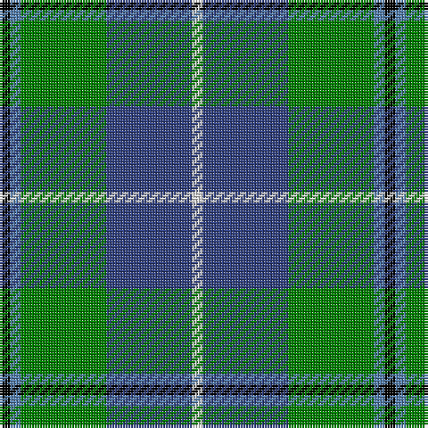

In pattern [KBGBW](/stripes/kbgbw/).

This was sourced from weddslist.  It is a [5 stripe tartan](/stripes/stripes5/).

Original link http://www.weddslist.com/cgi-bin/tartans/pg.pl?source=sts

## Thread count
K/4 Ba4 G32 B32 LN/4

## Palette
Each colour and the base-6 reference it is a variant of.

| Colour | Shade | Base |
|---|---|---|
| B | <code style="background-color:#304080;">#304080</code> `oklch(39.4% 0.109 270.2)` <small>#304080</small> | B <code style="background-color:#2A418A;">#2A418A</code> |
| Ba | <code style="background-color:#5480B0;">#5480B0</code> `oklch(58.8% 0.089 251.5)` <small>#5480B0</small> | B <code style="background-color:#2A418A;">#2A418A</code> |
| G | <code style="background-color:#008000;">#008000</code> `oklch(52.0% 0.177 142.5)` <small>#008000</small> | G <code style="background-color:#006100;">#006100</code> |
| K | <code style="background-color:#000000;">#000000</code> `oklch(0.0% 0.000 0.0)` <small>#000000</small> | K <code style="background-color:#000000;">#000000</code> |
| LN | <code style="background-color:#E0E0E0;">#E0E0E0</code> `oklch(90.7% 0.000 89.9)` <small>#E0E0E0</small> | W <code style="background-color:#F7F7F7;">#F7F7F7</code> |

# Sample pattern

## Nearest tartans

The nearest existing variants by ΔTartan distance, with this tartan at the top so the swatches line up against it.

ΔTartan

Tartan

Sett

—

<a href="/ttd/edit/#slug=k1t1g8db8w1~x4">Douglas</a> <a class="nn-out" href="/setts/s5/k1t1g8db8w1~x4/" title="open its dictionary page">↗</a>

0.59

<a href="/ttd/edit/#slug=k7m3g29db29w3~x2">Highlander, Highland Laddie Kilts</a> <a class="nn-out" href="/setts/s5/k7m3g29db29w3~x2/" title="open its dictionary page">↗</a>

0.67

<a href="/ttd/edit/#slug=k2ly1g10db10w1~x6">Turnbull Hunting (1983) #2</a> <a class="nn-out" href="/setts/s5/k2ly1g10db10w1~x6/" title="open its dictionary page">↗</a>

0.69

<a href="/ttd/edit/#slug=r1g9db9k1db1w1~x6">Irving of Glentulchan</a> <a class="nn-out" href="/setts/s6/r1g9db9k1db1w1~x6/" title="open its dictionary page">↗</a>

0.71

<a href="/ttd/edit/#slug=k7ly3g28db28w3~x2">Turnbull, hunting</a> <a class="nn-out" href="/setts/s5/k7ly3g28db28w3~x2/" title="open its dictionary page">↗</a>

0.71

<a href="/ttd/edit/#slug=r1g1k1g9db9w1~x6">Irving of Bonshaw Tower</a> <a class="nn-out" href="/setts/s6/r1g1k1g9db9w1~x6/" title="open its dictionary page">↗</a>

0.71

<a href="/ttd/edit/#slug=r7ly3g28db28w3~x2">Turnbull, hunting</a> <a class="nn-out" href="/setts/s5/r7ly3g28db28w3~x2/" title="open its dictionary page">↗</a>

0.81

<a href="/ttd/edit/#slug=k1db1g8db8w1~x4">Douglas, Green (Wilsons)</a> <a class="nn-out" href="/setts/s5/k1db1g8db8w1~x4/" title="open its dictionary page">↗</a>

0.82

<a href="/ttd/edit/#slug=r2ly1g10db10w1~x6">Turnbull Hunting (Name)</a> <a class="nn-out" href="/setts/s5/r2ly1g10db10w1~x6/" title="open its dictionary page">↗</a>

1.00

<a href="/ttd/edit/#slug=db20k6lo4db3g20w2~x2">DeLoughery (Personal)</a> <a class="nn-out" href="/setts/s6/db20k6lo4db3g20w2~x2/" title="open its dictionary page">↗</a>

1.03

<a href="/ttd/edit/#slug=lr4g24db10r3db12lo4~x2">Inglis (Name)</a> <a class="nn-out" href="/setts/s6/lr4g24db10r3db12lo4~x2/" title="open its dictionary page">↗</a>

## Neighbour map

Every grey dot is one of 14299 variants placed by the first two principal components of the ΔTartan feature space (44% of its variance). Red is this tartan; blue dots are its nearest — click one to open its page.

<svg viewBox="0 0 640 380" role="img" style="max-width:100%;height:auto;border:1px solid #e0e0e0;border-radius:4px;display:block" xmlns="http://www.w3.org/2000/svg"><image href="/nn/cloud.v1.png" width="640" height="380"/><a href="/setts/s5/k7m3g29db29w3~x2/"><circle cx="198.4" cy="204.9" r="4" fill="#3465a4"><title>Highlander, Highland Laddie Kilts</title></circle></a><a href="/setts/s5/k2ly1g10db10w1~x6/"><circle cx="215.6" cy="204.5" r="4" fill="#3465a4"><title>Turnbull Hunting (1983) #2</title></circle></a><a href="/setts/s6/r1g9db9k1db1w1~x6/"><circle cx="239.4" cy="190.2" r="4" fill="#3465a4"><title>Irving of Glentulchan</title></circle></a><a href="/setts/s5/k7ly3g28db28w3~x2/"><circle cx="185.7" cy="202.4" r="4" fill="#3465a4"><title>Turnbull, hunting</title></circle></a><a href="/setts/s6/r1g1k1g9db9w1~x6/"><circle cx="238.4" cy="190.2" r="4" fill="#3465a4"><title>Irving of Bonshaw Tower</title></circle></a><a href="/setts/s5/r7ly3g28db28w3~x2/"><circle cx="207.2" cy="208.8" r="4" fill="#3465a4"><title>Turnbull, hunting</title></circle></a><a href="/setts/s5/k1db1g8db8w1~x4/"><circle cx="219.2" cy="217.1" r="4" fill="#3465a4"><title>Douglas, Green (Wilsons)</title></circle></a><a href="/setts/s5/r2ly1g10db10w1~x6/"><circle cx="220.9" cy="202.5" r="4" fill="#3465a4"><title>Turnbull Hunting (Name)</title></circle></a><a href="/setts/s6/db20k6lo4db3g20w2~x2/"><circle cx="206.8" cy="203.1" r="4" fill="#3465a4"><title>DeLoughery (Personal)</title></circle></a><a href="/setts/s6/lr4g24db10r3db12lo4~x2/"><circle cx="183.4" cy="208.8" r="4" fill="#3465a4"><title>Inglis (Name)</title></circle></a><circle cx="210.4" cy="211.7" r="5" fill="#c00000"/></svg>

ID: /setts/s5/k1t1g8db8w1~x4/
