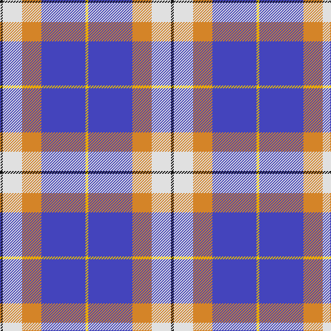

This page is one **sett** — a single exact thread-count. It belongs to the [tartan](/tartans/k1w7lo7b16ly1/)
(the same proportion at any scale), whose colour order is pattern [KWYBY](/stripes/kwyby/).

Sourced from tartans-authority.  It is a [5 stripe tartan](/stripes/stripes5/).

Original link http://www.tartansauthority.com/tartan-ferret/display/10182/

## Register references

External register numbers recorded for this tartan.

- Scottish Register of Tartans: [10182](https://www.tartanregister.gov.uk/tartanDetails?ref=10182)
- Scottish Tartans Authority (ITI): 10182

## Thread count
K/4 LN28 O28 B64 Y/4

## Palette

Palette: <strong>Tartan Register</strong> <small style="color:#888">(3 of 5 colours)</small>
<table><thead><tr><th>Colour</th><th>Threads</th><th>Shade</th><th>Base</th><th>OKLCh</th></tr></thead><tbody><tr><td>K/</td><td style="text-align:right;font-variant-numeric:tabular-nums">4</td><td><code style="background-color:#101010;">#101010</code> <small style="color:#888">#101010</small></td><td>K <code style="background-color:#000000;">#000000</code></td><td><small style="color:#888">oklch(17.3% 0.000 89.9)</small></td></tr><tr><td>LN</td><td style="text-align:right;font-variant-numeric:tabular-nums">28</td><td><code style="background-color:#E0E0E0;">#E0E0E0</code> <small style="color:#888">#E0E0E0</small></td><td>W <code style="background-color:#F7F7F7;">#F7F7F7</code></td><td><small style="color:#888">oklch(90.7% 0.000 89.9)</small></td></tr><tr><td>O</td><td style="text-align:right;font-variant-numeric:tabular-nums">28</td><td><code style="background-color:#D48428;">#D48428</code> <small style="color:#888">#D48428</small></td><td>Y <code style="background-color:#F2BF00;">#F2BF00</code></td><td><small style="color:#888">oklch(68.3% 0.140 64.1)</small></td></tr><tr><td>B</td><td style="text-align:right;font-variant-numeric:tabular-nums">64</td><td><code style="background-color:#4444BC;">#4444BC</code> <small style="color:#888">#4444BC</small></td><td>B <code style="background-color:#2A418A;">#2A418A</code></td><td><small style="color:#888">oklch(46.3% 0.183 276.5)</small></td></tr><tr><td>Y/</td><td style="text-align:right;font-variant-numeric:tabular-nums">4</td><td><code style="background-color:#E8C000;">#E8C000</code> <small style="color:#888">#E8C000</small></td><td>Y <code style="background-color:#F2BF00;">#F2BF00</code></td><td><small style="color:#888">oklch(81.9% 0.168 93.7)</small></td></tr></tbody></table>

# Sample pattern

## Nearest tartans

The nearest existing variants by ΔTartan distance, with this tartan at the top so the swatches line up against it.

ΔTartan

Tartan

Sett

—

<a href="/ttd/edit/#slug=k1w7lo7b16ly1~x4">Prehospital EMS (Corporate)</a> <a class="nn-out" href="/setts/s5/k1w7lo7b16ly1~x4/" title="open its dictionary page">↗</a>

0.79

<a href="/ttd/edit/#slug=k1w7r7db16ly1~x4">Prehospital EMS Tartan (USA)</a> <a class="nn-out" href="/setts/s5/k1w7r7db16ly1~x4/" title="open its dictionary page">↗</a>

1.05

<a href="/ttd/edit/#slug=g4w28dp8ly2db17g4~x2">Manx Dress</a> <a class="nn-out" href="/setts/s6/g4w28dp8ly2db17g4~x2/" title="open its dictionary page">↗</a>

1.21

<a href="/ttd/edit/#slug=g4w28p8ly2db17g4~x2">Manx, dress</a> <a class="nn-out" href="/setts/s6/g4w28p8ly2db17g4~x2/" title="open its dictionary page">↗</a>

1.23

<a href="/ttd/edit/#slug=db4r2db31k10g4w21g2~x2">Sinclair Dress (Dance)</a> <a class="nn-out" href="/setts/s7/db4r2db31k10g4w21g2~x2/" title="open its dictionary page">↗</a>

1.24

<a href="/ttd/edit/#slug=r15t98db72ly25db8w15">Afternoon Tea / Earl Grey</a> <a class="nn-out" href="/setts/s6/r15t98db72ly25db8w15/" title="open its dictionary page">↗</a>

1.24

<a href="/ttd/edit/#slug=w3b23lr44b26g4ly2~x2">Tartan Lassie (Fashion)</a> <a class="nn-out" href="/setts/s6/w3b23lr44b26g4ly2~x2/" title="open its dictionary page">↗</a>

1.28

<a href="/ttd/edit/#slug=w28t19dbi19w4db2p2dbi7~x2">St. Andrews Dress, Earl of (Danc</a> <a class="nn-out" href="/setts/s7/w28t19dbi19w4db2p2dbi7~x2/" title="open its dictionary page">↗</a>

1.29

<a href="/ttd/edit/#slug=w28t19dbi19w4db2lp2dbi7~x2">St Andrews Dress, Earl of.. District Tartan Tartan Number: 45. Earliest known date: pre 2003 See products available Copyright © Blair Urquhart, Comrie, 2015</a> <a class="nn-out" href="/setts/s7/w28t19dbi19w4db2lp2dbi7~x2/" title="open its dictionary page">↗</a>

1.33

<a href="/ttd/edit/#slug=w28t19db19w4dbi2lp2db7~x2">St Andrews, Earl of, dress</a> <a class="nn-out" href="/setts/s7/w28t19db19w4dbi2lp2db7~x2/" title="open its dictionary page">↗</a>

1.34

<a href="/ttd/edit/#slug=b4g16ly2p7b28w4~x2">Manx Laxey</a> <a class="nn-out" href="/setts/s6/b4g16ly2p7b28w4~x2/" title="open its dictionary page">↗</a>

## Neighbour map

Every grey dot is one of 14359 variants placed by the first two principal components of the ΔTartan feature space (44% of its variance). Red is this tartan; blue dots are its nearest — click one to open its page.

<svg viewBox="0 0 640 380" role="img" style="max-width:100%;height:auto;border:1px solid #e0e0e0;border-radius:4px;display:block" xmlns="http://www.w3.org/2000/svg"><image href="/nn/cloud.v1.png" width="640" height="380"/><a href="/setts/s5/k1w7r7db16ly1~x4/"><circle cx="222.5" cy="156.3" r="4" fill="#3465a4"><title>Prehospital EMS Tartan (USA)</title></circle></a><a href="/setts/s6/g4w28dp8ly2db17g4~x2/"><circle cx="180.7" cy="151.4" r="4" fill="#3465a4"><title>Manx Dress</title></circle></a><a href="/setts/s6/g4w28p8ly2db17g4~x2/"><circle cx="183.8" cy="152.5" r="4" fill="#3465a4"><title>Manx, dress</title></circle></a><a href="/setts/s7/db4r2db31k10g4w21g2~x2/"><circle cx="213.2" cy="144.0" r="4" fill="#3465a4"><title>Sinclair Dress (Dance)</title></circle></a><a href="/setts/s6/r15t98db72ly25db8w15/"><circle cx="185.4" cy="169.2" r="4" fill="#3465a4"><title>Afternoon Tea / Earl Grey</title></circle></a><a href="/setts/s6/w3b23lr44b26g4ly2~x2/"><circle cx="289.6" cy="149.4" r="4" fill="#3465a4"><title>Tartan Lassie (Fashion)</title></circle></a><a href="/setts/s7/w28t19dbi19w4db2p2dbi7~x2/"><circle cx="169.1" cy="156.5" r="4" fill="#3465a4"><title>St. Andrews Dress, Earl of (Danc</title></circle></a><a href="/setts/s7/w28t19dbi19w4db2lp2dbi7~x2/"><circle cx="169.1" cy="156.3" r="4" fill="#3465a4"><title>St Andrews Dress, Earl of.. District Tartan Tartan Number: 45. Earliest known date: pre 2003 See products available Copyright © Blair Urquhart, Comrie, 2015</title></circle></a><a href="/setts/s7/w28t19db19w4dbi2lp2db7~x2/"><circle cx="173.4" cy="158.9" r="4" fill="#3465a4"><title>St Andrews, Earl of, dress</title></circle></a><a href="/setts/s6/b4g16ly2p7b28w4~x2/"><circle cx="271.5" cy="176.2" r="4" fill="#3465a4"><title>Manx Laxey</title></circle></a><circle cx="236.7" cy="164.1" r="5" fill="#c00000"/></svg>

ID: /setts/s5/k1w7lo7b16ly1~x4/
