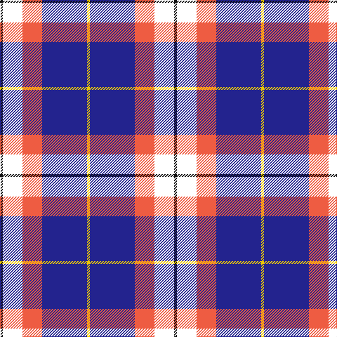

This page is one **sett** — a single exact thread-count. It belongs to the [tartan](/tartans/k1w7o7db16y1/)
(the same proportion at any scale), whose colour order is pattern [KWRBY](/stripes/kwrby/).

Sourced from register-of-tartans.  It is a [5 stripe tartan](/stripes/stripes5/).

Original link https://www.tartanregister.gov.uk/tartanDetails.aspx?ref=10182

## Register references

External register numbers recorded for this tartan.

- Scottish Register of Tartans: [10182](https://www.tartanregister.gov.uk/tartanDetails.aspx?ref=10182)

## Thread count
K/4 W28 O28 DB64 Y/4

## Palette
Each colour and the base-6 reference it is a variant of.

| Colour | Shade | Base |
|---|---|---|
| DB | <code style="background-color:#23238E;">#23238E</code> `oklch(34.3% 0.169 273.0)` <small>#23238E</small> | B <code style="background-color:#2A418A;">#2A418A</code> |
| K | <code style="background-color:#101010;">#101010</code> `oklch(17.3% 0.000 89.9)` <small>#101010</small> | K <code style="background-color:#000000;">#000000</code> |
| O | <code style="background-color:#EE5C42;">#EE5C42</code> `oklch(66.1% 0.185 32.3)` <small>#EE5C42</small> | R <code style="background-color:#CC0000;">#CC0000</code> |
| W | <code style="background-color:#FFFFFF;">#FFFFFF</code> `oklch(100.0% 0.000 89.9)` <small>#FFFFFF</small> | W <code style="background-color:#F7F7F7;">#F7F7F7</code> |
| Y | <code style="background-color:#EEC900;">#EEC900</code> `oklch(84.3% 0.173 95.5)` <small>#EEC900</small> | Y <code style="background-color:#F2BF00;">#F2BF00</code> |

# Sample pattern

## Nearest tartans

The nearest existing variants by ΔTartan distance, with this tartan at the top so the swatches line up against it.

ΔTartan

Tartan

Sett

—

<a href="/ttd/edit/#slug=k1w7r7db16ly1~x4">Prehospital EMS Tartan (USA)</a> <a class="nn-out" href="/setts/s5/k1w7r7db16ly1~x4/" title="open its dictionary page">↗</a>

0.79

<a href="/ttd/edit/#slug=k1w7lo7b16ly1~x4">Prehospital EMS (Corporate)</a> <a class="nn-out" href="/setts/s5/k1w7lo7b16ly1~x4/" title="open its dictionary page">↗</a>

1.23

<a href="/ttd/edit/#slug=g4w28dp8ly2db17g4~x2">Manx Dress</a> <a class="nn-out" href="/setts/s6/g4w28dp8ly2db17g4~x2/" title="open its dictionary page">↗</a>

1.23

<a href="/ttd/edit/#slug=db4r2db31k10g4w21g2~x2">Sinclair Dress (Dance)</a> <a class="nn-out" href="/setts/s7/db4r2db31k10g4w21g2~x2/" title="open its dictionary page">↗</a>

1.42

<a href="/ttd/edit/#slug=r15t98db72ly25db8w15">Afternoon Tea / Earl Grey</a> <a class="nn-out" href="/setts/s6/r15t98db72ly25db8w15/" title="open its dictionary page">↗</a>

1.43

<a href="/ttd/edit/#slug=db2r1db16k5g2w11g1~x4">Sinclair dress</a> <a class="nn-out" href="/setts/s7/db2r1db16k5g2w11g1~x4/" title="open its dictionary page">↗</a>

1.44

<a href="/ttd/edit/#slug=w12db48k13o22k3ly6">Clunie (Personal)</a> <a class="nn-out" href="/setts/s6/w12db48k13o22k3ly6/" title="open its dictionary page">↗</a>

1.45

<a href="/ttd/edit/#slug=k6w49db50dp6db8ly4">Pipers' Trail Dance, The</a> <a class="nn-out" href="/setts/s6/k6w49db50dp6db8ly4/" title="open its dictionary page">↗</a>

1.46

<a href="/ttd/edit/#slug=w18k1db4g4dp10lo2~x4">Edgar-Feyen (Personal)</a> <a class="nn-out" href="/setts/s6/w18k1db4g4dp10lo2~x4/" title="open its dictionary page">↗</a>

1.51

<a href="/ttd/edit/#slug=dp8db2dp24db5w26k2w8~x2">Lennox Purple Dress District Tartan Tartan Number: 8189. Earliest known date: pre 2003 Families with the surname 'Lennox' are usually considered related to Clans Stewart or MacFarlane. Some of this surname also choose to wear the distinctive and ancient 'Lennox' tartan. D W Stewart reproduced the sett from a 'lost' portrait of the Countess of Lennox dating from the 16th century./Threadcount and colours aren't 100% original. Generated manually./ See products available Copyright © Blair Urquhart, Comrie, 2015</a> <a class="nn-out" href="/setts/s7/dp8db2dp24db5w26k2w8~x2/" title="open its dictionary page">↗</a>

1.51

<a href="/ttd/edit/#slug=g4w28p8ly2db17g4~x2">Manx, dress</a> <a class="nn-out" href="/setts/s6/g4w28p8ly2db17g4~x2/" title="open its dictionary page">↗</a>

## Neighbour map

Every grey dot is one of 14299 variants placed by the first two principal components of the ΔTartan feature space (44% of its variance). Red is this tartan; blue dots are its nearest — click one to open its page.

<svg viewBox="0 0 640 380" role="img" style="max-width:100%;height:auto;border:1px solid #e0e0e0;border-radius:4px;display:block" xmlns="http://www.w3.org/2000/svg"><image href="/nn/cloud.v1.png" width="640" height="380"/><a href="/setts/s5/k1w7lo7b16ly1~x4/"><circle cx="237.6" cy="163.2" r="4" fill="#3465a4"><title>Prehospital EMS (Corporate)</title></circle></a><a href="/setts/s6/g4w28dp8ly2db17g4~x2/"><circle cx="181.6" cy="150.5" r="4" fill="#3465a4"><title>Manx Dress</title></circle></a><a href="/setts/s7/db4r2db31k10g4w21g2~x2/"><circle cx="213.9" cy="143.1" r="4" fill="#3465a4"><title>Sinclair Dress (Dance)</title></circle></a><a href="/setts/s6/r15t98db72ly25db8w15/"><circle cx="186.0" cy="168.3" r="4" fill="#3465a4"><title>Afternoon Tea / Earl Grey</title></circle></a><a href="/setts/s7/db2r1db16k5g2w11g1~x4/"><circle cx="210.0" cy="139.2" r="4" fill="#3465a4"><title>Sinclair dress</title></circle></a><a href="/setts/s6/w12db48k13o22k3ly6/"><circle cx="197.6" cy="160.5" r="4" fill="#3465a4"><title>Clunie (Personal)</title></circle></a><a href="/setts/s6/k6w49db50dp6db8ly4/"><circle cx="159.2" cy="128.4" r="4" fill="#3465a4"><title>Pipers' Trail Dance, The</title></circle></a><a href="/setts/s6/w18k1db4g4dp10lo2~x4/"><circle cx="184.6" cy="120.6" r="4" fill="#3465a4"><title>Edgar-Feyen (Personal)</title></circle></a><a href="/setts/s7/dp8db2dp24db5w26k2w8~x2/"><circle cx="237.8" cy="159.9" r="4" fill="#3465a4"><title>Lennox Purple Dress District Tartan Tartan Number: 8189. Earliest known date: pre 2003 Families with the surname 'Lennox' are usually considered related to Clans Stewart or MacFarlane. Some of this surname also choose to wear the distinctive and ancient 'Lennox' tartan. D W Stewart reproduced the sett from a 'lost' portrait of the Countess of Lennox dating from the 16th century./Threadcount and colours aren't 100% original. Generated manually./ See products available Copyright © Blair Urquhart, Comrie, 2015</title></circle></a><a href="/setts/s6/g4w28p8ly2db17g4~x2/"><circle cx="184.6" cy="151.6" r="4" fill="#3465a4"><title>Manx, dress</title></circle></a><circle cx="223.4" cy="155.3" r="5" fill="#c00000"/></svg>

ID: /setts/s5/k1w7r7db16ly1~x4/
