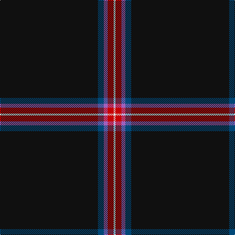

In pattern [KBBRW](/patterns/kbbrw/).

This was sourced from tartans-authority.  It is a [5 stripes tartan](/stripes/stripes5/).

Original link http://www.tartansauthority.com/tartan-ferret/display/7565/

## Attestations

This cloth appears in 2 source records; the oldest owns this page.

- 2008 — Fettes (Personal) (tartans-authority, [record](http://www.tartansauthority.com/tartan-ferret/display/7565/))
- undated — Fettes (Personal) (register-of-tartans, [record](https://www.tartanregister.gov.uk/tartanDetails.aspx?ref=5591))

## Thread count
K/200 DB12 LP8 R12 LN/4

## Palette
Each colour and its ΔE from the base-6 reference it is a variant of.

| Colour | Shade | Base | ΔE (OKLab) |
|---|---|---|---|
| DB | <code style="background-color:#004878;">#004878</code> `#004878` | B <code style="background-color:#2C4084;">#2C4084</code> | 0.04 |
| K | <code style="background-color:#101010;">#101010</code> `#101010` | K <code style="background-color:#000000;">#000000</code> | 0.17 |
| LN | <code style="background-color:#E0E0E0;">#E0E0E0</code> `#E0E0E0` | W <code style="background-color:#F4F4F0;">#F4F4F0</code> | 0.06 |
| LP | <code style="background-color:#A060BC;">#A060BC</code> `#A060BC` | B <code style="background-color:#2C4084;">#2C4084</code> | 0.23 |
| R | <code style="background-color:#C80000;">#C80000</code> `#C80000` | R <code style="background-color:#C80000;">#C80000</code> | 0.00 |

# Sample pattern

ID: /setts/s5/k200b12ba8r12w4-b004878-baa060bc-k101010-rc80000-we0e0e0/
