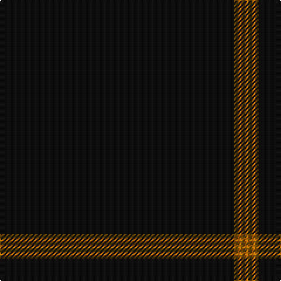

**Bands:** [KGYGY](/stripes/kgygy/) · **Stripes:** [K DY LO DY LO](/stripes/stripes5/) K DY LO DY LO

This was sourced from register-of-tartans.  It is a [5 band tartan](/bands/bands5/).

Original link https://www.tartanregister.gov.uk/tartanDetails.aspx?ref=3820

## Attestations

This cloth appears in 2 source records; the oldest owns this page.

- 01/03/2003 — SmartWool (register-of-tartans, [record](https://www.tartanregister.gov.uk/tartanDetails.aspx?ref=3820))
- March 2003 — SmartWool (Corporate) (tartans-authority, [record](http://www.tartansauthority.com/tartan-ferret/display/5828/))

## Register references

External register numbers recorded for this tartan.

- Scottish Register of Tartans: [3820](https://www.tartanregister.gov.uk/tartanDetails.aspx?ref=3820)
- Scottish Tartans Authority (ITI): 5828

## Thread count
K/200 T3 O3 T3 O/3

## Palette
Each colour and its ΔE from the base-6 reference it is a variant of.

| Colour | Shade | Base | ΔE (OKLab) |
|---|---|---|---|
| K | <code style="background-color:#101010;">#101010</code> `#101010` | K <code style="background-color:#000000;">#000000</code> | 0.17 |
| O | <code style="background-color:#D87C00;">#D87C00</code> `#D87C00` | Y <code style="background-color:#F2BF00;">#F2BF00</code> | 0.17 |
| T | <code style="background-color:#604000;">#604000</code> `#604000` | G <code style="background-color:#006100;">#006100</code> | 0.14 |

# Sample pattern

## Nearest tartans

The nearest existing variants by ΔTartan distance.

1. [Allt Dubh (Black Burn)](/setts/s6/k99r5k4r3k2y1~x2/) — ΔT 1.06
1. [Galloway (Name)](/setts/s4/r2k50n2r1~x2/) — ΔT 1.12
1. [Lochaber (Hesketh)](/setts/s7/k8ly3k120ly3k40t2k4~x2/) — ΔT 1.67
1. [Alich (Personal)](/setts/s4/k50r1db3dp1~x4/) — ΔT 1.77
1. [St. David's (District)](/setts/s6/dg60r2dg8r1dg5k2/) — ΔT 1.79
1. [Alich (Personal)](/setts/s4/k50r1dt3dp1~x4/) — ΔT 1.95
1. [Webster, Colin Wesley (Personal)](/setts/s10/k100dp5k4dp3k2y1k2dp2k4dp5~x2/) — ΔT 2.08
1. [St. David's Welsh District Tartan Tartan Number: 5746. Earliest known date: 2002 Representing the colours of Wales, this national tartan is recognised in Wales as The Brithwe Dewi Sant, or The Saint Davids Tartan, exclusively woven in Wales by The Cambrian Woollen Mill, in Llanwrtyd Wells, Powys. Launched at Cardiff Castle in honour of the Welsh Patron Saint, and worn by Welsh folk around the world for special occasions including St Davids Day, March 1st. A differing warp and weft create a vertical stripe in these Welsh Tartans. See products available Copyright © Blair Urquhart, Comrie, 2015](/setts/s6/dg60r2dg8r1dg5w2/) — ΔT 2.26
1. [Edinburgh International Film Festival](/setts/s13/k184r1k2r2k2r1k2w1k6w1k4r10k20/) — ΔT 2.45
1. [Eternity, Dedicated 2 Weddings](/setts/s5/do88o3ly2k2lr1~x2/) — ΔT 2.46

## Neighbour map

Every grey dot is one of 14313 variants placed by the first two principal components of the ΔTartan feature space (44% of its variance). Red is this tartan; blue dots are its nearest — click one to open its page.

<svg viewBox="0 0 640 380" role="img" style="max-width:100%;height:auto;border:1px solid #e0e0e0;border-radius:4px;display:block" xmlns="http://www.w3.org/2000/svg"><image href="/nn/cloud.v1.png" width="640" height="380"/><a href="/setts/s6/k99r5k4r3k2y1~x2/"><circle cx="626.0" cy="194.0" r="4" fill="#3465a4"><title>Allt Dubh (Black Burn)</title></circle></a><a href="/setts/s4/r2k50n2r1~x2/"><circle cx="626.0" cy="204.7" r="4" fill="#3465a4"><title>Galloway (Name)</title></circle></a><a href="/setts/s7/k8ly3k120ly3k40t2k4~x2/"><circle cx="626.0" cy="170.1" r="4" fill="#3465a4"><title>Lochaber (Hesketh)</title></circle></a><a href="/setts/s4/k50r1db3dp1~x4/"><circle cx="626.0" cy="213.8" r="4" fill="#3465a4"><title>Alich (Personal)</title></circle></a><a href="/setts/s6/dg60r2dg8r1dg5k2/"><circle cx="626.0" cy="200.6" r="4" fill="#3465a4"><title>St. David's (District)</title></circle></a><a href="/setts/s4/k50r1dt3dp1~x4/"><circle cx="626.0" cy="217.5" r="4" fill="#3465a4"><title>Alich (Personal)</title></circle></a><a href="/setts/s10/k100dp5k4dp3k2y1k2dp2k4dp5~x2/"><circle cx="626.0" cy="148.6" r="4" fill="#3465a4"><title>Webster, Colin Wesley (Personal)</title></circle></a><a href="/setts/s6/dg60r2dg8r1dg5w2/"><circle cx="626.0" cy="171.8" r="4" fill="#3465a4"><title>St. David's Welsh District Tartan Tartan Number: 5746. Earliest known date: 2002 Representing the colours of Wales, this national tartan is recognised in Wales as The Brithwe Dewi Sant, or The Saint Davids Tartan, exclusively woven in Wales by The Cambrian Woollen Mill, in Llanwrtyd Wells, Powys. Launched at Cardiff Castle in honour of the Welsh Patron Saint, and worn by Welsh folk around the world for special occasions including St Davids Day, March 1st. A differing warp and weft create a vertical stripe in these Welsh Tartans. See products available Copyright © Blair Urquhart, Comrie, 2015</title></circle></a><a href="/setts/s13/k184r1k2r2k2r1k2w1k6w1k4r10k20/"><circle cx="626.0" cy="112.7" r="4" fill="#3465a4"><title>Edinburgh International Film Festival</title></circle></a><a href="/setts/s5/do88o3ly2k2lr1~x2/"><circle cx="626.0" cy="155.7" r="4" fill="#3465a4"><title>Eternity, Dedicated 2 Weddings</title></circle></a><circle cx="626.0" cy="191.6" r="5" fill="#c00000"/></svg>

ID: /setts/s5/k200dy3lo3dy3lo3/
