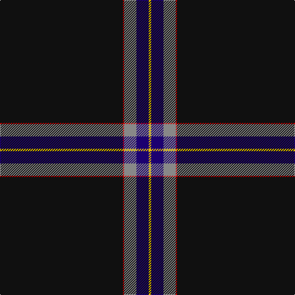

In pattern [KRRBY](/patterns/krrby/).

This was sourced from tartans-authority.  It is a [5 stripes tartan](/stripes/stripes5/).

Original link http://www.tartansauthority.com/tartan-ferret/display/8482/

## Thread count
K/200 R2 N20 DB20 Y/4

## Palette
Each colour and its ΔE from the base-6 reference it is a variant of.

| Colour | Shade | Base | ΔE (OKLab) |
|---|---|---|---|
| DB | <code style="background-color:#1C0070;">#1C0070</code> `#1C0070` | B <code style="background-color:#2C4084;">#2C4084</code> | 0.14 |
| K | <code style="background-color:#101010;">#101010</code> `#101010` | K <code style="background-color:#000000;">#000000</code> | 0.17 |
| N | <code style="background-color:#888888;">#888888</code> `#888888` | R <code style="background-color:#C80000;">#C80000</code> | 0.24 |
| R | <code style="background-color:#C80000;">#C80000</code> `#C80000` | R <code style="background-color:#C80000;">#C80000</code> | 0.00 |
| Y | <code style="background-color:#E8C000;">#E8C000</code> `#E8C000` | Y <code style="background-color:#E8C000;">#E8C000</code> | 0.00 |

# Sample pattern

## Nearest tartans

The nearest existing variants by ΔTartan distance.

1. [Fettes (Personal)](/setts/s5/k200b12ba8r12w4-b004878-baa060bc-k101010-rc80000-we0e0e0/) — ΔT 0.63
1. [Fettes Personal Tartan Tartan Number: 7565. Earliest known date: 2008 Designed online for four kilts by Fiona Fettes. See products available Copyright © Blair Urquhart, Comrie, 2015](/setts/s5/k100b6w4r6wa2-b003c64-k101010-rc80000-wc49cd8-wae0e0e0/) — ΔT 0.69
1. [McHattie (Personal)](/setts/s5/k90b4r8y2w2-b202060-k101010-rc80000-we0e0e0-ye8c000/) — ΔT 0.85
1. [McHattie (Personal)](/setts/s5/k90b4r8y2w2-b1474b4-k101010-rc80000-we0e0e0-ye8c000/) — ΔT 0.99
1. [Perratt (Personal)](/setts/s6/k166g8r8g20k2w6-g006818-k101010-rc80000-wfcfcfc/) — ΔT 1.26
1. [Dellen](/setts/s6/k160r12b6r24k4w4-b06392b-k1c1714-rb62531-wf9f5ef/) — ΔT 1.42
1. [Colleges Scotland (Corp)](/setts/s7/b2k100r2k4ba8bb14w2-b1474b4-ba5c5c5c-bb202060-k101010-rc80000-wfcfcfc/) — ΔT 1.44
1. [McCann of Castlecraig (Personal)](/setts/s7/k128g24b12k30r2g10y2-b5c5c5c-g545c24-k00002c-rb47800-ya0a0a0/) — ΔT 1.49
1. [Spirit of Lanarkshire (Corporate)](/setts/s8/k166y4b8r4k16g10r8w6-b2c2c80-g006818-k101010-rc80000-we0e0e0-ye8c000/) — ΔT 1.58
1. [Center (Name)](/setts/s8/k100b4k26w2k26b10g30r4-b1474b4-g006818-k101010-rc80000-we0e0e0/) — ΔT 1.60

## Neighbour map

Every grey dot is one of 15726 variants placed by the first two principal components of the ΔTartan feature space (44% of its variance). Red is this tartan; blue dots are its nearest — click one to open its page.

<svg viewBox="0 0 640 380" role="img" style="max-width:100%;height:auto;border:1px solid #e0e0e0;border-radius:4px;display:block" xmlns="http://www.w3.org/2000/svg"><image href="/nn/cloud.v1.png" width="640" height="380"/><a href="/setts/s5/k200b12ba8r12w4-b004878-baa060bc-k101010-rc80000-we0e0e0/"><circle cx="626.0" cy="132.0" r="4" fill="#3465a4"><title>Fettes (Personal)</title></circle></a><a href="/setts/s5/k100b6w4r6wa2-b003c64-k101010-rc80000-wc49cd8-wae0e0e0/"><circle cx="622.2" cy="128.9" r="4" fill="#3465a4"><title>Fettes Personal Tartan Tartan Number: 7565. Earliest known date: 2008 Designed online for four kilts by Fiona Fettes. See products available Copyright © Blair Urquhart, Comrie, 2015</title></circle></a><a href="/setts/s5/k90b4r8y2w2-b202060-k101010-rc80000-we0e0e0-ye8c000/"><circle cx="619.3" cy="131.0" r="4" fill="#3465a4"><title>McHattie (Personal)</title></circle></a><a href="/setts/s5/k90b4r8y2w2-b1474b4-k101010-rc80000-we0e0e0-ye8c000/"><circle cx="610.9" cy="127.4" r="4" fill="#3465a4"><title>McHattie (Personal)</title></circle></a><a href="/setts/s6/k166g8r8g20k2w6-g006818-k101010-rc80000-wfcfcfc/"><circle cx="586.9" cy="129.1" r="4" fill="#3465a4"><title>Perratt (Personal)</title></circle></a><a href="/setts/s6/k160r12b6r24k4w4-b06392b-k1c1714-rb62531-wf9f5ef/"><circle cx="581.4" cy="139.0" r="4" fill="#3465a4"><title>Dellen</title></circle></a><a href="/setts/s7/b2k100r2k4ba8bb14w2-b1474b4-ba5c5c5c-bb202060-k101010-rc80000-wfcfcfc/"><circle cx="577.4" cy="105.0" r="4" fill="#3465a4"><title>Colleges Scotland (Corp)</title></circle></a><a href="/setts/s7/k128g24b12k30r2g10y2-b5c5c5c-g545c24-k00002c-rb47800-ya0a0a0/"><circle cx="531.6" cy="127.7" r="4" fill="#3465a4"><title>McCann of Castlecraig (Personal)</title></circle></a><a href="/setts/s8/k166y4b8r4k16g10r8w6-b2c2c80-g006818-k101010-rc80000-we0e0e0-ye8c000/"><circle cx="561.2" cy="84.6" r="4" fill="#3465a4"><title>Spirit of Lanarkshire (Corporate)</title></circle></a><a href="/setts/s8/k100b4k26w2k26b10g30r4-b1474b4-g006818-k101010-rc80000-we0e0e0/"><circle cx="511.9" cy="129.0" r="4" fill="#3465a4"><title>Center (Name)</title></circle></a><circle cx="596.2" cy="135.4" r="5" fill="#c00000"/></svg>

ID: /setts/s5/k200r2ra20b20y4-b1c0070-k101010-rc80000-ra888888-ye8c000/
