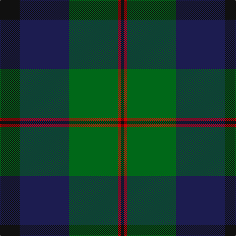

In pattern [KBGRK](/patterns/kbgrk/).

This was sourced from tartans-authority.  It is a [5 stripes tartan](/stripes/stripes5/).

Original link http://www.tartansauthority.com/tartan-ferret/display/10283/

## Thread count
K/40 DB100 G100 R6 K/6

## Palette
Each colour and its ΔE from the base-6 reference it is a variant of.

| Colour | Shade | Base | ΔE (OKLab) |
|---|---|---|---|
| DB | <code style="background-color:#1C1C50;">#1C1C50</code> `#1C1C50` | B <code style="background-color:#2A418A;">#2A418A</code> | 0.14 |
| G | <code style="background-color:#006818;">#006818</code> `#006818` | G <code style="background-color:#006100;">#006100</code> | 0.02 |
| K | <code style="background-color:#101010;">#101010</code> `#101010` | K <code style="background-color:#000000;">#000000</code> | 0.17 |
| R | <code style="background-color:#C80000;">#C80000</code> `#C80000` | R <code style="background-color:#CC0000;">#CC0000</code> | 0.01 |

# Sample pattern

## Nearest tartans

The nearest existing variants by ΔTartan distance.

1. [Dundas #2](/setts/s7/k4b16k12g12r1g2k2x2~b2c2c80-g006818-k101010-rc80000/) — ΔT 0.92
1. [MacRobart (Personal)](/setts/s6/b30k10g10w2g15w2x2~b202060-g006818-k101010-wa8ace8/) — ΔT 0.98
1. [Gunn Clan Tartan Tartan Number: 708. Earliest known date: c.1810-15 The Cockburn collection, housed in the Mitchell library in Glasgow, contains some of the oldest actual specimens of clan tartans in existance today. James Logan recorded the sett in his book 'The Scottish Gael' in 1831. The central blue stripes are often reproduced in black or very dark blue, giving the impression of four equally toned stripes. See products available Copyright © Blair Urquhart, Comrie, 2015](/setts/s6/r2g12k12g1b12g1x2~b2c2c80-g006818-k101010-rc80000/) — ΔT 1.00
1. [Dundas Clan Tartan Tartan Number: 1041. Earliest known date: 1842 The Dundas tartan originated in the Vestiarium Scoticum (1842). The design has the traditional green, black, blue background of the Highland military tartans with twin red stripes on the green. Dundas's played an important role in restoring the Highland way of life after the penalties imposed as a result of the '45 rebellion. It was Henry Dundas, who in 1784, introduced the bill to parliament restoring estates forfieted to the Crown after the uprising, following the repeal on the wearing of tartan in 1782. The Chief today is Sir David Dundas of Dundas, Bart. Appears in Edgars 'Old and Rare' See products available Copyright © Blair Urquhart, Comrie, 2015](/setts/s7/k4b16k12g24r1g2k2x2~b2c2c80-g006818-k101010-rc80000/) — ΔT 1.04
1. [Gunn](/setts/s6/g2b12g1k12g12r2x2~b1c0070-g006400-k101010-rc80000/) — ΔT 1.10
1. [Ferguson of Balquhidder](/setts/s6/g2b12r1k12g12k2x2~b2c4084-g005020-k101010-rdc0000/) — ΔT 1.12
1. [Mitchell, Cameron (Personal)](/setts/s6/k16g32k8r4ra11r2x2~g003c14-k101010-r888888-ra880000/) — ΔT 1.14
1. [National Galleries of Scotland Corporate Tartan Tartan Number: 2050. Earliest known date: November 1991 Based on the Black Watch or Government tartan. The three claret stripes represent the three galleries and the colour is that of William Playfair's original colour scheme for the National Gallery. See products available Copyright © Blair Urquhart, Comrie, 2015](/setts/s7/k7g22k22b6r2b15r2x2~b202060-g006818-k101010-rc80000/) — ΔT 1.15
1. [Graham of Montrose](/setts/s6/g4b15w2k16g19k4x2~b2c4084-g005020-k101010-we0e0e0/) — ΔT 1.17
1. [Louisville Spaulding (Personal)](/setts/s5/k20b50g50r3k3x2~b000080-g006400-k101010-rff0000/) — ΔT 1.17

## Neighbour map

Every grey dot is one of 15726 variants placed by the first two principal components of the ΔTartan feature space (44% of its variance). Red is this tartan; blue dots are its nearest — click one to open its page.

<svg viewBox="0 0 640 380" role="img" style="max-width:100%;height:auto;border:1px solid #e0e0e0;border-radius:4px;display:block" xmlns="http://www.w3.org/2000/svg"><image href="/nn/cloud.v1.png" width="640" height="380"/><a href="/setts/s7/k4b16k12g12r1g2k2x2~b2c2c80-g006818-k101010-rc80000/"><circle cx="245.5" cy="210.6" r="4" fill="#3465a4"><title>Dundas #2</title></circle></a><a href="/setts/s6/b30k10g10w2g15w2x2~b202060-g006818-k101010-wa8ace8/"><circle cx="261.0" cy="213.5" r="4" fill="#3465a4"><title>MacRobart (Personal)</title></circle></a><a href="/setts/s6/r2g12k12g1b12g1x2~b2c2c80-g006818-k101010-rc80000/"><circle cx="216.5" cy="222.8" r="4" fill="#3465a4"><title>Gunn Clan Tartan Tartan Number: 708. Earliest known date: c.1810-15 The Cockburn collection, housed in the Mitchell library in Glasgow, contains some of the oldest actual specimens of clan tartans in existance today. James Logan recorded the sett in his book 'The Scottish Gael' in 1831. The central blue stripes are often reproduced in black or very dark blue, giving the impression of four equally toned stripes. See products available Copyright © Blair Urquhart, Comrie, 2015</title></circle></a><a href="/setts/s7/k4b16k12g24r1g2k2x2~b2c2c80-g006818-k101010-rc80000/"><circle cx="289.0" cy="185.6" r="4" fill="#3465a4"><title>Dundas Clan Tartan Tartan Number: 1041. Earliest known date: 1842 The Dundas tartan originated in the Vestiarium Scoticum (1842). The design has the traditional green, black, blue background of the Highland military tartans with twin red stripes on the green. Dundas's played an important role in restoring the Highland way of life after the penalties imposed as a result of the '45 rebellion. It was Henry Dundas, who in 1784, introduced the bill to parliament restoring estates forfieted to the Crown after the uprising, following the repeal on the wearing of tartan in 1782. The Chief today is Sir David Dundas of Dundas, Bart. Appears in Edgars 'Old and Rare' See products available Copyright © Blair Urquhart, Comrie, 2015</title></circle></a><a href="/setts/s6/g2b12g1k12g12r2x2~b1c0070-g006400-k101010-rc80000/"><circle cx="213.2" cy="226.2" r="4" fill="#3465a4"><title>Gunn</title></circle></a><a href="/setts/s6/g2b12r1k12g12k2x2~b2c4084-g005020-k101010-rdc0000/"><circle cx="247.2" cy="242.0" r="4" fill="#3465a4"><title>Ferguson of Balquhidder</title></circle></a><a href="/setts/s6/k16g32k8r4ra11r2x2~g003c14-k101010-r888888-ra880000/"><circle cx="295.8" cy="222.9" r="4" fill="#3465a4"><title>Mitchell, Cameron (Personal)</title></circle></a><a href="/setts/s7/k7g22k22b6r2b15r2x2~b202060-g006818-k101010-rc80000/"><circle cx="226.7" cy="228.9" r="4" fill="#3465a4"><title>National Galleries of Scotland Corporate Tartan Tartan Number: 2050. Earliest known date: November 1991 Based on the Black Watch or Government tartan. The three claret stripes represent the three galleries and the colour is that of William Playfair's original colour scheme for the National Gallery. See products available Copyright © Blair Urquhart, Comrie, 2015</title></circle></a><a href="/setts/s6/g4b15w2k16g19k4x2~b2c4084-g005020-k101010-we0e0e0/"><circle cx="219.8" cy="248.1" r="4" fill="#3465a4"><title>Graham of Montrose</title></circle></a><a href="/setts/s5/k20b50g50r3k3x2~b000080-g006400-k101010-rff0000/"><circle cx="251.7" cy="217.1" r="4" fill="#3465a4"><title>Louisville Spaulding (Personal)</title></circle></a><circle cx="279.9" cy="225.4" r="5" fill="#c00000"/></svg>

ID: /setts/s5/k20b50g50r3k3x2~b1c1c50-g006818-k101010-rc80000/
