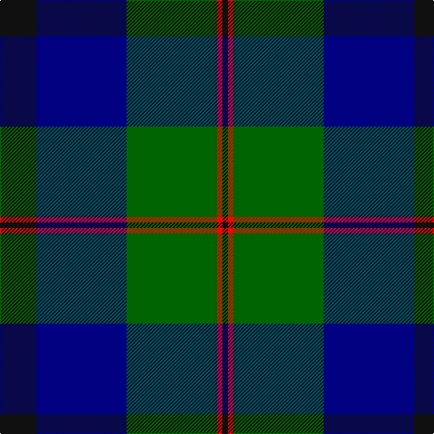

This page is one **sett** — a single exact thread-count. It belongs to the [tartan](/tartans/k20db50g50r3k3/)
(the same proportion at any scale), whose colour order is pattern [KBGRK](/stripes/kbgrk/).

Sourced from register-of-tartans.  It is a [5 stripe tartan](/stripes/stripes5/).

Original link https://www.tartanregister.gov.uk/tartanDetails.aspx?ref=10283

## Also known as

This cloth is also recorded under:

- Louisville Spaulding

2 attestations — the source records this cloth was collapsed from (oldest owns this page)

<ul>
<li>05/06/2010 — Louisville Spaulding (Personal) (register-of-tartans, <a href="https://www.tartanregister.gov.uk/tartanDetails.aspx?ref=10283">record</a>)</li>
<li>5th June 2010 — Louisville Spalding (Personal) (tartans-authority, <a href="http://www.tartansauthority.com/tartan-ferret/display/10283/">record</a>)</li>
</ul>

## Register references

External register numbers recorded for this tartan.

- Scottish Register of Tartans: [10283](https://www.tartanregister.gov.uk/tartanDetails.aspx?ref=10283)

## Thread count
K/40 DB100 G100 R6 K/6

## Palette

Palette: <strong>Tartan Register</strong> <small style="color:#888">(3 of 4 colours)</small>
<table><thead><tr><th>Colour</th><th>Threads</th><th>Shade</th><th>Base</th><th>OKLCh</th></tr></thead><tbody><tr><td>K/</td><td style="text-align:right;font-variant-numeric:tabular-nums">40</td><td><code style="background-color:#101010;">#101010</code> <small style="color:#888">#101010</small></td><td>K <code style="background-color:#000000;">#000000</code></td><td><small style="color:#888">oklch(17.3% 0.000 89.9)</small></td></tr><tr><td>DB</td><td style="text-align:right;font-variant-numeric:tabular-nums">100</td><td><code style="background-color:#000080;">#000080</code> <small style="color:#888">#000080</small></td><td>B <code style="background-color:#2A418A;">#2A418A</code></td><td><small style="color:#888">oklch(27.1% 0.188 264.1)</small></td></tr><tr><td>G</td><td style="text-align:right;font-variant-numeric:tabular-nums">100</td><td><code style="background-color:#006400;">#006400</code> <small style="color:#888">#006400</small></td><td>G <code style="background-color:#006100;">#006100</code></td><td><small style="color:#888">oklch(43.6% 0.148 142.5)</small></td></tr><tr><td>R</td><td style="text-align:right;font-variant-numeric:tabular-nums">6</td><td><code style="background-color:#FF0000;">#FF0000</code> <small style="color:#888">#FF0000</small></td><td>R <code style="background-color:#CC0000;">#CC0000</code></td><td><small style="color:#888">oklch(62.8% 0.258 29.2)</small></td></tr><tr><td>K/</td><td style="text-align:right;font-variant-numeric:tabular-nums">6</td><td><code style="background-color:#101010;">#101010</code> <small style="color:#888">#101010</small></td><td>K <code style="background-color:#000000;">#000000</code></td><td><small style="color:#888">oklch(17.3% 0.000 89.9)</small></td></tr></tbody></table>

# Sample pattern

## Nearest tartans

The nearest existing variants by ΔTartan distance, with this tartan at the top so the swatches line up against it.

ΔTartan

Tartan

Sett

—

<a href="/ttd/edit/#slug=k20db50g50r3k3~x2">Louisville Spaulding (Personal)</a> <a class="nn-out" href="/setts/s5/k20db50g50r3k3~x2/" title="open its dictionary page">↗</a>

0.73

<a href="/ttd/edit/#slug=db30k10g10lb2g15lb2~x2">MacRobart (Personal)</a> <a class="nn-out" href="/setts/s6/db30k10g10lb2g15lb2~x2/" title="open its dictionary page">↗</a>

1.07

<a href="/ttd/edit/#slug=lo4db24g3k21g23k1~x2">Glenturret Distillery</a> <a class="nn-out" href="/setts/s6/lo4db24g3k21g23k1~x2/" title="open its dictionary page">↗</a>

1.08

<a href="/ttd/edit/#slug=r2g23db11db22r2~x2">Skibo</a> <a class="nn-out" href="/setts/s5/r2g23db11db22r2~x2/" title="open its dictionary page">↗</a>

1.11

<a href="/ttd/edit/#slug=r2g12k12g1db12g2~x2">Gunn</a> <a class="nn-out" href="/setts/s6/r2g12k12g1db12g2~x2/" title="open its dictionary page">↗</a>

1.12

<a href="/ttd/edit/#slug=db31g2k20ly2g24~x2">Landels (Personal)</a> <a class="nn-out" href="/setts/s5/db31g2k20ly2g24~x2/" title="open its dictionary page">↗</a>

1.14

<a href="/ttd/edit/#slug=db3r2db22k11g22r2g3~x2">Gammell (1978) (Personal)</a> <a class="nn-out" href="/setts/s7/db3r2db22k11g22r2g3~x2/" title="open its dictionary page">↗</a>

1.17

<a href="/ttd/edit/#slug=db2g12k13w1db13w2~x2">Herd Family Tartan Tartan Number: 170. Earliest known date: 1978 Woven for the wedding of William Hurd to Heather Petit. From JCT: STS monitoring committee recorded 1978. In march 2005. STS Record has the application being made by Councillor R J Herd, C.Eng, M.I.C.E., A.M.B.I.M. who had been granted arms by Lord Lyon. See products available Copyright © Blair Urquhart, Comrie, 2015</a> <a class="nn-out" href="/setts/s6/db2g12k13w1db13w2~x2/" title="open its dictionary page">↗</a>

1.17

<a href="/ttd/edit/#slug=t2db29t12g29w2~x2">Wallace Blue (Fashion)</a> <a class="nn-out" href="/setts/s5/t2db29t12g29w2~x2/" title="open its dictionary page">↗</a>

1.20

<a href="/ttd/edit/#slug=k4db16k12g12r1g2k2~x2">Dundas #2</a> <a class="nn-out" href="/setts/s7/k4db16k12g12r1g2k2~x2/" title="open its dictionary page">↗</a>

1.21

<a href="/ttd/edit/#slug=dg16b2dg1k12db12k1~x2">Graham of Menteith</a> <a class="nn-out" href="/setts/s6/dg16b2dg1k12db12k1~x2/" title="open its dictionary page">↗</a>

## Neighbour map

Every grey dot is one of 14299 variants placed by the first two principal components of the ΔTartan feature space (44% of its variance). Red is this tartan; blue dots are its nearest — click one to open its page.

<svg viewBox="0 0 640 380" role="img" style="max-width:100%;height:auto;border:1px solid #e0e0e0;border-radius:4px;display:block" xmlns="http://www.w3.org/2000/svg"><image href="/nn/cloud.v1.png" width="640" height="380"/><a href="/setts/s6/db30k10g10lb2g15lb2~x2/"><circle cx="264.2" cy="217.4" r="4" fill="#3465a4"><title>MacRobart (Personal)</title></circle></a><a href="/setts/s6/lo4db24g3k21g23k1~x2/"><circle cx="226.1" cy="198.5" r="4" fill="#3465a4"><title>Glenturret Distillery</title></circle></a><a href="/setts/s5/r2g23db11db22r2~x2/"><circle cx="216.4" cy="231.8" r="4" fill="#3465a4"><title>Skibo</title></circle></a><a href="/setts/s6/r2g12k12g1db12g2~x2/"><circle cx="216.6" cy="230.6" r="4" fill="#3465a4"><title>Gunn</title></circle></a><a href="/setts/s5/db31g2k20ly2g24~x2/"><circle cx="218.7" cy="213.6" r="4" fill="#3465a4"><title>Landels (Personal)</title></circle></a><a href="/setts/s7/db3r2db22k11g22r2g3~x2/"><circle cx="231.6" cy="210.5" r="4" fill="#3465a4"><title>Gammell (1978) (Personal)</title></circle></a><a href="/setts/s6/db2g12k13w1db13w2~x2/"><circle cx="187.9" cy="213.2" r="4" fill="#3465a4"><title>Herd Family Tartan Tartan Number: 170. Earliest known date: 1978 Woven for the wedding of William Hurd to Heather Petit. From JCT: STS monitoring committee recorded 1978. In march 2005. STS Record has the application being made by Councillor R J Herd, C.Eng, M.I.C.E., A.M.B.I.M. who had been granted arms by Lord Lyon. See products available Copyright © Blair Urquhart, Comrie, 2015</title></circle></a><a href="/setts/s5/t2db29t12g29w2~x2/"><circle cx="249.0" cy="223.1" r="4" fill="#3465a4"><title>Wallace Blue (Fashion)</title></circle></a><a href="/setts/s7/k4db16k12g12r1g2k2~x2/"><circle cx="248.7" cy="216.6" r="4" fill="#3465a4"><title>Dundas #2</title></circle></a><a href="/setts/s6/dg16b2dg1k12db12k1~x2/"><circle cx="243.0" cy="220.0" r="4" fill="#3465a4"><title>Graham of Menteith</title></circle></a><circle cx="255.6" cy="220.7" r="5" fill="#c00000"/></svg>

ID: /setts/s5/k20db50g50r3k3~x2/
