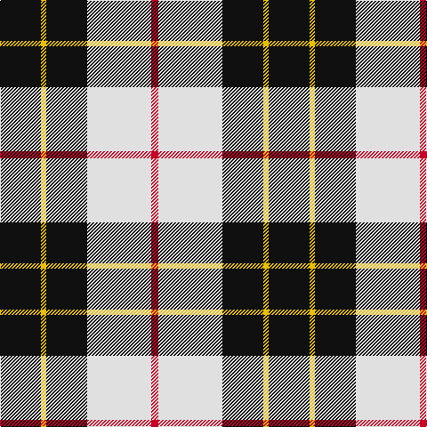

In pattern [KYKWR](/patterns/kykwr/).

This was sourced from register-of-tartans.  It is a [5 stripes tartan](/stripes/stripes5/).

Original link https://www.tartanregister.gov.uk/tartanDetails.aspx?ref=2647

## Register references

External register numbers recorded for this tartan.

- Scottish Register of Tartans: [2647](https://www.tartanregister.gov.uk/tartanDetails.aspx?ref=2647)
- Scottish Tartans World Register: 2847

## Thread count
K/46 Y6 K46 LN72 R/8

## Palette
Each colour and its ΔE from the base-6 reference it is a variant of.

| Colour | Shade | Base | ΔE (OKLab) |
|---|---|---|---|
| K | <code style="background-color:#101010;">#101010</code> `#101010` | K <code style="background-color:#000000;">#000000</code> | 0.17 |
| LN | <code style="background-color:#E0E0E0;">#E0E0E0</code> `#E0E0E0` | W <code style="background-color:#F7F7F7;">#F7F7F7</code> | 0.07 |
| R | <code style="background-color:#C80028;">#C80028</code> `#C80028` | R <code style="background-color:#CC0000;">#CC0000</code> | 0.02 |
| Y | <code style="background-color:#E8C000;">#E8C000</code> `#E8C000` | Y <code style="background-color:#F2BF00;">#F2BF00</code> | 0.02 |

# Sample pattern

## Nearest tartans

The nearest existing variants by ΔTartan distance.

1. [Macleod, Winnifred (Personal)](/setts/s5/k23y3k23w36r4~k101010-rc80000-we0e0e0-ye8c000~x2/) — ΔT 0.02
1. [Gleneckley](/setts/s4/b3w25k25r3~b2c2c80-k101010-rdc0000-we0e0e0~x2/) — ΔT 1.03
1. [(6) Burberry](/setts/s5/k3w3k3y10r1~k000000-rc80000-wf8f4d0-yb8a47c~x6/) — ΔT 1.03
1. [Kennison](/setts/s8/k22w16y2w14y2w16k22b3~b00008c-k000000-wf8f8f8-yc89800~x2/) — ΔT 1.10
1. [MacPherson Dress, Blue (Dance)](/setts/s7/w5r3w26k21w3k8y3~k000000-r800028-we0e0e0-ye8c000~x2/) — ΔT 1.12
1. [Gleneckly](/setts/s4/b3w25k25r3~b2c2c80-k101010-rc80000-wfcfcfc~x2/) — ΔT 1.13
1. [Burberry Hunting](/setts/s5/k3w3k3g10r1~g406054-k101010-rc80000-wfcfcfc~x6/) — ΔT 1.14
1. [Brodie (WCWM)](/setts/s6/r2w30k15y2k15r2~k101010-rc80000-wf0ecd4-ybc8c00~x2/) — ΔT 1.19
1. [Burberry Check Corporate Tartan Tartan Number: 1239. Earliest known date: 1984 Nothing See products available Copyright © Blair Urquhart, Comrie, 2015](/setts/s5/k6w6k6y21r2~k101010-rc80000-we0e0e0-ya08858~x4/) — ΔT 1.19
1. [Kierson](/setts/s8/k22w16g2w14g2w16k22r3~g006818-k101010-r880000-wf8f8f8~x2/) — ΔT 1.20

## Neighbour map

Every grey dot is one of 15726 variants placed by the first two principal components of the ΔTartan feature space (44% of its variance). Red is this tartan; blue dots are its nearest — click one to open its page.

<svg viewBox="0 0 640 380" role="img" style="max-width:100%;height:auto;border:1px solid #e0e0e0;border-radius:4px;display:block" xmlns="http://www.w3.org/2000/svg"><image href="/nn/cloud.v1.png" width="640" height="380"/><a href="/setts/s5/k23y3k23w36r4~k101010-rc80000-we0e0e0-ye8c000~x2/"><circle cx="245.6" cy="205.6" r="4" fill="#3465a4"><title>Macleod, Winnifred (Personal)</title></circle></a><a href="/setts/s4/b3w25k25r3~b2c2c80-k101010-rdc0000-we0e0e0~x2/"><circle cx="209.5" cy="217.7" r="4" fill="#3465a4"><title>Gleneckley</title></circle></a><a href="/setts/s5/k3w3k3y10r1~k000000-rc80000-wf8f4d0-yb8a47c~x6/"><circle cx="213.1" cy="199.6" r="4" fill="#3465a4"><title>(6) Burberry</title></circle></a><a href="/setts/s8/k22w16y2w14y2w16k22b3~b00008c-k000000-wf8f8f8-yc89800~x2/"><circle cx="206.7" cy="191.9" r="4" fill="#3465a4"><title>Kennison</title></circle></a><a href="/setts/s7/w5r3w26k21w3k8y3~k000000-r800028-we0e0e0-ye8c000~x2/"><circle cx="226.0" cy="184.0" r="4" fill="#3465a4"><title>MacPherson Dress, Blue (Dance)</title></circle></a><a href="/setts/s4/b3w25k25r3~b2c2c80-k101010-rc80000-wfcfcfc~x2/"><circle cx="204.6" cy="214.5" r="4" fill="#3465a4"><title>Gleneckly</title></circle></a><a href="/setts/s5/k3w3k3g10r1~g406054-k101010-rc80000-wfcfcfc~x6/"><circle cx="229.5" cy="214.0" r="4" fill="#3465a4"><title>Burberry Hunting</title></circle></a><a href="/setts/s6/r2w30k15y2k15r2~k101010-rc80000-wf0ecd4-ybc8c00~x2/"><circle cx="240.7" cy="165.6" r="4" fill="#3465a4"><title>Brodie (WCWM)</title></circle></a><a href="/setts/s5/k6w6k6y21r2~k101010-rc80000-we0e0e0-ya08858~x4/"><circle cx="243.1" cy="202.5" r="4" fill="#3465a4"><title>Burberry Check Corporate Tartan Tartan Number: 1239. Earliest known date: 1984 Nothing See products available Copyright © Blair Urquhart, Comrie, 2015</title></circle></a><a href="/setts/s8/k22w16g2w14g2w16k22r3~g006818-k101010-r880000-wf8f8f8~x2/"><circle cx="207.8" cy="188.8" r="4" fill="#3465a4"><title>Kierson</title></circle></a><circle cx="245.7" cy="205.6" r="5" fill="#c00000"/></svg>

ID: /setts/s5/k23y3k23w36r4~k101010-rc80028-we0e0e0-ye8c000~x2/
