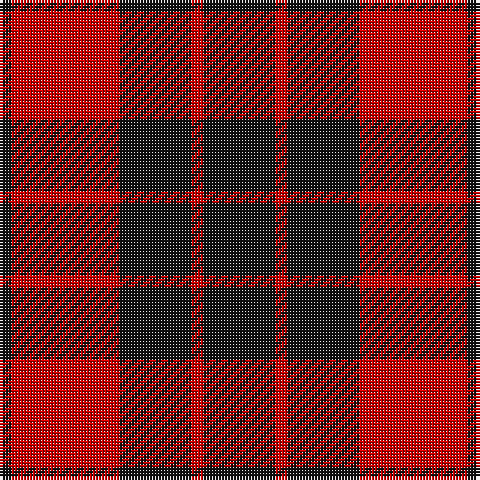

In pattern [KRKRK](/patterns/krkrk/).

This was sourced from house-of-tartan.  It is a [5 stripes tartan](/stripes/stripes5/).

Original link http://www.house-of-tartan.scotland.net/house/TartanViewjs.asp?colr=Def&tnam=1172

## Thread count
K/4 R36 K24 R4 K/24

## Palette
Each colour and its ΔE from the base-6 reference it is a variant of.

| Colour | Shade | Base | ΔE (OKLab) |
|---|---|---|---|
| K | <code style="background-color:#101010;">#101010</code> `#101010` | K <code style="background-color:#000000;">#000000</code> | 0.17 |
| R | <code style="background-color:#C80000;">#C80000</code> `#C80000` | R <code style="background-color:#CC0000;">#CC0000</code> | 0.01 |

# Sample pattern

## Nearest tartans

The nearest existing variants by ΔTartan distance.

1. [MacLeod of Raasay (Highland Society of London)](/setts/s5/k26r4k26r38k4-k101010-rc80000/) — ΔT 0.10
1. [Lendrum or MacFarlane Clan Tartan Tartan Number: 1190. Earliest known date: (1815-20) MacGregor-Hastie's notes say 'The sett is the same as MacFarlane Black and Red See products available Copyright © Blair Urquhart, Comrie, 2015](/setts/s4/k67r32k6r32-k101010-rc80000/) — ΔT 0.67
1. [MacFarlane Red & Black (Artefact)](/setts/s4/k120r68k12r68-k101010-rc80000/) — ΔT 0.91
1. [Erskine (Paton)](/setts/s6/k62r8k94r94k8r62-k101010-rdc0000/) — ΔT 1.02
1. [Erskine, Black & Red (Clan)](/setts/s6/k12r6k56r56k6r12-k101010-rc80000/) — ΔT 1.07
1. [Bodog.com](/setts/s5/r6k50r50k20w6-k101010-rc80000-wc0c0c0/) — ΔT 1.09
1. [MacLeod Black & Red](/setts/s5/r16k2r16k24r2-k101010-rdc0000/) — ΔT 1.13
1. [Ettrick (District)](/setts/s4/k20r104k104r20-k101010-rc80000/) — ΔT 1.13
1. [MacLeod, Black & Red](/setts/s5/r16k2r16k24r2-k000000-rc00000/) — ΔT 1.13
1. [Ettrick District Tartan Tartan Number: 1191. Earliest known date: 1830-70 This sett appears in Paton's collection which is housed at the Scottish Tartans Museum, Comrie in Perthshire, Scotland. The samples are undated but the collection is known to have been put together around the 1830's, with some additions during the Victorian period. See products available Copyright © Blair Urquhart, Comrie, 2015](/setts/s4/k12r62k62r12-k101010-rc80000/) — ΔT 1.14

## Neighbour map

Every grey dot is one of 15726 variants placed by the first two principal components of the ΔTartan feature space (44% of its variance). Red is this tartan; blue dots are its nearest — click one to open its page.

<svg viewBox="0 0 640 380" role="img" style="max-width:100%;height:auto;border:1px solid #e0e0e0;border-radius:4px;display:block" xmlns="http://www.w3.org/2000/svg"><image href="/nn/cloud.v1.png" width="640" height="380"/><a href="/setts/s5/k26r4k26r38k4-k101010-rc80000/"><circle cx="375.8" cy="263.3" r="4" fill="#3465a4"><title>MacLeod of Raasay (Highland Society of London)</title></circle></a><a href="/setts/s4/k67r32k6r32-k101010-rc80000/"><circle cx="365.7" cy="270.3" r="4" fill="#3465a4"><title>Lendrum or MacFarlane Clan Tartan Tartan Number: 1190. Earliest known date: (1815-20) MacGregor-Hastie's notes say 'The sett is the same as MacFarlane Black and Red See products available Copyright © Blair Urquhart, Comrie, 2015</title></circle></a><a href="/setts/s4/k120r68k12r68-k101010-rc80000/"><circle cx="346.8" cy="279.3" r="4" fill="#3465a4"><title>MacFarlane Red &amp; Black (Artefact)</title></circle></a><a href="/setts/s6/k62r8k94r94k8r62-k101010-rdc0000/"><circle cx="340.6" cy="242.4" r="4" fill="#3465a4"><title>Erskine (Paton)</title></circle></a><a href="/setts/s6/k12r6k56r56k6r12-k101010-rc80000/"><circle cx="362.9" cy="233.3" r="4" fill="#3465a4"><title>Erskine, Black &amp; Red (Clan)</title></circle></a><a href="/setts/s5/r6k50r50k20w6-k101010-rc80000-wc0c0c0/"><circle cx="318.6" cy="239.2" r="4" fill="#3465a4"><title>Bodog.com</title></circle></a><a href="/setts/s5/r16k2r16k24r2-k101010-rdc0000/"><circle cx="379.0" cy="239.5" r="4" fill="#3465a4"><title>MacLeod Black &amp; Red</title></circle></a><a href="/setts/s4/k20r104k104r20-k101010-rc80000/"><circle cx="331.4" cy="291.1" r="4" fill="#3465a4"><title>Ettrick (District)</title></circle></a><a href="/setts/s5/r16k2r16k24r2-k000000-rc00000/"><circle cx="366.3" cy="241.0" r="4" fill="#3465a4"><title>MacLeod, Black &amp; Red</title></circle></a><a href="/setts/s4/k12r62k62r12-k101010-rc80000/"><circle cx="331.0" cy="291.5" r="4" fill="#3465a4"><title>Ettrick District Tartan Tartan Number: 1191. Earliest known date: 1830-70 This sett appears in Paton's collection which is housed at the Scottish Tartans Museum, Comrie in Perthshire, Scotland. The samples are undated but the collection is known to have been put together around the 1830's, with some additions during the Victorian period. See products available Copyright © Blair Urquhart, Comrie, 2015</title></circle></a><circle cx="370.6" cy="265.3" r="5" fill="#c00000"/></svg>

ID: /setts/s5/k24r4k24r36k4-k101010-rc80000/
