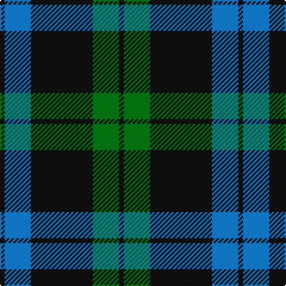

In pattern [KBKGK](/patterns/kbkgk/).

This was sourced from register-of-tartans.  It is a [5 stripes tartan](/stripes/stripes5/).

Original link https://www.tartanregister.gov.uk/tartanDetails.aspx?ref=521

## Attestations

This cloth appears in 2 source records; the oldest owns this page.

- 01/01/1770 — Campbell of Loch Awe (register-of-tartans, [record](https://www.tartanregister.gov.uk/tartanDetails.aspx?ref=521))
- 1770 — Campbell of Loch Awe (Clan) (tartans-authority, [record](http://www.tartansauthority.com/tartan-ferret/display/13/))

## Register references

External register numbers recorded for this tartan.

- Scottish Register of Tartans: [521](https://www.tartanregister.gov.uk/tartanDetails.aspx?ref=521)
- Scottish Tartans Authority (ITI): 13
- Scottish Tartans World Register: 13

## Thread count
K/4 B22 K52 G22 K/4

## Palette
Each colour and its ΔE from the base-6 reference it is a variant of.

| Colour | Shade | Base | ΔE (OKLab) |
|---|---|---|---|
| B | <code style="background-color:#1474B4;">#1474B4</code> `#1474B4` | B <code style="background-color:#2A418A;">#2A418A</code> | 0.15 |
| G | <code style="background-color:#006818;">#006818</code> `#006818` | G <code style="background-color:#006100;">#006100</code> | 0.02 |
| K | <code style="background-color:#101010;">#101010</code> `#101010` | K <code style="background-color:#000000;">#000000</code> | 0.17 |

# Sample pattern

## Nearest tartans

The nearest existing variants by ΔTartan distance.

1. [Perthshire (New) District Tartan Tartan Number: 2188. Earliest known date: 1992 The New Perthshire District tartan has established itself through use and wont since 1992. It provides a useful alternative to the Drummond pattern which was always closely associated with Perthshire. See products available Copyright © Blair Urquhart, Comrie, 2015](/setts/s6/b26r6g16b8g3r2~b202060-g006818-rc80000~x2/) — ΔT 1.07
1. [MacIntyre LC](/setts/s6/g4b12r3b12g32y4~b000052-g11450d-raa0000-yaaaaaa~x2/) — ΔT 1.09
1. [MacIntyre LC](/setts/s6/g4b12r3b12g32y4~b000052-g11450d-raa0000-yaaaaaa/) — ΔT 1.09
1. [Bumbee #1 (Fashion)](/setts/s4/g10k2b5g1~b300048-g006818-k000000~x8/) — ΔT 1.14
1. [Press & Journal](/setts/s5/k9b3k28b25w2~b4c5484-k101010-we0e0e0~x2/) — ΔT 1.16
1. [MacIntyre L](/setts/s6/g4b12r3b12g32w4~b000064-g004c00-rc80000-wd0d0d0/) — ΔT 1.17
1. [Campbell of Lochawe Clan Tartan Tartan Number: 1038. Earliest known date: pre 2003 MacKinlay strip. Sample in STS collection. See products available Copyright © Blair Urquhart, Comrie, 2015](/setts/s5/k2b11k26g11k2~b2c2c80-g006818-k101010~x2/) — ΔT 1.20
1. [Cadence Design Systems (Corporate)](/setts/s7/k51g5r15g37k17r6g7~g006818-k00003c-rc80000~x2/) — ΔT 1.29
1. [Gracie (Name)](/setts/s5/g47r3g6b35y3~b1c0070-g006818-r880000-yd09800~x2/) — ΔT 1.29
1. [MacArthur Clan Tartan Tartan Number: 1100. Earliest known date: 1842 MacArthurs were at one time linked with the MacDonalds and this tartan has the same basic form as the MacDonald, Lord of the Isles sett. MacArthurs, in Skye, held land as the hereditary pipers to the MacDonalds. There is also an older MacArthur of Milton tartan whose design reflects the links with Clan Campbell. See products available Copyright © Blair Urquhart, Comrie, 2015](/setts/s5/k32g6k12g30y3~g006818-k101010-ye8c000/) — ΔT 1.31

## Neighbour map

Every grey dot is one of 15726 variants placed by the first two principal components of the ΔTartan feature space (44% of its variance). Red is this tartan; blue dots are its nearest — click one to open its page.

<svg viewBox="0 0 640 380" role="img" style="max-width:100%;height:auto;border:1px solid #e0e0e0;border-radius:4px;display:block" xmlns="http://www.w3.org/2000/svg"><image href="/nn/cloud.v1.png" width="640" height="380"/><a href="/setts/s6/b26r6g16b8g3r2~b202060-g006818-rc80000~x2/"><circle cx="350.8" cy="235.5" r="4" fill="#3465a4"><title>Perthshire (New) District Tartan Tartan Number: 2188. Earliest known date: 1992 The New Perthshire District tartan has established itself through use and wont since 1992. It provides a useful alternative to the Drummond pattern which was always closely associated with Perthshire. See products available Copyright © Blair Urquhart, Comrie, 2015</title></circle></a><a href="/setts/s6/g4b12r3b12g32y4~b000052-g11450d-raa0000-yaaaaaa~x2/"><circle cx="319.1" cy="226.1" r="4" fill="#3465a4"><title>MacIntyre LC</title></circle></a><a href="/setts/s6/g4b12r3b12g32y4~b000052-g11450d-raa0000-yaaaaaa/"><circle cx="319.1" cy="226.1" r="4" fill="#3465a4"><title>MacIntyre LC</title></circle></a><a href="/setts/s4/g10k2b5g1~b300048-g006818-k000000~x8/"><circle cx="353.1" cy="265.6" r="4" fill="#3465a4"><title>Bumbee #1 (Fashion)</title></circle></a><a href="/setts/s5/k9b3k28b25w2~b4c5484-k101010-we0e0e0~x2/"><circle cx="368.4" cy="242.4" r="4" fill="#3465a4"><title>Press &amp; Journal</title></circle></a><a href="/setts/s6/g4b12r3b12g32w4~b000064-g004c00-rc80000-wd0d0d0/"><circle cx="298.0" cy="217.8" r="4" fill="#3465a4"><title>MacIntyre L</title></circle></a><a href="/setts/s5/k2b11k26g11k2~b2c2c80-g006818-k101010~x2/"><circle cx="382.8" cy="257.5" r="4" fill="#3465a4"><title>Campbell of Lochawe Clan Tartan Tartan Number: 1038. Earliest known date: pre 2003 MacKinlay strip. Sample in STS collection. See products available Copyright © Blair Urquhart, Comrie, 2015</title></circle></a><a href="/setts/s7/k51g5r15g37k17r6g7~g006818-k00003c-rc80000~x2/"><circle cx="276.0" cy="227.6" r="4" fill="#3465a4"><title>Cadence Design Systems (Corporate)</title></circle></a><a href="/setts/s5/g47r3g6b35y3~b1c0070-g006818-r880000-yd09800~x2/"><circle cx="353.9" cy="209.6" r="4" fill="#3465a4"><title>Gracie (Name)</title></circle></a><a href="/setts/s5/k32g6k12g30y3~g006818-k101010-ye8c000/"><circle cx="331.4" cy="261.7" r="4" fill="#3465a4"><title>MacArthur Clan Tartan Tartan Number: 1100. Earliest known date: 1842 MacArthurs were at one time linked with the MacDonalds and this tartan has the same basic form as the MacDonald, Lord of the Isles sett. MacArthurs, in Skye, held land as the hereditary pipers to the MacDonalds. There is also an older MacArthur of Milton tartan whose design reflects the links with Clan Campbell. See products available Copyright © Blair Urquhart, Comrie, 2015</title></circle></a><circle cx="347.5" cy="243.7" r="5" fill="#c00000"/></svg>

ID: /setts/s5/k2b11k26g11k2~b1474b4-g006818-k101010~x2/
