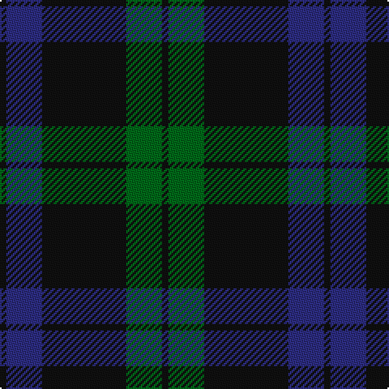

In pattern [KBKGK](/patterns/kbkgk/).

This was sourced from house-of-tartan.  It is a [5 stripes tartan](/stripes/stripes5/).

Original link http://www.house-of-tartan.scotland.net/house/TartanViewjs.asp?colr=Def&tnam=1038

## Thread count
K/4 DB22 K52 G22 K/4

## Palette
Each colour and its ΔE from the base-6 reference it is a variant of.

| Colour | Shade | Base | ΔE (OKLab) |
|---|---|---|---|
| DB | <code style="background-color:#2C2C80;">#2C2C80</code> `#2C2C80` | B <code style="background-color:#2A418A;">#2A418A</code> | 0.06 |
| G | <code style="background-color:#006818;">#006818</code> `#006818` | G <code style="background-color:#006100;">#006100</code> | 0.02 |
| K | <code style="background-color:#101010;">#101010</code> `#101010` | K <code style="background-color:#000000;">#000000</code> | 0.17 |

# Sample pattern

## Nearest tartans

The nearest existing variants by ΔTartan distance.

1. [Perthshire, New /Tourist Board](/setts/s6/b37r10g22b11g3r3~b000050-g003000-r800000~x2/) — ΔT 1.06
1. [Gunn (Logan)](/setts/s6/g2k12g1k12g12r2~g005020-k101010-rdc0000~x2/) — ΔT 1.08
1. [Barclay Hunting](/setts/s4/g1b16g16r1~b000052-g11450d-raa0000~x2/) — ΔT 1.16
1. [Black Watch (variation)](/setts/s6/k5g23k18b21k33b3~b202060-g006818-k101010~x2/) — ΔT 1.20
1. [Campbell of Loch Awe](/setts/s5/k2b11k26g11k2~b1474b4-g006818-k101010~x2/) — ΔT 1.20
1. [Perthshire (New) District Tartan Tartan Number: 2188. Earliest known date: 1992 The New Perthshire District tartan has established itself through use and wont since 1992. It provides a useful alternative to the Drummond pattern which was always closely associated with Perthshire. See products available Copyright © Blair Urquhart, Comrie, 2015](/setts/s6/b26r6g16b8g3r2~b202060-g006818-rc80000~x2/) — ΔT 1.25
1. [Barclay Hunting](/setts/s4/g1b16g16r1~b000064-g004c00-rc80000~x2/) — ΔT 1.30
1. [MacKay (Blue) #2](/setts/s5/k15b4k15b28r2~b2c4084-k101010-rdc0000~x2/) — ΔT 1.39
1. [Hutton](/setts/s6/k2g7b2g7b16r1~b00004c-g005030-k101010-rc80000~x6/) — ΔT 1.41
1. [Robert Gordon University](/setts/s6/k4r2k12b12k1y2~b202060-k101010-r880000-yd09800~x2/) — ΔT 1.41

## Neighbour map

Every grey dot is one of 15726 variants placed by the first two principal components of the ΔTartan feature space (44% of its variance). Red is this tartan; blue dots are its nearest — click one to open its page.

<svg viewBox="0 0 640 380" role="img" style="max-width:100%;height:auto;border:1px solid #e0e0e0;border-radius:4px;display:block" xmlns="http://www.w3.org/2000/svg"><image href="/nn/cloud.v1.png" width="640" height="380"/><a href="/setts/s6/b37r10g22b11g3r3~b000050-g003000-r800000~x2/"><circle cx="385.4" cy="259.4" r="4" fill="#3465a4"><title>Perthshire, New /Tourist Board</title></circle></a><a href="/setts/s6/g2k12g1k12g12r2~g005020-k101010-rdc0000~x2/"><circle cx="401.4" cy="265.0" r="4" fill="#3465a4"><title>Gunn (Logan)</title></circle></a><a href="/setts/s4/g1b16g16r1~b000052-g11450d-raa0000~x2/"><circle cx="397.6" cy="264.2" r="4" fill="#3465a4"><title>Barclay Hunting</title></circle></a><a href="/setts/s6/k5g23k18b21k33b3~b202060-g006818-k101010~x2/"><circle cx="344.2" cy="283.1" r="4" fill="#3465a4"><title>Black Watch (variation)</title></circle></a><a href="/setts/s5/k2b11k26g11k2~b1474b4-g006818-k101010~x2/"><circle cx="347.5" cy="243.7" r="4" fill="#3465a4"><title>Campbell of Loch Awe</title></circle></a><a href="/setts/s6/b26r6g16b8g3r2~b202060-g006818-rc80000~x2/"><circle cx="350.8" cy="235.5" r="4" fill="#3465a4"><title>Perthshire (New) District Tartan Tartan Number: 2188. Earliest known date: 1992 The New Perthshire District tartan has established itself through use and wont since 1992. It provides a useful alternative to the Drummond pattern which was always closely associated with Perthshire. See products available Copyright © Blair Urquhart, Comrie, 2015</title></circle></a><a href="/setts/s4/g1b16g16r1~b000064-g004c00-rc80000~x2/"><circle cx="378.7" cy="257.0" r="4" fill="#3465a4"><title>Barclay Hunting</title></circle></a><a href="/setts/s5/k15b4k15b28r2~b2c4084-k101010-rdc0000~x2/"><circle cx="376.0" cy="266.0" r="4" fill="#3465a4"><title>MacKay (Blue) #2</title></circle></a><a href="/setts/s6/k2g7b2g7b16r1~b00004c-g005030-k101010-rc80000~x6/"><circle cx="357.5" cy="228.2" r="4" fill="#3465a4"><title>Hutton</title></circle></a><a href="/setts/s6/k4r2k12b12k1y2~b202060-k101010-r880000-yd09800~x2/"><circle cx="336.5" cy="232.6" r="4" fill="#3465a4"><title>Robert Gordon University</title></circle></a><circle cx="382.8" cy="257.5" r="5" fill="#c00000"/></svg>

ID: /setts/s5/k2b11k26g11k2~b2c2c80-g006818-k101010~x2/
