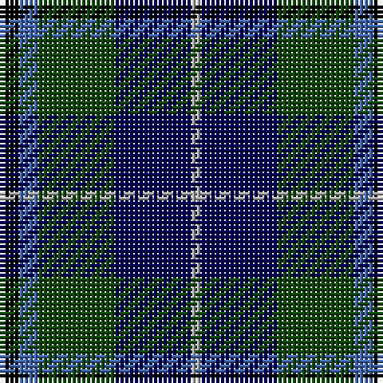

This page is one **sett** — a single exact thread-count. It belongs to the [tartan](/tartans/k2b2dg8db8lr1/)
(the same proportion at any scale), whose colour order is pattern [KBGBY](/stripes/kbgby/).

Sourced from weddslist.  It is a [5 stripe tartan](/stripes/stripes5/).

Original link http://www.weddslist.com/cgi-bin/tartans/pg.pl?source=tinsel

## Thread count
K/4 B4 DG16 DB16 N/2

## Palette

Palette: <strong>Ingles Buchan</strong> <small style="color:#888">(1 of 5 colours)</small>
<table><thead><tr><th>Colour</th><th>Threads</th><th>Shade</th><th>Base</th><th>OKLCh</th></tr></thead><tbody><tr><td>K/</td><td style="text-align:right;font-variant-numeric:tabular-nums">4</td><td><code style="background-color:#000000;">#000000</code> <small style="color:#888">#000000</small></td><td>K <code style="background-color:#000000;">#000000</code></td><td><small style="color:#888">oklch(0.0% 0.000 0.0)</small></td></tr><tr><td>B</td><td style="text-align:right;font-variant-numeric:tabular-nums">4</td><td><code style="background-color:#4367AE;">#4367AE</code> <small style="color:#888">#4367AE</small></td><td>B <code style="background-color:#2A418A;">#2A418A</code></td><td><small style="color:#888">oklch(52.2% 0.120 262.7)</small></td></tr><tr><td>DG</td><td style="text-align:right;font-variant-numeric:tabular-nums">16</td><td><code style="background-color:#11450D;">#11450D</code> <small style="color:#888">#11450D</small></td><td>G <code style="background-color:#006100;">#006100</code></td><td><small style="color:#888">oklch(34.4% 0.101 142.1)</small></td></tr><tr><td>DB</td><td style="text-align:right;font-variant-numeric:tabular-nums">16</td><td><code style="background-color:#000052;">#000052</code> <small style="color:#888">#000052</small></td><td>B <code style="background-color:#2A418A;">#2A418A</code></td><td><small style="color:#888">oklch(19.8% 0.137 264.1)</small></td></tr><tr><td>N/</td><td style="text-align:right;font-variant-numeric:tabular-nums">2</td><td><code style="background-color:#AAAAAA;">#AAAAAA</code> <small style="color:#888">#AAAAAA</small></td><td>Y <code style="background-color:#F2BF00;">#F2BF00</code></td><td><small style="color:#888">oklch(73.8% 0.000 89.9)</small></td></tr></tbody></table>

# Sample pattern

## Nearest tartans

The nearest existing variants by ΔTartan distance, with this tartan at the top so the swatches line up against it.

ΔTartan

Tartan

Sett

—

<a href="/ttd/edit/#slug=k2b2dg8db8lr1~x2">Douglas</a> <a class="nn-out" href="/setts/s5/k2b2dg8db8lr1~x2/" title="open its dictionary page">↗</a>

0.00

<a href="/ttd/edit/#slug=k2b2dg8db8lr1">Douglas</a> <a class="nn-out" href="/setts/s5/k2b2dg8db8lr1/" title="open its dictionary page">↗</a>

0.64

<a href="/ttd/edit/#slug=k4b2dg8db8lr1~x2">Dougles Green</a> <a class="nn-out" href="/setts/s5/k4b2dg8db8lr1~x2/" title="open its dictionary page">↗</a>

0.64

<a href="/ttd/edit/#slug=k4b2dg8db8lr1">Dougles Green</a> <a class="nn-out" href="/setts/s5/k4b2dg8db8lr1/" title="open its dictionary page">↗</a>

0.66

<a href="/ttd/edit/#slug=k7lt3dg18db18w2~x2">Bhatti</a> <a class="nn-out" href="/setts/s5/k7lt3dg18db18w2~x2/" title="open its dictionary page">↗</a>

0.77

<a href="/ttd/edit/#slug=db31b4db5k19g20lo4~x2">Midlothian</a> <a class="nn-out" href="/setts/s6/db31b4db5k19g20lo4~x2/" title="open its dictionary page">↗</a>

0.84

<a href="/ttd/edit/#slug=dg5db2dg9dbi19dr9ly2~x2">Lyle and Scott</a> <a class="nn-out" href="/setts/s6/dg5db2dg9dbi19dr9ly2~x2/" title="open its dictionary page">↗</a>

0.84

<a href="/ttd/edit/#slug=k2g17k16r2db17lr2~x2">Mitchell (Clan)</a> <a class="nn-out" href="/setts/s6/k2g17k16r2db17lr2~x2/" title="open its dictionary page">↗</a>

0.89

<a href="/ttd/edit/#slug=r1db6k3dg6lr1~x2">Davidson of Tulloch</a> <a class="nn-out" href="/setts/s5/r1db6k3dg6lr1~x2/" title="open its dictionary page">↗</a>

0.94

<a href="/ttd/edit/#slug=b32do16dg3o4k28~x2">Corey in Balachuirn</a> <a class="nn-out" href="/setts/s5/b32do16dg3o4k28~x2/" title="open its dictionary page">↗</a>

0.98

<a href="/ttd/edit/#slug=k7r3g30db28lb3~x2">Highlander Highland Laddie</a> <a class="nn-out" href="/setts/s5/k7r3g30db28lb3~x2/" title="open its dictionary page">↗</a>

## Neighbour map

Every grey dot is one of 14359 variants placed by the first two principal components of the ΔTartan feature space (44% of its variance). Red is this tartan; blue dots are its nearest — click one to open its page.

<svg viewBox="0 0 640 380" role="img" style="max-width:100%;height:auto;border:1px solid #e0e0e0;border-radius:4px;display:block" xmlns="http://www.w3.org/2000/svg"><image href="/nn/cloud.v1.png" width="640" height="380"/><a href="/setts/s5/k2b2dg8db8lr1/"><circle cx="182.6" cy="238.6" r="4" fill="#3465a4"><title>Douglas</title></circle></a><a href="/setts/s5/k4b2dg8db8lr1~x2/"><circle cx="147.2" cy="246.4" r="4" fill="#3465a4"><title>Dougles Green</title></circle></a><a href="/setts/s5/k4b2dg8db8lr1/"><circle cx="147.2" cy="246.4" r="4" fill="#3465a4"><title>Dougles Green</title></circle></a><a href="/setts/s5/k7lt3dg18db18w2~x2/"><circle cx="165.3" cy="226.4" r="4" fill="#3465a4"><title>Bhatti</title></circle></a><a href="/setts/s6/db31b4db5k19g20lo4~x2/"><circle cx="191.1" cy="227.9" r="4" fill="#3465a4"><title>Midlothian</title></circle></a><a href="/setts/s6/dg5db2dg9dbi19dr9ly2~x2/"><circle cx="202.9" cy="222.8" r="4" fill="#3465a4"><title>Lyle and Scott</title></circle></a><a href="/setts/s6/k2g17k16r2db17lr2~x2/"><circle cx="163.3" cy="222.6" r="4" fill="#3465a4"><title>Mitchell (Clan)</title></circle></a><a href="/setts/s5/r1db6k3dg6lr1~x2/"><circle cx="140.4" cy="250.7" r="4" fill="#3465a4"><title>Davidson of Tulloch</title></circle></a><a href="/setts/s5/b32do16dg3o4k28~x2/"><circle cx="199.4" cy="230.5" r="4" fill="#3465a4"><title>Corey in Balachuirn</title></circle></a><a href="/setts/s5/k7r3g30db28lb3~x2/"><circle cx="222.2" cy="214.8" r="4" fill="#3465a4"><title>Highlander Highland Laddie</title></circle></a><circle cx="182.6" cy="238.6" r="5" fill="#c00000"/></svg>

ID: /setts/s5/k2b2dg8db8lr1~x2/
