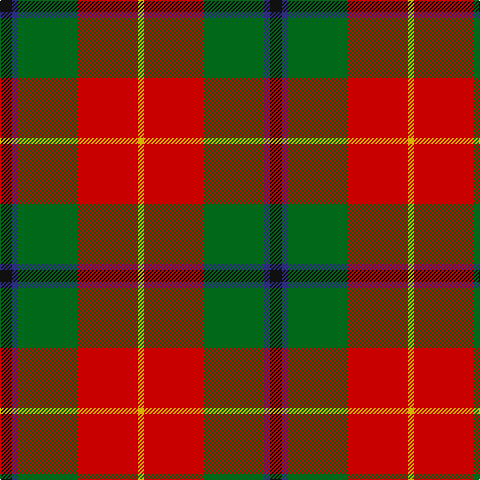

This page is one **sett** — a single exact thread-count. It belongs to the [tartan](/tartans/k2db1g10r10y1/)
(the same proportion at any scale), whose colour order is pattern [KBGRY](/stripes/kbgry/).

Sourced from register-of-tartans.  It is a [5 stripe tartan](/stripes/stripes5/).

Original link https://www.tartanregister.gov.uk/tartanDetails.aspx?ref=4161

2 attestations — the source records this cloth was collapsed from (oldest owns this page)

<ul>
<li>01/01/1980 — Turnbull Dress (register-of-tartans, <a href="https://www.tartanregister.gov.uk/tartanDetails.aspx?ref=4161">record</a>)</li>
<li>pre 1980 — Turnbull Dress (Clan) (tartans-authority, <a href="http://www.tartansauthority.com/tartan-ferret/display/1035/">record</a>)</li>
</ul>

## Register references

External register numbers recorded for this tartan.

- Scottish Register of Tartans: [4161](https://www.tartanregister.gov.uk/tartanDetails.aspx?ref=4161)
- Scottish Tartans Authority (ITI): 1035
- Scottish Tartans World Register: 1035

## Thread count
K/12 DB6 G60 R60 Y/6

## Palette
Each colour and the base-6 reference it is a variant of.

| Colour | Shade | Base |
|---|---|---|
| DB | <code style="background-color:#2C2C80;">#2C2C80</code> `oklch(35.0% 0.138 276.6)` <small>#2C2C80</small> | B <code style="background-color:#2A418A;">#2A418A</code> |
| G | <code style="background-color:#006818;">#006818</code> `oklch(45.0% 0.142 145.0)` <small>#006818</small> | G <code style="background-color:#006100;">#006100</code> |
| K | <code style="background-color:#101010;">#101010</code> `oklch(17.3% 0.000 89.9)` <small>#101010</small> | K <code style="background-color:#000000;">#000000</code> |
| R | <code style="background-color:#C80000;">#C80000</code> `oklch(52.3% 0.215 29.2)` <small>#C80000</small> | R <code style="background-color:#CC0000;">#CC0000</code> |
| Y | <code style="background-color:#D8B000;">#D8B000</code> `oklch(77.1% 0.158 92.3)` <small>#D8B000</small> | Y <code style="background-color:#F2BF00;">#F2BF00</code> |

# Sample pattern

## Nearest tartans

The nearest existing variants by ΔTartan distance, with this tartan at the top so the swatches line up against it.

ΔTartan

Tartan

Sett

—

<a href="/ttd/edit/#slug=k2db1g10r10ly1~x6">Turnbull Dress</a> <a class="nn-out" href="/setts/s5/k2db1g10r10ly1~x6/" title="open its dictionary page">↗</a>

0.69

<a href="/ttd/edit/#slug=r15w1db4ly1g15~x4">Eglinton, Duke of (Artefact)</a> <a class="nn-out" href="/setts/s5/r15w1db4ly1g15~x4/" title="open its dictionary page">↗</a>

0.82

<a href="/ttd/edit/#slug=k5db4g24r21w3~x2">Sachie Hara Scottish Check (Personal)</a> <a class="nn-out" href="/setts/s5/k5db4g24r21w3~x2/" title="open its dictionary page">↗</a>

0.88

<a href="/ttd/edit/#slug=k7db3g28r28ly3~x2">Turnbull, dress</a> <a class="nn-out" href="/setts/s5/k7db3g28r28ly3~x2/" title="open its dictionary page">↗</a>

1.02

<a href="/ttd/edit/#slug=g24b2r25ly2k3~x2">Bronte</a> <a class="nn-out" href="/setts/s5/g24b2r25ly2k3~x2/" title="open its dictionary page">↗</a>

1.05

<a href="/ttd/edit/#slug=w4dg20g10r25b2r2g2~x2">Caledonian Brewery</a> <a class="nn-out" href="/setts/s7/w4dg20g10r25b2r2g2~x2/" title="open its dictionary page">↗</a>

1.05

<a href="/ttd/edit/#slug=k2o20k8dg18o3w2~x2">Celtic Combat</a> <a class="nn-out" href="/setts/s6/k2o20k8dg18o3w2~x2/" title="open its dictionary page">↗</a>

1.11

<a href="/ttd/edit/#slug=db1r12g6ly1g6db1~x4">Cetoloni (Personal)</a> <a class="nn-out" href="/setts/s6/db1r12g6ly1g6db1~x4/" title="open its dictionary page">↗</a>

1.13

<a href="/ttd/edit/#slug=r3db1r12o3dg12lb1dg2~x4">Leckie (Personal)</a> <a class="nn-out" href="/setts/s7/r3db1r12o3dg12lb1dg2~x4/" title="open its dictionary page">↗</a>

1.18

<a href="/ttd/edit/#slug=db6lo25dy16k2db3~x2">Prince of Orange #2</a> <a class="nn-out" href="/setts/s5/db6lo25dy16k2db3~x2/" title="open its dictionary page">↗</a>

1.19

<a href="/ttd/edit/#slug=db4r11db1g8r2g4k1ly2~x4">Craik, of Assington</a> <a class="nn-out" href="/setts/s8/db4r11db1g8r2g4k1ly2~x4/" title="open its dictionary page">↗</a>

## Neighbour map

Every grey dot is one of 14299 variants placed by the first two principal components of the ΔTartan feature space (44% of its variance). Red is this tartan; blue dots are its nearest — click one to open its page.

<svg viewBox="0 0 640 380" role="img" style="max-width:100%;height:auto;border:1px solid #e0e0e0;border-radius:4px;display:block" xmlns="http://www.w3.org/2000/svg"><image href="/nn/cloud.v1.png" width="640" height="380"/><a href="/setts/s5/r15w1db4ly1g15~x4/"><circle cx="250.4" cy="177.2" r="4" fill="#3465a4"><title>Eglinton, Duke of (Artefact)</title></circle></a><a href="/setts/s5/k5db4g24r21w3~x2/"><circle cx="194.2" cy="201.6" r="4" fill="#3465a4"><title>Sachie Hara Scottish Check (Personal)</title></circle></a><a href="/setts/s5/k7db3g28r28ly3~x2/"><circle cx="197.0" cy="188.9" r="4" fill="#3465a4"><title>Turnbull, dress</title></circle></a><a href="/setts/s5/g24b2r25ly2k3~x2/"><circle cx="284.0" cy="182.7" r="4" fill="#3465a4"><title>Bronte</title></circle></a><a href="/setts/s7/w4dg20g10r25b2r2g2~x2/"><circle cx="207.3" cy="158.5" r="4" fill="#3465a4"><title>Caledonian Brewery</title></circle></a><a href="/setts/s6/k2o20k8dg18o3w2~x2/"><circle cx="237.3" cy="204.2" r="4" fill="#3465a4"><title>Celtic Combat</title></circle></a><a href="/setts/s6/db1r12g6ly1g6db1~x4/"><circle cx="288.3" cy="197.8" r="4" fill="#3465a4"><title>Cetoloni (Personal)</title></circle></a><a href="/setts/s7/r3db1r12o3dg12lb1dg2~x4/"><circle cx="275.0" cy="180.8" r="4" fill="#3465a4"><title>Leckie (Personal)</title></circle></a><a href="/setts/s5/db6lo25dy16k2db3~x2/"><circle cx="277.3" cy="200.3" r="4" fill="#3465a4"><title>Prince of Orange #2</title></circle></a><a href="/setts/s8/db4r11db1g8r2g4k1ly2~x4/"><circle cx="188.5" cy="170.1" r="4" fill="#3465a4"><title>Craik, of Assington</title></circle></a><circle cx="235.9" cy="194.0" r="5" fill="#c00000"/></svg>

ID: /setts/s5/k2db1g10r10ly1~x6/
