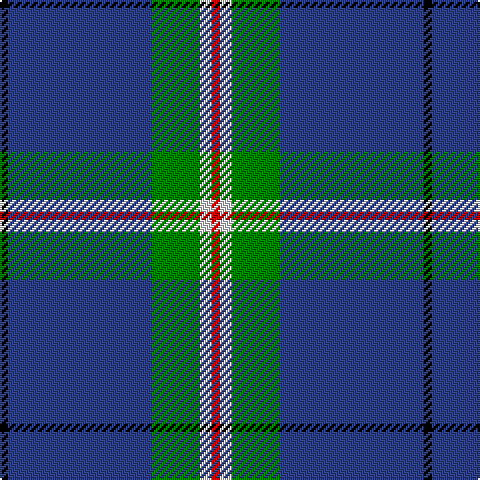

In pattern [KBGWR](/stripes/kbgwr/).

This was sourced from weddslist.  It is a [5 stripe tartan](/stripes/stripes5/).

Original link http://www.weddslist.com/cgi-bin/tartans/pg.pl?source=sts

## Thread count
K/4 B72 G24 LN6 R/4

## Palette
Each colour and the base-6 reference it is a variant of.

| Colour | Shade | Base |
|---|---|---|
| B | <code style="background-color:#304080;">#304080</code> `oklch(39.4% 0.109 270.2)` <small>#304080</small> | B <code style="background-color:#2A418A;">#2A418A</code> |
| G | <code style="background-color:#008000;">#008000</code> `oklch(52.0% 0.177 142.5)` <small>#008000</small> | G <code style="background-color:#006100;">#006100</code> |
| K | <code style="background-color:#000000;">#000000</code> `oklch(0.0% 0.000 0.0)` <small>#000000</small> | K <code style="background-color:#000000;">#000000</code> |
| LN | <code style="background-color:#E0E0E0;">#E0E0E0</code> `oklch(90.7% 0.000 89.9)` <small>#E0E0E0</small> | W <code style="background-color:#F7F7F7;">#F7F7F7</code> |
| R | <code style="background-color:#C00000;">#C00000</code> `oklch(50.7% 0.208 29.2)` <small>#C00000</small> | R <code style="background-color:#CC0000;">#CC0000</code> |

# Sample pattern

## Nearest tartans

The nearest existing variants by ΔTartan distance, with this tartan at the top so the swatches line up against it.

ΔTartan

Tartan

Sett

—

<a href="/ttd/edit/#slug=k2db36g12w3r2~x2">Cleland</a> <a class="nn-out" href="/setts/s5/k2db36g12w3r2~x2/" title="open its dictionary page">↗</a>

1.20

<a href="/ttd/edit/#slug=k2n36g12w3r2~x2">Cleland</a> <a class="nn-out" href="/setts/s5/k2n36g12w3r2~x2/" title="open its dictionary page">↗</a>

1.31

<a href="/ttd/edit/#slug=db30r3db3ly3db3g30db36w5~x2">De Nardi Hunting (Personal)</a> <a class="nn-out" href="/setts/s8/db30r3db3ly3db3g30db36w5~x2/" title="open its dictionary page">↗</a>

1.34

<a href="/ttd/edit/#slug=k30b40ly3b5w2b6~x2">Micron</a> <a class="nn-out" href="/setts/s6/k30b40ly3b5w2b6~x2/" title="open its dictionary page">↗</a>

1.34

<a href="/ttd/edit/#slug=db60dg16w8lo3~x2">MaleHsuHK (Hong Kong) (Personal)</a> <a class="nn-out" href="/setts/s4/db60dg16w8lo3~x2/" title="open its dictionary page">↗</a>

1.35

<a href="/ttd/edit/#slug=lr5k6w2dg7w2dt44w2~x2">Leblant-Macqueron (Personal)</a> <a class="nn-out" href="/setts/s7/lr5k6w2dg7w2dt44w2~x2/" title="open its dictionary page">↗</a>

1.39

<a href="/ttd/edit/#slug=g23db3k8db4g4db56ly8">Tern House</a> <a class="nn-out" href="/setts/s7/g23db3k8db4g4db56ly8/" title="open its dictionary page">↗</a>

1.41

<a href="/ttd/edit/#slug=db26t6dg1o1w2~x2">Special Air Service</a> <a class="nn-out" href="/setts/s5/db26t6dg1o1w2~x2/" title="open its dictionary page">↗</a>

1.41

<a href="/ttd/edit/#slug=db47g14dr5o2r3g7~x2">Round Table of Britain and Ireland, RtbI.</a> <a class="nn-out" href="/setts/s6/db47g14dr5o2r3g7~x2/" title="open its dictionary page">↗</a>

1.43

<a href="/ttd/edit/#slug=b64k3g14k4b4k12lo4~x2">Murray of Elibank</a> <a class="nn-out" href="/setts/s7/b64k3g14k4b4k12lo4~x2/" title="open its dictionary page">↗</a>

1.44

<a href="/ttd/edit/#slug=db20dy1db1dy1dg8k1w3~x2">Chestico</a> <a class="nn-out" href="/setts/s7/db20dy1db1dy1dg8k1w3~x2/" title="open its dictionary page">↗</a>

## Neighbour map

Every grey dot is one of 14299 variants placed by the first two principal components of the ΔTartan feature space (44% of its variance). Red is this tartan; blue dots are its nearest — click one to open its page.

<svg viewBox="0 0 640 380" role="img" style="max-width:100%;height:auto;border:1px solid #e0e0e0;border-radius:4px;display:block" xmlns="http://www.w3.org/2000/svg"><image href="/nn/cloud.v1.png" width="640" height="380"/><a href="/setts/s5/k2n36g12w3r2~x2/"><circle cx="406.7" cy="177.5" r="4" fill="#3465a4"><title>Cleland</title></circle></a><a href="/setts/s8/db30r3db3ly3db3g30db36w5~x2/"><circle cx="343.2" cy="175.3" r="4" fill="#3465a4"><title>De Nardi Hunting (Personal)</title></circle></a><a href="/setts/s6/k30b40ly3b5w2b6~x2/"><circle cx="355.6" cy="175.0" r="4" fill="#3465a4"><title>Micron</title></circle></a><a href="/setts/s4/db60dg16w8lo3~x2/"><circle cx="421.6" cy="198.4" r="4" fill="#3465a4"><title>MaleHsuHK (Hong Kong) (Personal)</title></circle></a><a href="/setts/s7/lr5k6w2dg7w2dt44w2~x2/"><circle cx="364.5" cy="123.4" r="4" fill="#3465a4"><title>Leblant-Macqueron (Personal)</title></circle></a><a href="/setts/s7/g23db3k8db4g4db56ly8/"><circle cx="371.2" cy="174.9" r="4" fill="#3465a4"><title>Tern House</title></circle></a><a href="/setts/s5/db26t6dg1o1w2~x2/"><circle cx="453.6" cy="149.0" r="4" fill="#3465a4"><title>Special Air Service</title></circle></a><a href="/setts/s6/db47g14dr5o2r3g7~x2/"><circle cx="360.0" cy="155.0" r="4" fill="#3465a4"><title>Round Table of Britain and Ireland, RtbI.</title></circle></a><a href="/setts/s7/b64k3g14k4b4k12lo4~x2/"><circle cx="413.7" cy="161.7" r="4" fill="#3465a4"><title>Murray of Elibank</title></circle></a><a href="/setts/s7/db20dy1db1dy1dg8k1w3~x2/"><circle cx="353.2" cy="144.6" r="4" fill="#3465a4"><title>Chestico</title></circle></a><circle cx="388.0" cy="168.6" r="5" fill="#c00000"/></svg>

ID: /setts/s5/k2db36g12w3r2~x2/
