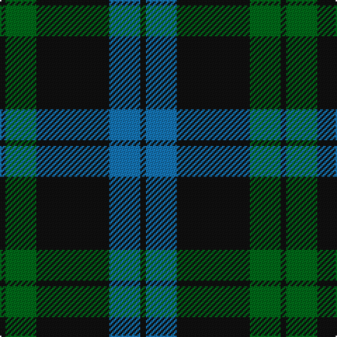

This page is one **sett** — a single exact thread-count. It belongs to the [tartan](/tartans/k2g11k26b11k2/)
(the same proportion at any scale), whose colour order is pattern [KBKGK](/stripes/kbkgk/).

Sourced from register-of-tartans.  It is a [5 stripe tartan](/stripes/stripes5/).

Original link https://www.tartanregister.gov.uk/tartanDetails.aspx?ref=521

2 attestations — the source records this cloth was collapsed from (oldest owns this page)

<ul>
<li>01/01/1770 — Campbell of Loch Awe (register-of-tartans, <a href="https://www.tartanregister.gov.uk/tartanDetails.aspx?ref=521">record</a>)</li>
<li>1770 — Campbell of Loch Awe (Clan) (tartans-authority, <a href="http://www.tartansauthority.com/tartan-ferret/display/13/">record</a>)</li>
</ul>

## Register references

External register numbers recorded for this tartan.

- Scottish Register of Tartans: [521](https://www.tartanregister.gov.uk/tartanDetails.aspx?ref=521)
- Scottish Tartans Authority (ITI): 13
- Scottish Tartans World Register: 13

## Thread count
K/4 G22 K52 B22 K/4

## Palette

Palette: <strong>Tartan Register</strong>
<table><thead><tr><th>Colour</th><th>Threads</th><th>Shade</th><th>Base</th><th>OKLCh</th></tr></thead><tbody><tr><td>K/</td><td style="text-align:right;font-variant-numeric:tabular-nums">4</td><td><code style="background-color:#101010;">#101010</code> <small style="color:#888">#101010</small></td><td>K <code style="background-color:#000000;">#000000</code></td><td><small style="color:#888">oklch(17.3% 0.000 89.9)</small></td></tr><tr><td>G</td><td style="text-align:right;font-variant-numeric:tabular-nums">22</td><td><code style="background-color:#006818;">#006818</code> <small style="color:#888">#006818</small></td><td>G <code style="background-color:#006100;">#006100</code></td><td><small style="color:#888">oklch(45.0% 0.142 145.0)</small></td></tr><tr><td>K</td><td style="text-align:right;font-variant-numeric:tabular-nums">52</td><td><code style="background-color:#101010;">#101010</code> <small style="color:#888">#101010</small></td><td>K <code style="background-color:#000000;">#000000</code></td><td><small style="color:#888">oklch(17.3% 0.000 89.9)</small></td></tr><tr><td>B</td><td style="text-align:right;font-variant-numeric:tabular-nums">22</td><td><code style="background-color:#1474B4;">#1474B4</code> <small style="color:#888">#1474B4</small></td><td>B <code style="background-color:#2A418A;">#2A418A</code></td><td><small style="color:#888">oklch(54.0% 0.129 245.1)</small></td></tr><tr><td>K/</td><td style="text-align:right;font-variant-numeric:tabular-nums">4</td><td><code style="background-color:#101010;">#101010</code> <small style="color:#888">#101010</small></td><td>K <code style="background-color:#000000;">#000000</code></td><td><small style="color:#888">oklch(17.3% 0.000 89.9)</small></td></tr></tbody></table>

# Sample pattern

## Nearest tartans

The nearest existing variants by ΔTartan distance, with this tartan at the top so the swatches line up against it.

ΔTartan

Tartan

Sett

—

<a href="/ttd/edit/#slug=k2g11k26b11k2~x2">Campbell of Loch Awe</a> <a class="nn-out" href="/setts/s5/k2g11k26b11k2~x2/" title="open its dictionary page">↗</a>

1.07

<a href="/ttd/edit/#slug=db26r6g16db8g3r2~x2">Perthshire (New) District Tartan Tartan Number: 2188. Earliest known date: 1992 The New Perthshire District tartan has established itself through use and wont since 1992. It provides a useful alternative to the Drummond pattern which was always closely associated with Perthshire. See products available Copyright © Blair Urquhart, Comrie, 2015</a> <a class="nn-out" href="/setts/s6/db26r6g16db8g3r2~x2/" title="open its dictionary page">↗</a>

1.09

<a href="/ttd/edit/#slug=dg4db12r3db12dg32lr4~x2">MacIntyre LC</a> <a class="nn-out" href="/setts/s6/dg4db12r3db12dg32lr4~x2/" title="open its dictionary page">↗</a>

1.09

<a href="/ttd/edit/#slug=dg4db12r3db12dg32lr4">MacIntyre LC</a> <a class="nn-out" href="/setts/s6/dg4db12r3db12dg32lr4/" title="open its dictionary page">↗</a>

1.14

<a href="/ttd/edit/#slug=g10k2dp5g1~x8">Bumbee #1 (Fashion)</a> <a class="nn-out" href="/setts/s4/g10k2dp5g1~x8/" title="open its dictionary page">↗</a>

1.16

<a href="/ttd/edit/#slug=k9n3k28n25w2~x2">Press &amp; Journal</a> <a class="nn-out" href="/setts/s5/k9n3k28n25w2~x2/" title="open its dictionary page">↗</a>

1.18

<a href="/ttd/edit/#slug=dg4db12r3db12dg32lb4">MacIntyre L</a> <a class="nn-out" href="/setts/s6/dg4db12r3db12dg32lb4/" title="open its dictionary page">↗</a>

1.28

<a href="/ttd/edit/#slug=k51g5r15g37k17r6g7~x2">Cadence Design Systems (Corporate)</a> <a class="nn-out" href="/setts/s7/k51g5r15g37k17r6g7~x2/" title="open its dictionary page">↗</a>

1.30

<a href="/ttd/edit/#slug=g47r3g6db35lo3~x2">Gracie (Name)</a> <a class="nn-out" href="/setts/s5/g47r3g6db35lo3~x2/" title="open its dictionary page">↗</a>

1.34

<a href="/ttd/edit/#slug=db51dg5r15dg37db17r6dg5~x2">Cadence</a> <a class="nn-out" href="/setts/s7/db51dg5r15dg37db17r6dg5~x2/" title="open its dictionary page">↗</a>

1.35

<a href="/ttd/edit/#slug=db1g12db4lb1db4g4db1~x4">St. Dennis &amp; Cranley School</a> <a class="nn-out" href="/setts/s7/db1g12db4lb1db4g4db1~x4/" title="open its dictionary page">↗</a>

## Neighbour map

Every grey dot is one of 14359 variants placed by the first two principal components of the ΔTartan feature space (44% of its variance). Red is this tartan; blue dots are its nearest — click one to open its page.

<svg viewBox="0 0 640 380" role="img" style="max-width:100%;height:auto;border:1px solid #e0e0e0;border-radius:4px;display:block" xmlns="http://www.w3.org/2000/svg"><image href="/nn/cloud.v1.png" width="640" height="380"/><a href="/setts/s6/db26r6g16db8g3r2~x2/"><circle cx="352.7" cy="237.6" r="4" fill="#3465a4"><title>Perthshire (New) District Tartan Tartan Number: 2188. Earliest known date: 1992 The New Perthshire District tartan has established itself through use and wont since 1992. It provides a useful alternative to the Drummond pattern which was always closely associated with Perthshire. See products available Copyright © Blair Urquhart, Comrie, 2015</title></circle></a><a href="/setts/s6/dg4db12r3db12dg32lr4~x2/"><circle cx="322.0" cy="229.6" r="4" fill="#3465a4"><title>MacIntyre LC</title></circle></a><a href="/setts/s6/dg4db12r3db12dg32lr4/"><circle cx="322.0" cy="229.6" r="4" fill="#3465a4"><title>MacIntyre LC</title></circle></a><a href="/setts/s4/g10k2dp5g1~x8/"><circle cx="355.3" cy="264.9" r="4" fill="#3465a4"><title>Bumbee #1 (Fashion)</title></circle></a><a href="/setts/s5/k9n3k28n25w2~x2/"><circle cx="370.4" cy="242.8" r="4" fill="#3465a4"><title>Press &amp; Journal</title></circle></a><a href="/setts/s6/dg4db12r3db12dg32lb4/"><circle cx="301.0" cy="219.4" r="4" fill="#3465a4"><title>MacIntyre L</title></circle></a><a href="/setts/s7/k51g5r15g37k17r6g7~x2/"><circle cx="278.9" cy="227.9" r="4" fill="#3465a4"><title>Cadence Design Systems (Corporate)</title></circle></a><a href="/setts/s5/g47r3g6db35lo3~x2/"><circle cx="356.4" cy="211.1" r="4" fill="#3465a4"><title>Gracie (Name)</title></circle></a><a href="/setts/s7/db51dg5r15dg37db17r6dg5~x2/"><circle cx="311.1" cy="240.6" r="4" fill="#3465a4"><title>Cadence</title></circle></a><a href="/setts/s7/db1g12db4lb1db4g4db1~x4/"><circle cx="369.2" cy="225.7" r="4" fill="#3465a4"><title>St. Dennis &amp; Cranley School</title></circle></a><circle cx="350.1" cy="245.0" r="5" fill="#c00000"/></svg>

ID: /setts/s5/k2g11k26b11k2~x2/
