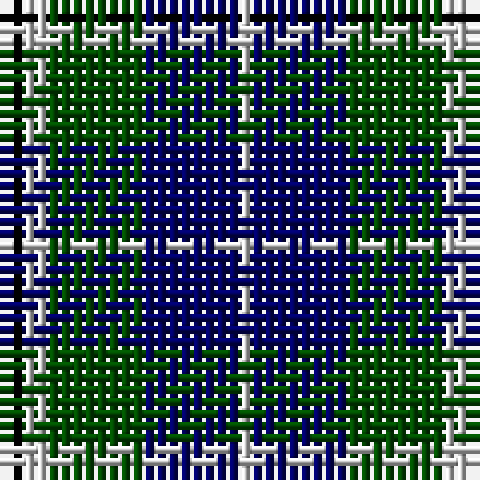

In pattern [KWGBW](/stripes/kwgbw/).

This was sourced from weddslist.  It is a [5 stripe tartan](/stripes/stripes5/).

Original link http://www.weddslist.com/cgi-bin/tartans/pg.pl?source=rb

## Thread count
K/2 N2 G8 DB8 N/1

## Palette
Each colour and the base-6 reference it is a variant of.

| Colour | Shade | Base |
|---|---|---|
| DB | <code style="background-color:#000064;">#000064</code> `oklch(22.7% 0.158 264.1)` <small>#000064</small> | B <code style="background-color:#2A418A;">#2A418A</code> |
| G | <code style="background-color:#004C00;">#004C00</code> `oklch(36.1% 0.123 142.5)` <small>#004C00</small> | G <code style="background-color:#006100;">#006100</code> |
| K | <code style="background-color:#000000;">#000000</code> `oklch(0.0% 0.000 0.0)` <small>#000000</small> | K <code style="background-color:#000000;">#000000</code> |
| N | <code style="background-color:#D0D0D0;">#D0D0D0</code> `oklch(85.8% 0.000 89.9)` <small>#D0D0D0</small> | W <code style="background-color:#F7F7F7;">#F7F7F7</code> |

# Sample pattern

## Nearest tartans

The nearest existing variants by ΔTartan distance, with this tartan at the top so the swatches line up against it.

ΔTartan

Tartan

Sett

—

<a href="/ttd/edit/#slug=k2lb2dg8db8lb1">Douglas</a> <a class="nn-out" href="/setts/s5/k2lb2dg8db8lb1/" title="open its dictionary page">↗</a>

0.64

<a href="/ttd/edit/#slug=k4lb2dg8db8lb1">Douglas Green</a> <a class="nn-out" href="/setts/s5/k4lb2dg8db8lb1/" title="open its dictionary page">↗</a>

0.88

<a href="/ttd/edit/#slug=w1db9k9g9k2w1~x4">MacNeil 1</a> <a class="nn-out" href="/setts/s6/w1db9k9g9k2w1~x4/" title="open its dictionary page">↗</a>

0.88

<a href="/ttd/edit/#slug=db2k2db12k11g12w2~x2">Campbell, The White Stripe</a> <a class="nn-out" href="/setts/s6/db2k2db12k11g12w2~x2/" title="open its dictionary page">↗</a>

0.89

<a href="/ttd/edit/#slug=db2k2db12k8g11r2~x2">Murray</a> <a class="nn-out" href="/setts/s6/db2k2db12k8g11r2~x2/" title="open its dictionary page">↗</a>

0.93

<a href="/ttd/edit/#slug=db3g28db3k16db28r3">Flower of Scotland</a> <a class="nn-out" href="/setts/s6/db3g28db3k16db28r3/" title="open its dictionary page">↗</a>

0.95

<a href="/ttd/edit/#slug=t1db11k11g11k2t1~x2">Unnamed, No 59</a> <a class="nn-out" href="/setts/s6/t1db11k11g11k2t1~x2/" title="open its dictionary page">↗</a>

0.96

<a href="/ttd/edit/#slug=w4db4g22k20db20w3">Unnamed, No 26</a> <a class="nn-out" href="/setts/s6/w4db4g22k20db20w3/" title="open its dictionary page">↗</a>

0.96

<a href="/ttd/edit/#slug=db3g12k13w2db13w3~x2">Herd/Hurd</a> <a class="nn-out" href="/setts/s6/db3g12k13w2db13w3~x2/" title="open its dictionary page">↗</a>

1.01

<a href="/ttd/edit/#slug=r2db9k5g6db1~x4">Frobo Nairn</a> <a class="nn-out" href="/setts/s5/r2db9k5g6db1~x4/" title="open its dictionary page">↗</a>

1.04

<a href="/ttd/edit/#slug=k2g12k11db12w1~x2">MacKirdy</a> <a class="nn-out" href="/setts/s5/k2g12k11db12w1~x2/" title="open its dictionary page">↗</a>

## Neighbour map

Every grey dot is one of 14299 variants placed by the first two principal components of the ΔTartan feature space (44% of its variance). Red is this tartan; blue dots are its nearest — click one to open its page.

<svg viewBox="0 0 640 380" role="img" style="max-width:100%;height:auto;border:1px solid #e0e0e0;border-radius:4px;display:block" xmlns="http://www.w3.org/2000/svg"><image href="/nn/cloud.v1.png" width="640" height="380"/><a href="/setts/s5/k4lb2dg8db8lb1/"><circle cx="135.9" cy="243.1" r="4" fill="#3465a4"><title>Douglas Green</title></circle></a><a href="/setts/s6/w1db9k9g9k2w1~x4/"><circle cx="146.6" cy="216.6" r="4" fill="#3465a4"><title>MacNeil 1</title></circle></a><a href="/setts/s6/db2k2db12k11g12w2~x2/"><circle cx="129.7" cy="236.0" r="4" fill="#3465a4"><title>Campbell, The White Stripe</title></circle></a><a href="/setts/s6/db2k2db12k8g11r2~x2/"><circle cx="152.4" cy="240.0" r="4" fill="#3465a4"><title>Murray</title></circle></a><a href="/setts/s6/db3g28db3k16db28r3/"><circle cx="207.2" cy="216.0" r="4" fill="#3465a4"><title>Flower of Scotland</title></circle></a><a href="/setts/s6/t1db11k11g11k2t1~x2/"><circle cx="167.6" cy="212.4" r="4" fill="#3465a4"><title>Unnamed, No 59</title></circle></a><a href="/setts/s6/w4db4g22k20db20w3/"><circle cx="118.2" cy="224.4" r="4" fill="#3465a4"><title>Unnamed, No 26</title></circle></a><a href="/setts/s6/db3g12k13w2db13w3~x2/"><circle cx="126.3" cy="236.3" r="4" fill="#3465a4"><title>Herd/Hurd</title></circle></a><a href="/setts/s5/r2db9k5g6db1~x4/"><circle cx="186.4" cy="247.5" r="4" fill="#3465a4"><title>Frobo Nairn</title></circle></a><a href="/setts/s5/k2g12k11db12w1~x2/"><circle cx="161.3" cy="227.2" r="4" fill="#3465a4"><title>MacKirdy</title></circle></a><circle cx="168.2" cy="233.3" r="5" fill="#c00000"/></svg>

ID: /setts/s5/k2lb2dg8db8lb1/
