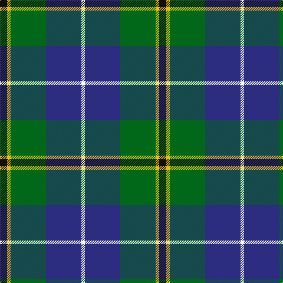

In pattern [KYGBW](/stripes/kygbw/).

This was sourced from register-of-tartans.  It is a [5 stripe tartan](/stripes/stripes5/).

Original link https://www.tartanregister.gov.uk/tartanDetails.aspx?ref=4163

## Also known as

This cloth is also recorded under:

- Turnbull Hunting #2

## Attestations

This cloth appears in 2 source records; the oldest owns this page.

- 01/01/1983 — Turnbull Hunting (1983) #2 (register-of-tartans, [record](https://www.tartanregister.gov.uk/tartanDetails.aspx?ref=4163))
- 1983 — Turnbull Hunting (Clan) (tartans-authority, [record](http://www.tartansauthority.com/tartan-ferret/display/1265/))

## Register references

External register numbers recorded for this tartan.

- Scottish Register of Tartans: [4163](https://www.tartanregister.gov.uk/tartanDetails.aspx?ref=4163)
- Scottish Tartans Authority (ITI): 1265
- Scottish Tartans World Register: 1265

## Thread count
K/12 Y6 G60 DB60 W/6

## Palette
Each colour and its ΔE from the base-6 reference it is a variant of.

| Colour | Shade | Base | ΔE (OKLab) |
|---|---|---|---|
| DB | <code style="background-color:#2C2C80;">#2C2C80</code> `#2C2C80` | B <code style="background-color:#2A418A;">#2A418A</code> | 0.06 |
| G | <code style="background-color:#006818;">#006818</code> `#006818` | G <code style="background-color:#006100;">#006100</code> | 0.02 |
| K | <code style="background-color:#101010;">#101010</code> `#101010` | K <code style="background-color:#000000;">#000000</code> | 0.17 |
| W | <code style="background-color:#FCFCFC;">#FCFCFC</code> `#FCFCFC` | W <code style="background-color:#F7F7F7;">#F7F7F7</code> | 0.01 |
| Y | <code style="background-color:#E8C000;">#E8C000</code> `#E8C000` | Y <code style="background-color:#F2BF00;">#F2BF00</code> | 0.02 |

# Sample pattern

## Nearest tartans

The nearest existing variants by ΔTartan distance.

1. [Turnbull Hunting (Name)](/setts/s5/r2ly1g10db10w1~x6/) — ΔT 0.46
1. [Highlander, Highland Laddie Kilts](/setts/s5/k7m3g29db29w3~x2/) — ΔT 0.47
1. [Douglas, Green (Wilsons)](/setts/s5/k1db1g8db8w1~x4/) — ΔT 0.51
1. [Highlander Highland Laddie](/setts/s5/k7r3g30db28lb3~x2/) — ΔT 0.65
1. [Douglas](/setts/s5/k1t1g8db8w1~x4/) — ΔT 0.67
1. [DeLoughery (Personal)](/setts/s6/db20k6lo4db3g20w2~x2/) — ΔT 0.68
1. [Carmichael](/setts/s6/k5g32db32r3db3ly3~x2/) — ΔT 0.76
1. [Inglis (Name)](/setts/s6/lr4g24db10r3db12lo4~x2/) — ΔT 0.77
1. [Turnbull, hunting](/setts/s5/k7ly3g28db28w3~x2/) — ΔT 0.79
1. [Bhatti (Name)](/setts/s5/k7lb3g18db18w2~x2/) — ΔT 0.82

## Neighbour map

Every grey dot is one of 14299 variants placed by the first two principal components of the ΔTartan feature space (44% of its variance). Red is this tartan; blue dots are its nearest — click one to open its page.

<svg viewBox="0 0 640 380" role="img" style="max-width:100%;height:auto;border:1px solid #e0e0e0;border-radius:4px;display:block" xmlns="http://www.w3.org/2000/svg"><image href="/nn/cloud.v1.png" width="640" height="380"/><a href="/setts/s5/r2ly1g10db10w1~x6/"><circle cx="220.9" cy="202.5" r="4" fill="#3465a4"><title>Turnbull Hunting (Name)</title></circle></a><a href="/setts/s5/k7m3g29db29w3~x2/"><circle cx="198.4" cy="204.9" r="4" fill="#3465a4"><title>Highlander, Highland Laddie Kilts</title></circle></a><a href="/setts/s5/k1db1g8db8w1~x4/"><circle cx="219.2" cy="217.1" r="4" fill="#3465a4"><title>Douglas, Green (Wilsons)</title></circle></a><a href="/setts/s5/k7r3g30db28lb3~x2/"><circle cx="222.4" cy="213.7" r="4" fill="#3465a4"><title>Highlander Highland Laddie</title></circle></a><a href="/setts/s5/k1t1g8db8w1~x4/"><circle cx="210.4" cy="211.7" r="4" fill="#3465a4"><title>Douglas</title></circle></a><a href="/setts/s6/db20k6lo4db3g20w2~x2/"><circle cx="206.8" cy="203.1" r="4" fill="#3465a4"><title>DeLoughery (Personal)</title></circle></a><a href="/setts/s6/k5g32db32r3db3ly3~x2/"><circle cx="250.9" cy="188.4" r="4" fill="#3465a4"><title>Carmichael</title></circle></a><a href="/setts/s6/lr4g24db10r3db12lo4~x2/"><circle cx="183.4" cy="208.8" r="4" fill="#3465a4"><title>Inglis (Name)</title></circle></a><a href="/setts/s5/k7ly3g28db28w3~x2/"><circle cx="185.7" cy="202.4" r="4" fill="#3465a4"><title>Turnbull, hunting</title></circle></a><a href="/setts/s5/k7lb3g18db18w2~x2/"><circle cx="167.9" cy="220.5" r="4" fill="#3465a4"><title>Bhatti (Name)</title></circle></a><circle cx="215.6" cy="204.5" r="5" fill="#c00000"/></svg>

ID: /setts/s5/k2ly1g10db10w1~x6/
