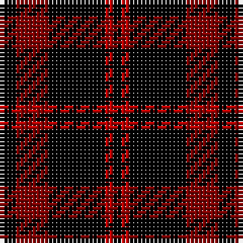

In pattern [KRKRK](/stripes/krkrk/).

This was sourced from weddslist.  It is a [5 stripe tartan](/stripes/stripes5/).

Original link http://www.weddslist.com/cgi-bin/tartans/pg.pl?source=sts

## Thread count
K/4 DR8 K14 R2 K/2

## Palette
Each colour and the base-6 reference it is a variant of.

| Colour | Shade | Base |
|---|---|---|
| DR | <code style="background-color:#800000;">#800000</code> `oklch(37.7% 0.155 29.2)` <small>#800000</small> | R <code style="background-color:#CC0000;">#CC0000</code> |
| K | <code style="background-color:#000000;">#000000</code> `oklch(0.0% 0.000 0.0)` <small>#000000</small> | K <code style="background-color:#000000;">#000000</code> |
| R | <code style="background-color:#C00000;">#C00000</code> `oklch(50.7% 0.208 29.2)` <small>#C00000</small> | R <code style="background-color:#CC0000;">#CC0000</code> |

# Sample pattern

## Nearest tartans

The nearest existing variants by ΔTartan distance.

1. [Campbell of Lochlane](/setts/s7/k2r1k6r6k1r1k1~x4/) — ΔT 1.55
1. [MacLeod of Raasay](/setts/s5/k6r1k6r9k1~x4/) — ΔT 1.81
1. [Black (symmetrical)](/setts/s6/k17r6k2lb6k17lo2~x2/) — ΔT 1.91
1. [Cameron, Black & Red (dress)](/setts/s6/k1r4k1r4k13r1~x4/) — ΔT 1.93
1. [Benson (New England)](/setts/s7/k16b2k8r3lr3r3k8~x2/) — ΔT 1.97
1. [MacQueen](/setts/s6/k2r6k2r6k12ly1~x2/) — ΔT 2.02
1. [Justus Family Tartan Tartan Number: 2100. Earliest known date: 1990 Submitted as the Justus family sett but awaits the approval of the proposed Justus Family Society of North America. Sample supplied in 9 tpi. See products available Copyright © Blair Urquhart, Comrie, 2015](/setts/s7/db1k4r1k1ly1k4db1~x6/) — ΔT 2.05
1. [Black 1990 (Name)](/setts/s6/k17r6k2w6k17lo2~x2/) — ΔT 2.05
1. [Unidentified Kirtle](/setts/s5/k55r18k4r18k38/) — ΔT 2.06
1. [Wallace](/setts/s4/k1r8k8ly1~x2/) — ΔT 2.06

## Neighbour map

Every grey dot is one of 14299 variants placed by the first two principal components of the ΔTartan feature space (44% of its variance). Red is this tartan; blue dots are its nearest — click one to open its page.

<svg viewBox="0 0 640 380" role="img" style="max-width:100%;height:auto;border:1px solid #e0e0e0;border-radius:4px;display:block" xmlns="http://www.w3.org/2000/svg"><image href="/nn/cloud.v1.png" width="640" height="380"/><a href="/setts/s7/k2r1k6r6k1r1k1~x4/"><circle cx="355.8" cy="257.4" r="4" fill="#3465a4"><title>Campbell of Lochlane</title></circle></a><a href="/setts/s5/k6r1k6r9k1~x4/"><circle cx="348.3" cy="259.3" r="4" fill="#3465a4"><title>MacLeod of Raasay</title></circle></a><a href="/setts/s6/k17r6k2lb6k17lo2~x2/"><circle cx="381.5" cy="227.4" r="4" fill="#3465a4"><title>Black (symmetrical)</title></circle></a><a href="/setts/s6/k1r4k1r4k13r1~x4/"><circle cx="417.0" cy="213.1" r="4" fill="#3465a4"><title>Cameron, Black &amp; Red (dress)</title></circle></a><a href="/setts/s7/k16b2k8r3lr3r3k8~x2/"><circle cx="403.6" cy="228.2" r="4" fill="#3465a4"><title>Benson (New England)</title></circle></a><a href="/setts/s6/k2r6k2r6k12ly1~x2/"><circle cx="324.5" cy="212.7" r="4" fill="#3465a4"><title>MacQueen</title></circle></a><a href="/setts/s7/db1k4r1k1ly1k4db1~x6/"><circle cx="336.0" cy="255.8" r="4" fill="#3465a4"><title>Justus Family Tartan Tartan Number: 2100. Earliest known date: 1990 Submitted as the Justus family sett but awaits the approval of the proposed Justus Family Society of North America. Sample supplied in 9 tpi. See products available Copyright © Blair Urquhart, Comrie, 2015</title></circle></a><a href="/setts/s6/k17r6k2w6k17lo2~x2/"><circle cx="372.1" cy="222.4" r="4" fill="#3465a4"><title>Black 1990 (Name)</title></circle></a><a href="/setts/s5/k55r18k4r18k38/"><circle cx="469.6" cy="259.9" r="4" fill="#3465a4"><title>Unidentified Kirtle</title></circle></a><a href="/setts/s4/k1r8k8ly1~x2/"><circle cx="296.4" cy="245.8" r="4" fill="#3465a4"><title>Wallace</title></circle></a><circle cx="387.4" cy="266.4" r="5" fill="#c00000"/></svg>

ID: /setts/s5/k2r4k7r1k1~x2/
