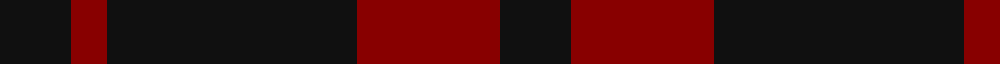

In pattern [KRKRK](/patterns/krkrk/).

This was sourced from register-of-tartans.  It is a [5 stripes tartan](/stripes/stripes5/).

Original link https://www.tartanregister.gov.uk/tartanDetails.aspx?ref=3545

## Attestations

This cloth appears in 2 source records; the oldest owns this page.

- 01/01/2002 — Romsdal Tresfjord (register-of-tartans, [record](https://www.tartanregister.gov.uk/tartanDetails.aspx?ref=3545))
- pre 2002 — Romsdal Tresfjord District (Artefact (tartans-authority, [record](http://www.tartansauthority.com/tartan-ferret/display/2088/))

## Thread count
K/4 DR2 K14 DR8 K/4

## Palette
Each colour and its ΔE from the base-6 reference it is a variant of.

| Colour | Shade | Base | ΔE (OKLab) |
|---|---|---|---|
| DR | <code style="background-color:#880000;">#880000</code> `#880000` | R <code style="background-color:#CC0000;">#CC0000</code> | 0.15 |
| K | <code style="background-color:#101010;">#101010</code> `#101010` | K <code style="background-color:#000000;">#000000</code> | 0.17 |

# Sample pattern

## Nearest tartans

The nearest existing variants by ΔTartan distance.

1. [Wcwm 9275-1333-2](/setts/s4/k20r3k20r20x2~k101010-r880000/) — ΔT 1.19
1. [Leonard Hunting](/setts/s6/k10b5k30b5k10b9x4~b6c006c-k101010/) — ΔT 1.28
1. [Leonard Hunting (Name)](/setts/s4/k30b5k10b9x4~b6c006c-k101010/) — ΔT 1.37
1. [Clan Anord (Corporate)](/setts/s4/k3r20k20r3x2~k101010-r880000/) — ΔT 1.88
1. [Lendrum (Black & Red) or MacFarlane](/setts/s4/k12r7k1r9x4~k101010-r880000/) — ΔT 1.89
1. [Spirit of Glyndwr Grey (Fashion)](/setts/s8/k24b18k11b4k11b18k53b4~b5c5c5c-k101010/) — ΔT 1.92
1. [MacAn of Lurgyvallan (Hose)](/setts/s6/r9k1r5g6r4k2x4~g006818-k101010-r880000/) — ΔT 2.03
1. [Grey Spirit Fashion Tartan Tartan Number: 6594. Earliest known date: 01/03/2005 A fashion tartan from ACS Clothing of Glasgow for use in their kilt hire business. Woven by Lochcarron. The grey is actually a grey/black marl (mixture) which can't be shown graphically. See products available Copyright © Blair Urquhart, Comrie, 2015](/setts/s6/b6k16b6k16b45k4x2~b5f5f5f-k1e1a10/) — ΔT 2.08
1. [Freedom of Scotland](/setts/s6/k15b7k6b11k50b4x2~b5c5c5c-k101010/) — ΔT 2.10
1. [Spirit of Glyndwr Gold (Fashion)](/setts/s8/k24b18k11b4k11b18k53r4~b5c5c5c-k101010-rc80000/) — ΔT 2.10

## Neighbour map

Every grey dot is one of 15726 variants placed by the first two principal components of the ΔTartan feature space (44% of its variance). Red is this tartan; blue dots are its nearest — click one to open its page.

<svg viewBox="0 0 640 380" role="img" style="max-width:100%;height:auto;border:1px solid #e0e0e0;border-radius:4px;display:block" xmlns="http://www.w3.org/2000/svg"><image href="/nn/cloud.v1.png" width="640" height="380"/><a href="/setts/s4/k20r3k20r20x2~k101010-r880000/"><circle cx="427.4" cy="347.4" r="4" fill="#3465a4"><title>Wcwm 9275-1333-2</title></circle></a><a href="/setts/s6/k10b5k30b5k10b9x4~b6c006c-k101010/"><circle cx="510.9" cy="316.6" r="4" fill="#3465a4"><title>Leonard Hunting</title></circle></a><a href="/setts/s4/k30b5k10b9x4~b6c006c-k101010/"><circle cx="530.0" cy="338.2" r="4" fill="#3465a4"><title>Leonard Hunting (Name)</title></circle></a><a href="/setts/s4/k3r20k20r3x2~k101010-r880000/"><circle cx="397.5" cy="309.6" r="4" fill="#3465a4"><title>Clan Anord (Corporate)</title></circle></a><a href="/setts/s4/k12r7k1r9x4~k101010-r880000/"><circle cx="420.4" cy="307.4" r="4" fill="#3465a4"><title>Lendrum (Black &amp; Red) or MacFarlane</title></circle></a><a href="/setts/s8/k24b18k11b4k11b18k53b4~b5c5c5c-k101010/"><circle cx="487.7" cy="258.2" r="4" fill="#3465a4"><title>Spirit of Glyndwr Grey (Fashion)</title></circle></a><a href="/setts/s6/r9k1r5g6r4k2x4~g006818-k101010-r880000/"><circle cx="422.3" cy="277.1" r="4" fill="#3465a4"><title>MacAn of Lurgyvallan (Hose)</title></circle></a><a href="/setts/s6/b6k16b6k16b45k4x2~b5f5f5f-k1e1a10/"><circle cx="459.2" cy="266.0" r="4" fill="#3465a4"><title>Grey Spirit Fashion Tartan Tartan Number: 6594. Earliest known date: 01/03/2005 A fashion tartan from ACS Clothing of Glasgow for use in their kilt hire business. Woven by Lochcarron. The grey is actually a grey/black marl (mixture) which can't be shown graphically. See products available Copyright © Blair Urquhart, Comrie, 2015</title></circle></a><a href="/setts/s6/k15b7k6b11k50b4x2~b5c5c5c-k101010/"><circle cx="563.7" cy="265.7" r="4" fill="#3465a4"><title>Freedom of Scotland</title></circle></a><a href="/setts/s8/k24b18k11b4k11b18k53r4~b5c5c5c-k101010-rc80000/"><circle cx="459.6" cy="238.6" r="4" fill="#3465a4"><title>Spirit of Glyndwr Gold (Fashion)</title></circle></a><circle cx="480.5" cy="318.0" r="5" fill="#c00000"/></svg>

ID: /setts/s5/k2r4k7r1k2x2~k101010-r880000/
