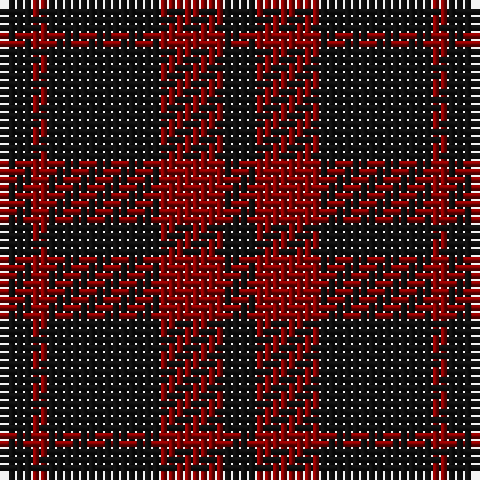

**Bands:** [KRKRK](/stripes/krkrk/) · **Stripes:** [K R K R K](/stripes/stripes5/) K R K R K

This was sourced from register-of-tartans.  It is a [5 band tartan](/bands/bands5/).

Original link https://www.tartanregister.gov.uk/tartanDetails.aspx?ref=3545

## Attestations

This cloth appears in 2 source records; the oldest owns this page.

- 01/01/2002 — Romsdal Tresfjord (register-of-tartans, [record](https://www.tartanregister.gov.uk/tartanDetails.aspx?ref=3545))
- pre 2002 — Romsdal Tresfjord District (Artefact (tartans-authority, [record](http://www.tartansauthority.com/tartan-ferret/display/2088/))

## Register references

External register numbers recorded for this tartan.

- Scottish Register of Tartans: [3545](https://www.tartanregister.gov.uk/tartanDetails.aspx?ref=3545)
- Scottish Tartans Authority (ITI): 2088
- Scottish Tartans World Register: 2088

## Variants

Other setts woven to the same stripe pattern.

- [MacLeod of Raasay](/setts/s5/k6r1k6r9k1~x4/)
- [MacLeod of Raasay (Highland Society of London)](/setts/s5/k13r2k13r19k2~x2/)
- [Romsdal, Tresfjord](/setts/s5/k2r4k7r1k1~x2/)
- [Unidentified Kirtle](/setts/s5/k55r18k4r18k38/)

## Thread count
K/4 DR2 K14 DR8 K/4

## Palette
Each colour and its ΔE from the base-6 reference it is a variant of.

| Colour | Shade | Base | ΔE (OKLab) |
|---|---|---|---|
| DR | <code style="background-color:#880000;">#880000</code> `#880000` | R <code style="background-color:#CC0000;">#CC0000</code> | 0.15 |
| K | <code style="background-color:#101010;">#101010</code> `#101010` | K <code style="background-color:#000000;">#000000</code> | 0.17 |

# Sample pattern

## Nearest tartans

The nearest existing variants by ΔTartan distance.

1. [Wcwm 9275-1333-2](/setts/s4/k20r3k20r20~x2/) — ΔT 1.19
1. [Leonard Hunting](/setts/s6/k10dp5k30dp5k10dp9~x4/) — ΔT 1.28
1. [Leonard Hunting (Name)](/setts/s4/k30dp5k10dp9~x4/) — ΔT 1.37
1. [Clan Anord (Corporate)](/setts/s4/k3r20k20r3~x2/) — ΔT 1.87
1. [Lendrum (Black & Red) or MacFarlane](/setts/s4/k12r7k1r9~x4/) — ΔT 1.89
1. [Spirit of Glyndwr Grey (Fashion)](/setts/s8/k24n18k11n4k11n18k53n4/) — ΔT 1.93
1. [MacAn of Lurgyvallan (Hose)](/setts/s6/r9k1r5g6r4k2~x4/) — ΔT 2.03
1. [Grey Spirit Fashion Tartan Tartan Number: 6594. Earliest known date: 01/03/2005 A fashion tartan from ACS Clothing of Glasgow for use in their kilt hire business. Woven by Lochcarron. The grey is actually a grey/black marl (mixture) which can't be shown graphically. See products available Copyright © Blair Urquhart, Comrie, 2015](/setts/s6/n6k16n6k16n45k4~x2/) — ΔT 2.09
1. [Freedom of Scotland](/setts/s6/k15n7k6n11k50n4~x2/) — ΔT 2.10
1. [Spirit of Glyndwr Gold (Fashion)](/setts/s8/k24n18k11n4k11n18k53r4/) — ΔT 2.10

## Neighbour map

Every grey dot is one of 14313 variants placed by the first two principal components of the ΔTartan feature space (44% of its variance). Red is this tartan; blue dots are its nearest — click one to open its page.

<svg viewBox="0 0 640 380" role="img" style="max-width:100%;height:auto;border:1px solid #e0e0e0;border-radius:4px;display:block" xmlns="http://www.w3.org/2000/svg"><image href="/nn/cloud.v1.png" width="640" height="380"/><a href="/setts/s4/k20r3k20r20~x2/"><circle cx="427.8" cy="347.9" r="4" fill="#3465a4"><title>Wcwm 9275-1333-2</title></circle></a><a href="/setts/s6/k10dp5k30dp5k10dp9~x4/"><circle cx="511.7" cy="319.0" r="4" fill="#3465a4"><title>Leonard Hunting</title></circle></a><a href="/setts/s4/k30dp5k10dp9~x4/"><circle cx="530.7" cy="340.1" r="4" fill="#3465a4"><title>Leonard Hunting (Name)</title></circle></a><a href="/setts/s4/k3r20k20r3~x2/"><circle cx="398.0" cy="310.1" r="4" fill="#3465a4"><title>Clan Anord (Corporate)</title></circle></a><a href="/setts/s4/k12r7k1r9~x4/"><circle cx="420.4" cy="307.5" r="4" fill="#3465a4"><title>Lendrum (Black &amp; Red) or MacFarlane</title></circle></a><a href="/setts/s8/k24n18k11n4k11n18k53n4/"><circle cx="489.3" cy="259.0" r="4" fill="#3465a4"><title>Spirit of Glyndwr Grey (Fashion)</title></circle></a><a href="/setts/s6/r9k1r5g6r4k2~x4/"><circle cx="422.0" cy="277.3" r="4" fill="#3465a4"><title>MacAn of Lurgyvallan (Hose)</title></circle></a><a href="/setts/s6/n6k16n6k16n45k4~x2/"><circle cx="460.6" cy="268.5" r="4" fill="#3465a4"><title>Grey Spirit Fashion Tartan Tartan Number: 6594. Earliest known date: 01/03/2005 A fashion tartan from ACS Clothing of Glasgow for use in their kilt hire business. Woven by Lochcarron. The grey is actually a grey/black marl (mixture) which can't be shown graphically. See products available Copyright © Blair Urquhart, Comrie, 2015</title></circle></a><a href="/setts/s6/k15n7k6n11k50n4~x2/"><circle cx="565.2" cy="266.2" r="4" fill="#3465a4"><title>Freedom of Scotland</title></circle></a><a href="/setts/s8/k24n18k11n4k11n18k53r4/"><circle cx="461.2" cy="239.5" r="4" fill="#3465a4"><title>Spirit of Glyndwr Gold (Fashion)</title></circle></a><circle cx="481.0" cy="318.9" r="5" fill="#c00000"/></svg>

ID: /setts/s5/k2r4k7r1k2~x2/
