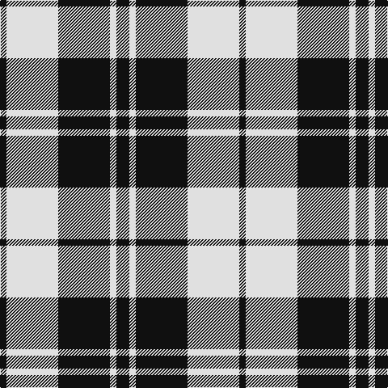

**Bands:** [KWKWK](/stripes/kwkwk/) · **Stripes:** [K W K W K](/stripes/stripes5/) K W K W K

This was sourced from register-of-tartans.  It is a [5 band tartan](/bands/bands5/).

Original link https://www.tartanregister.gov.uk/tartanDetails.aspx?ref=461

## Attestations

This cloth appears in 2 source records; the oldest owns this page.

- 01/01/2003 — Cairn (Marton Mills) (register-of-tartans, [record](https://www.tartanregister.gov.uk/tartanDetails.aspx?ref=461))
- pre 2003 — Cairn (Fashion) (tartans-authority, [record](http://www.tartansauthority.com/tartan-ferret/display/6010/))

## Register references

External register numbers recorded for this tartan.

- Scottish Register of Tartans: [461](https://www.tartanregister.gov.uk/tartanDetails.aspx?ref=461)
- Scottish Tartans Authority (ITI): 6010

## Variants

Other setts woven to the same stripe pattern.

- [Black Camel Tartan Tartan Number: 3333. Earliest known date: Marton Mills Jura./Threadcount and colours aren't 100% original. Generated manually./ See products available Copyright © Blair Urquhart, Comrie, 2015](/setts/s5/k160w6k2w3k3~x2/)
- [MacPhee MacFee or MacIver](/setts/s5/k22w3k3w11k1~x2/)

## Thread count
K/8 LN64 K64 LN8 K/16

## Palette
Each colour and its ΔE from the base-6 reference it is a variant of.

| Colour | Shade | Base | ΔE (OKLab) |
|---|---|---|---|
| K | <code style="background-color:#101010;">#101010</code> `#101010` | K <code style="background-color:#000000;">#000000</code> | 0.17 |
| LN | <code style="background-color:#E0E0E0;">#E0E0E0</code> `#E0E0E0` | W <code style="background-color:#F7F7F7;">#F7F7F7</code> | 0.07 |

# Sample pattern

## Nearest tartans

The nearest existing variants by ΔTartan distance.

1. [Erskine BW MINI Design Tartan Tartan Number: 12466. Earliest known date: Generated for display purposes. Reduced copy of the original 1246 Erskine BW. See products available Copyright © Blair Urquhart, Comrie, 2015](/setts/s6/k2w1k9w9k1w2~x3/) — ΔT 0.68
1. [MacLeod, Black & White](/setts/s5/w8k1w8k12w1~x2/) — ΔT 0.75
1. [Valley Forge (Artefact)](/setts/s6/lb5k4lb32k32lb5k4~x2/) — ΔT 0.85
1. [Erskine (Black and White)](/setts/s6/k2w1k9w9k1w2~x6/) — ΔT 0.91
1. [MacPhee (Black and White)](/setts/s4/k22w3k3w22~x2/) — ΔT 0.94
1. [Scott (Abbreviated)](/setts/s7/w2k1w6k6w2k1w1~x2/) — ΔT 1.17
1. [Shembe Zulu Church](/setts/s5/k5w25r6k45w4~x2/) — ΔT 1.22
1. [Juchter (Personal)](/setts/s4/dg20w5r3w5~x2/) — ΔT 1.41
1. [MacLeod Black & White](/setts/s5/w14k2w14k19w2~x2/) — ΔT 1.44
1. [Takla Makan #2 (Artefact)](/setts/s4/k4lo15k4w2~x2/) — ΔT 1.47

## Neighbour map

Every grey dot is one of 14313 variants placed by the first two principal components of the ΔTartan feature space (44% of its variance). Red is this tartan; blue dots are its nearest — click one to open its page.

<svg viewBox="0 0 640 380" role="img" style="max-width:100%;height:auto;border:1px solid #e0e0e0;border-radius:4px;display:block" xmlns="http://www.w3.org/2000/svg"><image href="/nn/cloud.v1.png" width="640" height="380"/><a href="/setts/s6/k2w1k9w9k1w2~x3/"><circle cx="299.5" cy="217.8" r="4" fill="#3465a4"><title>Erskine BW MINI Design Tartan Tartan Number: 12466. Earliest known date: Generated for display purposes. Reduced copy of the original 1246 Erskine BW. See products available Copyright © Blair Urquhart, Comrie, 2015</title></circle></a><a href="/setts/s5/w8k1w8k12w1~x2/"><circle cx="320.4" cy="229.8" r="4" fill="#3465a4"><title>MacLeod, Black &amp; White</title></circle></a><a href="/setts/s6/lb5k4lb32k32lb5k4~x2/"><circle cx="304.7" cy="219.5" r="4" fill="#3465a4"><title>Valley Forge (Artefact)</title></circle></a><a href="/setts/s6/k2w1k9w9k1w2~x6/"><circle cx="294.8" cy="213.9" r="4" fill="#3465a4"><title>Erskine (Black and White)</title></circle></a><a href="/setts/s4/k22w3k3w22~x2/"><circle cx="284.6" cy="248.9" r="4" fill="#3465a4"><title>MacPhee (Black and White)</title></circle></a><a href="/setts/s7/w2k1w6k6w2k1w1~x2/"><circle cx="300.1" cy="231.5" r="4" fill="#3465a4"><title>Scott (Abbreviated)</title></circle></a><a href="/setts/s5/k5w25r6k45w4~x2/"><circle cx="317.1" cy="198.5" r="4" fill="#3465a4"><title>Shembe Zulu Church</title></circle></a><a href="/setts/s4/dg20w5r3w5~x2/"><circle cx="306.6" cy="242.9" r="4" fill="#3465a4"><title>Juchter (Personal)</title></circle></a><a href="/setts/s5/w14k2w14k19w2~x2/"><circle cx="313.4" cy="234.2" r="4" fill="#3465a4"><title>MacLeod Black &amp; White</title></circle></a><a href="/setts/s4/k4lo15k4w2~x2/"><circle cx="308.4" cy="235.9" r="4" fill="#3465a4"><title>Takla Makan #2 (Artefact)</title></circle></a><circle cx="312.7" cy="237.7" r="5" fill="#c00000"/></svg>

ID: /setts/s5/k2w1k8w8k1~x8/
