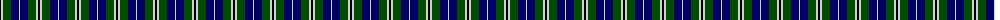

In pattern [KWGBW](/patterns/kwgbw/).

This was sourced from weddslist.  It is a [5 stripes tartan](/stripes/stripes5/).

Original link http://www.weddslist.com/cgi-bin/tartans/pg.pl?source=rb

## Thread count
K/2 N2 G8 DB8 N/1

## Palette
Each colour and its ΔE from the base-6 reference it is a variant of.

| Colour | Shade | Base | ΔE (OKLab) |
|---|---|---|---|
| DB | <code style="background-color:#000064;">#000064</code> `#000064` | B <code style="background-color:#2C4084;">#2C4084</code> | 0.17 |
| G | <code style="background-color:#004C00;">#004C00</code> `#004C00` | G <code style="background-color:#006400;">#006400</code> | 0.08 |
| K | <code style="background-color:#000000;">#000000</code> `#000000` | K <code style="background-color:#000000;">#000000</code> | 0.00 |
| N | <code style="background-color:#D0D0D0;">#D0D0D0</code> `#D0D0D0` | W <code style="background-color:#F4F4F0;">#F4F4F0</code> | 0.11 |

# Sample pattern

## Nearest tartans

The nearest existing variants by ΔTartan distance.

1. [Douglas Green](/setts/s5/k4w2g8b8w1-b000064-g004c00-k000000-wd0d0d0/) — ΔT 0.63
1. [MacNeil 1](/setts/s6/w4b36k36g36k8w4-b304080-g008000-k000000-we0e0e0/) — ΔT 0.88
1. [Campbell, The White Stripe](/setts/s6/b4k4b24k22g24w4-b304080-g008000-k000000-we0e0e0/) — ΔT 0.88
1. [Murray](/setts/s6/b4k4b24k16g22r4-b304080-g008000-k000000-rc00000/) — ΔT 0.89
1. [Flower of Scotland](/setts/s6/b3g28b3k16b28r3-b304080-g008000-k000000-rc00000/) — ΔT 0.93
1. [Unnamed, No 59](/setts/s6/b2ba22k22g22k4b2-b5480b0-ba304080-g008000-k000000/) — ΔT 0.95
1. [Herd/Hurd](/setts/s6/b6g24k26w4b26w6-b2c2c80-g006818-k101010-wfcfcfc/) — ΔT 0.96
1. [Unnamed, No 26](/setts/s6/w4b4g22k20b20w3-b304080-g008000-k000000-we0e0e0/) — ΔT 0.96
1. [Frobo Nairn](/setts/s5/r8b36k20g24b4-b00008c-g007800-k000000-r8c0000/) — ΔT 1.01
1. [Ferguson](/setts/s6/g8b48r6k48g50k8-b304080-g008000-k000000-rc00000/) — ΔT 1.02

## Neighbour map

Every grey dot is one of 15726 variants placed by the first two principal components of the ΔTartan feature space (44% of its variance). Red is this tartan; blue dots are its nearest — click one to open its page.

<svg viewBox="0 0 640 380" role="img" style="max-width:100%;height:auto;border:1px solid #e0e0e0;border-radius:4px;display:block" xmlns="http://www.w3.org/2000/svg"><image href="/nn/cloud.v1.png" width="640" height="380"/><a href="/setts/s5/k4w2g8b8w1-b000064-g004c00-k000000-wd0d0d0/"><circle cx="132.3" cy="241.9" r="4" fill="#3465a4"><title>Douglas Green</title></circle></a><a href="/setts/s6/w4b36k36g36k8w4-b304080-g008000-k000000-we0e0e0/"><circle cx="142.8" cy="216.1" r="4" fill="#3465a4"><title>MacNeil 1</title></circle></a><a href="/setts/s6/b4k4b24k22g24w4-b304080-g008000-k000000-we0e0e0/"><circle cx="126.2" cy="235.3" r="4" fill="#3465a4"><title>Campbell, The White Stripe</title></circle></a><a href="/setts/s6/b4k4b24k16g22r4-b304080-g008000-k000000-rc00000/"><circle cx="149.3" cy="238.9" r="4" fill="#3465a4"><title>Murray</title></circle></a><a href="/setts/s6/b3g28b3k16b28r3-b304080-g008000-k000000-rc00000/"><circle cx="203.7" cy="214.4" r="4" fill="#3465a4"><title>Flower of Scotland</title></circle></a><a href="/setts/s6/b2ba22k22g22k4b2-b5480b0-ba304080-g008000-k000000/"><circle cx="163.5" cy="210.8" r="4" fill="#3465a4"><title>Unnamed, No 59</title></circle></a><a href="/setts/s6/b6g24k26w4b26w6-b2c2c80-g006818-k101010-wfcfcfc/"><circle cx="123.0" cy="235.5" r="4" fill="#3465a4"><title>Herd/Hurd</title></circle></a><a href="/setts/s6/w4b4g22k20b20w3-b304080-g008000-k000000-we0e0e0/"><circle cx="114.6" cy="224.1" r="4" fill="#3465a4"><title>Unnamed, No 26</title></circle></a><a href="/setts/s5/r8b36k20g24b4-b00008c-g007800-k000000-r8c0000/"><circle cx="183.0" cy="245.5" r="4" fill="#3465a4"><title>Frobo Nairn</title></circle></a><a href="/setts/s6/g8b48r6k48g50k8-b304080-g008000-k000000-rc00000/"><circle cx="151.5" cy="224.2" r="4" fill="#3465a4"><title>Ferguson</title></circle></a><circle cx="164.5" cy="232.1" r="5" fill="#c00000"/></svg>

ID: /setts/s5/k2w2g8b8w1-b000064-g004c00-k000000-wd0d0d0/
