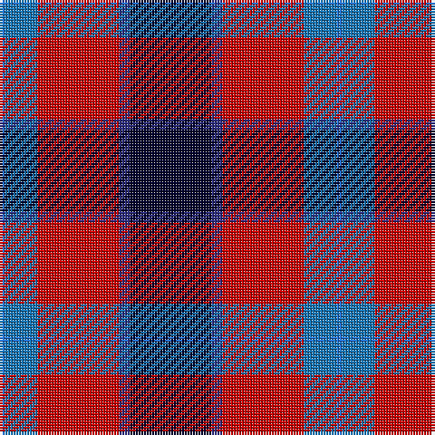

In pattern [BBRBK](/patterns/bbrbk/).

This was sourced from tartans-authority.  It is a [5 stripes tartan](/stripes/stripes5/).

Original link http://www.tartansauthority.com/tartan-ferret/display/7088/

## Thread count
B/2 Ba12 R30 DBa4 DB/30

## Palette
Each colour and its ΔE from the base-6 reference it is a variant of.

| Colour | Shade | Base | ΔE (OKLab) |
|---|---|---|---|
| B | <code style="background-color:#2474E8;">#2474E8</code> `#2474E8` | B <code style="background-color:#2C4084;">#2C4084</code> | 0.20 |
| Ba | <code style="background-color:#1474B4;">#1474B4</code> `#1474B4` | B <code style="background-color:#2C4084;">#2C4084</code> | 0.15 |
| DB | <code style="background-color:#00002C;">#00002C</code> `#00002C` | K <code style="background-color:#000000;">#000000</code> | 0.16 |
| DBa | <code style="background-color:#2C2C80;">#2C2C80</code> `#2C2C80` | B <code style="background-color:#2C4084;">#2C4084</code> | 0.05 |
| R | <code style="background-color:#C80000;">#C80000</code> `#C80000` | R <code style="background-color:#C80000;">#C80000</code> | 0.00 |

# Sample pattern

## Nearest tartans

The nearest existing variants by ΔTartan distance.

1. [MacTavish](/setts/s6/b4r24ba4b12k12b2-b4367ae-ba000052-k000000-raa0000/) — ΔT 1.07
1. [MacTavish](/setts/s6/b2r12ba2b6k6b1-b4367ae-ba000052-k000000-raa0000/) — ΔT 1.07
1. [Afternoon Tea / Assam](/setts/s6/r15ra98b72ba25b8w15-b202060-ba5c8ca8-rc80000-ra880000-wfcfcfc/) — ΔT 1.09
1. [Regent](/setts/s7/b36k14g10r8g14k2y4-b800080-g008000-k000000-rc00000-yf0c000/) — ΔT 1.15
1. [Regent Trade Tartan Tartan Number: 341. Earliest known date: 1819 See MacLaren See products available Copyright © Blair Urquhart, Comrie, 2015](/setts/s7/b36k14g10r8g14k2y4-b780078-g006818-k101010-rc80000-ye8c000/) — ΔT 1.22
1. [Fife](/setts/s6/b62ba8b12k38r40y8-b304080-ba5480b0-k000000-rc00000-yf0c000/) — ΔT 1.25
1. [Soroptimist International Corporate Tartan Tartan Number: 3097. Earliest known date: 2002 Non-repeating sett. Launched at the Federation of Great Britain & Ireland Conference in 2002 during the Presidency of Lynn Dunning. The design and the colours have been chosen carefully to symbolise the purple heather of the mountains and hills of Scotland together with the blue and gold of Soroptimist International woven together with the white hand of Peace. See products available Copyright © Blair Urquhart, Comrie, 2015](/setts/s6/w4k2b20k12ba24y4-b780078-ba2c2c80-k101010-we0e0e0-ye8c000/) — ΔT 1.28
1. [Baillie of Polkemett](/setts/s5/w6b24k24r40g4-b304080-g008000-k000000-rc00000-we0e0e0/) — ΔT 1.28
1. [Highland Spring Dress (2004) (Corp)](/setts/s5/w8b60g20r50w4-b2c2c80-g289c18-r880000-wfcfcfc/) — ΔT 1.30
1. [Fife (McGill)](/setts/s6/b62ba8b12k38r40y8-b2c2c80-ba5c8ca8-k101010-rc80000-ye8c000/) — ΔT 1.31

## Neighbour map

Every grey dot is one of 15726 variants placed by the first two principal components of the ΔTartan feature space (44% of its variance). Red is this tartan; blue dots are its nearest — click one to open its page.

<svg viewBox="0 0 640 380" role="img" style="max-width:100%;height:auto;border:1px solid #e0e0e0;border-radius:4px;display:block" xmlns="http://www.w3.org/2000/svg"><image href="/nn/cloud.v1.png" width="640" height="380"/><a href="/setts/s6/b4r24ba4b12k12b2-b4367ae-ba000052-k000000-raa0000/"><circle cx="208.6" cy="196.0" r="4" fill="#3465a4"><title>MacTavish</title></circle></a><a href="/setts/s6/b2r12ba2b6k6b1-b4367ae-ba000052-k000000-raa0000/"><circle cx="208.6" cy="196.0" r="4" fill="#3465a4"><title>MacTavish</title></circle></a><a href="/setts/s6/r15ra98b72ba25b8w15-b202060-ba5c8ca8-rc80000-ra880000-wfcfcfc/"><circle cx="214.7" cy="173.9" r="4" fill="#3465a4"><title>Afternoon Tea / Assam</title></circle></a><a href="/setts/s7/b36k14g10r8g14k2y4-b800080-g008000-k000000-rc00000-yf0c000/"><circle cx="183.1" cy="150.5" r="4" fill="#3465a4"><title>Regent</title></circle></a><a href="/setts/s7/b36k14g10r8g14k2y4-b780078-g006818-k101010-rc80000-ye8c000/"><circle cx="208.1" cy="160.8" r="4" fill="#3465a4"><title>Regent Trade Tartan Tartan Number: 341. Earliest known date: 1819 See MacLaren See products available Copyright © Blair Urquhart, Comrie, 2015</title></circle></a><a href="/setts/s6/b62ba8b12k38r40y8-b304080-ba5480b0-k000000-rc00000-yf0c000/"><circle cx="168.9" cy="202.3" r="4" fill="#3465a4"><title>Fife</title></circle></a><a href="/setts/s6/w4k2b20k12ba24y4-b780078-ba2c2c80-k101010-we0e0e0-ye8c000/"><circle cx="166.5" cy="187.2" r="4" fill="#3465a4"><title>Soroptimist International Corporate Tartan Tartan Number: 3097. Earliest known date: 2002 Non-repeating sett. Launched at the Federation of Great Britain &amp; Ireland Conference in 2002 during the Presidency of Lynn Dunning. The design and the colours have been chosen carefully to symbolise the purple heather of the mountains and hills of Scotland together with the blue and gold of Soroptimist International woven together with the white hand of Peace. See products available Copyright © Blair Urquhart, Comrie, 2015</title></circle></a><a href="/setts/s5/w6b24k24r40g4-b304080-g008000-k000000-rc00000-we0e0e0/"><circle cx="159.2" cy="196.7" r="4" fill="#3465a4"><title>Baillie of Polkemett</title></circle></a><a href="/setts/s5/w8b60g20r50w4-b2c2c80-g289c18-r880000-wfcfcfc/"><circle cx="225.8" cy="194.4" r="4" fill="#3465a4"><title>Highland Spring Dress (2004) (Corp)</title></circle></a><a href="/setts/s6/b62ba8b12k38r40y8-b2c2c80-ba5c8ca8-k101010-rc80000-ye8c000/"><circle cx="186.2" cy="208.1" r="4" fill="#3465a4"><title>Fife (McGill)</title></circle></a><circle cx="196.0" cy="180.9" r="5" fill="#c00000"/></svg>

ID: /setts/s5/k30b4r30ba12bb2-b2c2c80-ba1474b4-bb2474e8-k00002c-rc80000/
