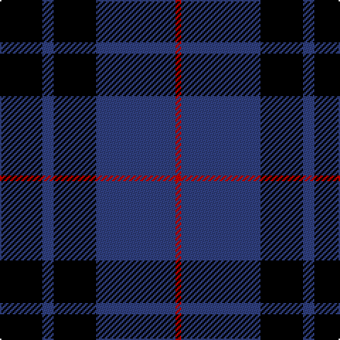

In pattern [KBKBR](/patterns/kbkbr/).

This was sourced from weddslist.  It is a [5 stripes tartan](/stripes/stripes5/).

Original link http://www.weddslist.com/cgi-bin/tartans/pg.pl?source=sts

## Thread count
K/30 B8 K30 B56 R/4

## Palette
Each colour and its ΔE from the base-6 reference it is a variant of.

| Colour | Shade | Base | ΔE (OKLab) |
|---|---|---|---|
| B | <code style="background-color:#304080;">#304080</code> `#304080` | B <code style="background-color:#2A418A;">#2A418A</code> | 0.02 |
| K | <code style="background-color:#000000;">#000000</code> `#000000` | K <code style="background-color:#000000;">#000000</code> | 0.00 |
| R | <code style="background-color:#C00000;">#C00000</code> `#C00000` | R <code style="background-color:#CC0000;">#CC0000</code> | 0.03 |

# Sample pattern

## Nearest tartans

The nearest existing variants by ΔTartan distance.

1. [Marchmont](/setts/s7/k4b48k48g4k48b48w4-b304080-g407050-k000000-we0e0e0/) — ΔT 1.15
1. [MacKay](/setts/s6/b4k12b4k12b32r2-b304080-k000000-rc00000/) — ΔT 1.26
1. [Press & Journal](/setts/s5/k18b6k56b50w4-b4c5484-k101010-we0e0e0/) — ΔT 1.30
1. [Scottish Express International](/setts/s6/b6k29ba6k29b50ka6-b304080-ba8080d0-k000000-ka000030/) — ΔT 1.39
1. [Wallace Blue](/setts/s4/k1b8k8y1-b000052-k000000-yaaaa00/) — ΔT 1.41
1. [Mother's Pride (Corporate)](/setts/s3/k40b40y4-b1c0070-k000000-yd09800/) — ΔT 1.44
1. [Wallace (Personal)](/setts/s4/k10b70k70y10-b200084-k101010-yfccc3c/) — ΔT 1.44
1. [Wcwm 1106-2](/setts/s5/k8g6b36k36w4-b4c1864-g004c00-k000000-wc8c8c8/) — ΔT 1.45
1. [College of Radiographers](/setts/s5/k30y4k20b36w6-b00008c-k101010-wc8c8c8-yc88c00/) — ΔT 1.46
1. [College of Radiographers](/setts/s5/k30g4k20b36w6-b304080-g908000-k000000-we0e0e0/) — ΔT 1.46

## Neighbour map

Every grey dot is one of 15726 variants placed by the first two principal components of the ΔTartan feature space (44% of its variance). Red is this tartan; blue dots are its nearest — click one to open its page.

<svg viewBox="0 0 640 380" role="img" style="max-width:100%;height:auto;border:1px solid #e0e0e0;border-radius:4px;display:block" xmlns="http://www.w3.org/2000/svg"><image href="/nn/cloud.v1.png" width="640" height="380"/><a href="/setts/s7/k4b48k48g4k48b48w4-b304080-g407050-k000000-we0e0e0/"><circle cx="281.7" cy="216.1" r="4" fill="#3465a4"><title>Marchmont</title></circle></a><a href="/setts/s6/b4k12b4k12b32r2-b304080-k000000-rc00000/"><circle cx="387.2" cy="215.2" r="4" fill="#3465a4"><title>MacKay</title></circle></a><a href="/setts/s5/k18b6k56b50w4-b4c5484-k101010-we0e0e0/"><circle cx="369.2" cy="239.1" r="4" fill="#3465a4"><title>Press &amp; Journal</title></circle></a><a href="/setts/s6/b6k29ba6k29b50ka6-b304080-ba8080d0-k000000-ka000030/"><circle cx="252.6" cy="232.3" r="4" fill="#3465a4"><title>Scottish Express International</title></circle></a><a href="/setts/s4/k1b8k8y1-b000052-k000000-yaaaa00/"><circle cx="321.8" cy="282.1" r="4" fill="#3465a4"><title>Wallace Blue</title></circle></a><a href="/setts/s3/k40b40y4-b1c0070-k000000-yd09800/"><circle cx="306.7" cy="295.9" r="4" fill="#3465a4"><title>Mother's Pride (Corporate)</title></circle></a><a href="/setts/s4/k10b70k70y10-b200084-k101010-yfccc3c/"><circle cx="306.9" cy="278.9" r="4" fill="#3465a4"><title>Wallace (Personal)</title></circle></a><a href="/setts/s5/k8g6b36k36w4-b4c1864-g004c00-k000000-wc8c8c8/"><circle cx="269.4" cy="229.9" r="4" fill="#3465a4"><title>Wcwm 1106-2</title></circle></a><a href="/setts/s5/k30y4k20b36w6-b00008c-k101010-wc8c8c8-yc88c00/"><circle cx="271.3" cy="250.2" r="4" fill="#3465a4"><title>College of Radiographers</title></circle></a><a href="/setts/s5/k30g4k20b36w6-b304080-g908000-k000000-we0e0e0/"><circle cx="248.6" cy="239.8" r="4" fill="#3465a4"><title>College of Radiographers</title></circle></a><circle cx="323.8" cy="244.1" r="5" fill="#c00000"/></svg>

ID: /setts/s5/k30b8k30b56r4-b304080-k000000-rc00000/
