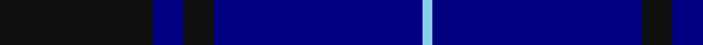
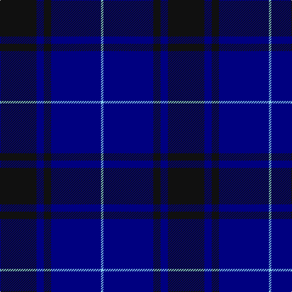

In pattern [KBKBW](/stripes/kbkbw/).

This was sourced from register-of-tartans.  It is a [5 stripe tartan](/stripes/stripes5/).

Original link https://www.tartanregister.gov.uk/tartanDetails.aspx?ref=10107

## Register references

External register numbers recorded for this tartan.

- Scottish Register of Tartans: [10107](https://www.tartanregister.gov.uk/tartanDetails.aspx?ref=10107)

## Thread count
K/60 DB12 K12 DB82 LB/4

## Palette
Each colour and its ΔE from the base-6 reference it is a variant of.

| Colour | Shade | Base | ΔE (OKLab) |
|---|---|---|---|
| DB | <code style="background-color:#000080;">#000080</code> `#000080` | B <code style="background-color:#2A418A;">#2A418A</code> | 0.14 |
| K | <code style="background-color:#101010;">#101010</code> `#101010` | K <code style="background-color:#000000;">#000000</code> | 0.17 |
| LB | <code style="background-color:#87CEEB;">#87CEEB</code> `#87CEEB` | W <code style="background-color:#F7F7F7;">#F7F7F7</code> | 0.18 |

# Sample pattern

## Nearest tartans

The nearest existing variants by ΔTartan distance.

1. [Deighan (Burham Kent) (Name)](/setts/s5/n4db43k20n7o2~x2/) — ΔT 1.18
1. [Largan (?)](/setts/s6/db8k39db8k39db87r6/) — ΔT 1.20
1. [MacKay V](/setts/s6/db2k6db2k6db16r1~x2/) — ΔT 1.44
1. [Lyndon Prep (School)](/setts/s6/k4ly1k18db18lb1db4~x4/) — ΔT 1.49
1. [Wellington Variation](/setts/s4/k3db23k17r2~x2/) — ΔT 1.56
1. [MacKay (Blue) #2](/setts/s5/k15db4k15db28r2~x2/) — ΔT 1.57
1. [Perthshire, New /Tourist Board](/setts/s6/db37r10dg22db11dg3r3~x2/) — ΔT 1.61
1. [Atlin (Fashion)](/setts/s6/k14db14k14db40k3db2~x2/) — ΔT 1.61
1. [Gagetown (School)](/setts/s6/db2k11db5k1db5k1~x6/) — ΔT 1.64
1. [Argentina](/setts/s7/db5w3db33k3db3k36db3~x2/) — ΔT 1.65

## Neighbour map

Every grey dot is one of 14299 variants placed by the first two principal components of the ΔTartan feature space (44% of its variance). Red is this tartan; blue dots are its nearest — click one to open its page.

<svg viewBox="0 0 640 380" role="img" style="max-width:100%;height:auto;border:1px solid #e0e0e0;border-radius:4px;display:block" xmlns="http://www.w3.org/2000/svg"><image href="/nn/cloud.v1.png" width="640" height="380"/><a href="/setts/s5/n4db43k20n7o2~x2/"><circle cx="403.1" cy="225.5" r="4" fill="#3465a4"><title>Deighan (Burham Kent) (Name)</title></circle></a><a href="/setts/s6/db8k39db8k39db87r6/"><circle cx="429.9" cy="254.8" r="4" fill="#3465a4"><title>Largan (?)</title></circle></a><a href="/setts/s6/db2k6db2k6db16r1~x2/"><circle cx="427.6" cy="244.5" r="4" fill="#3465a4"><title>MacKay V</title></circle></a><a href="/setts/s6/k4ly1k18db18lb1db4~x4/"><circle cx="368.2" cy="219.3" r="4" fill="#3465a4"><title>Lyndon Prep (School)</title></circle></a><a href="/setts/s4/k3db23k17r2~x2/"><circle cx="394.5" cy="285.2" r="4" fill="#3465a4"><title>Wellington Variation</title></circle></a><a href="/setts/s5/k15db4k15db28r2~x2/"><circle cx="378.4" cy="270.1" r="4" fill="#3465a4"><title>MacKay (Blue) #2</title></circle></a><a href="/setts/s6/db37r10dg22db11dg3r3~x2/"><circle cx="387.9" cy="265.7" r="4" fill="#3465a4"><title>Perthshire, New /Tourist Board</title></circle></a><a href="/setts/s6/k14db14k14db40k3db2~x2/"><circle cx="501.0" cy="273.1" r="4" fill="#3465a4"><title>Atlin (Fashion)</title></circle></a><a href="/setts/s6/db2k11db5k1db5k1~x6/"><circle cx="413.5" cy="280.1" r="4" fill="#3465a4"><title>Gagetown (School)</title></circle></a><a href="/setts/s7/db5w3db33k3db3k36db3~x2/"><circle cx="379.4" cy="224.0" r="4" fill="#3465a4"><title>Argentina</title></circle></a><circle cx="436.3" cy="253.4" r="5" fill="#c00000"/></svg>

ID: /setts/s5/k30db6k6db41lt2~x2/
