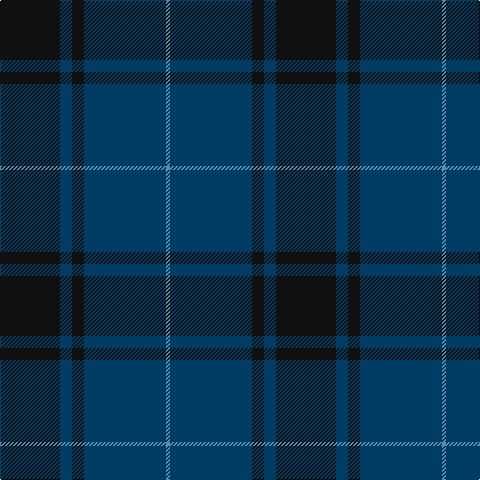

In pattern [BBKBK](/stripes/bbkbk/).

This was sourced from tartans-authority.  It is a [5 stripe tartan](/stripes/stripes5/).

Original link http://www.tartansauthority.com/tartan-ferret/display/10107/

## Thread count
K/60 DB12 K12 DB82 B/4

## Palette
Each colour and its ΔE from the base-6 reference it is a variant of.

| Colour | Shade | Base | ΔE (OKLab) |
|---|---|---|---|
| B | <code style="background-color:#5C8CA8;">#5C8CA8</code> `#5C8CA8` | B <code style="background-color:#2A418A;">#2A418A</code> | 0.23 |
| DB | <code style="background-color:#003C64;">#003C64</code> `#003C64` | B <code style="background-color:#2A418A;">#2A418A</code> | 0.08 |
| K | <code style="background-color:#101010;">#101010</code> `#101010` | K <code style="background-color:#000000;">#000000</code> | 0.17 |

# Sample pattern

## Nearest tartans

The nearest existing variants by ΔTartan distance.

1. [Casterton (Corporate)](/setts/s6/k7r2k33db33k2db7~x2/) — ΔT 1.26
1. [Largan (?)](/setts/s6/db8k39db8k39db87r6/) — ΔT 1.57
1. [Keeper of the Quaich](/setts/s6/dy3db3dy3db27dy40y3/) — ΔT 1.68
1. [Atlin](/setts/s6/do14db14do14db40do3db2~x2/) — ΔT 1.72
1. [Perthshire, New /Tourist Board](/setts/s6/db37r10dg22db11dg3r3~x2/) — ΔT 1.75
1. [Harmony 12](/setts/s6/dg6db2dg29db29dg2db6~x2/) — ΔT 1.77
1. [Monarchs](/setts/s6/db19k4dr1k4dg9dr1~x4/) — ΔT 1.80
1. [Barclay Hunting](/setts/s4/dg1db16dg16r1~x2/) — ΔT 1.83
1. [Unidentified Tweed](/setts/s6/dg4db1dg12db12w1db4~x2/) — ΔT 1.83
1. [Potts (Personal)](/setts/s6/k1y3db3do28db36y1~x2/) — ΔT 1.86

## Neighbour map

Every grey dot is one of 14299 variants placed by the first two principal components of the ΔTartan feature space (44% of its variance). Red is this tartan; blue dots are its nearest — click one to open its page.

<svg viewBox="0 0 640 380" role="img" style="max-width:100%;height:auto;border:1px solid #e0e0e0;border-radius:4px;display:block" xmlns="http://www.w3.org/2000/svg"><image href="/nn/cloud.v1.png" width="640" height="380"/><a href="/setts/s6/k7r2k33db33k2db7~x2/"><circle cx="452.0" cy="266.5" r="4" fill="#3465a4"><title>Casterton (Corporate)</title></circle></a><a href="/setts/s6/db8k39db8k39db87r6/"><circle cx="429.9" cy="254.8" r="4" fill="#3465a4"><title>Largan (?)</title></circle></a><a href="/setts/s6/dy3db3dy3db27dy40y3/"><circle cx="472.2" cy="247.6" r="4" fill="#3465a4"><title>Keeper of the Quaich</title></circle></a><a href="/setts/s6/do14db14do14db40do3db2~x2/"><circle cx="552.3" cy="294.4" r="4" fill="#3465a4"><title>Atlin</title></circle></a><a href="/setts/s6/db37r10dg22db11dg3r3~x2/"><circle cx="387.9" cy="265.7" r="4" fill="#3465a4"><title>Perthshire, New /Tourist Board</title></circle></a><a href="/setts/s6/dg6db2dg29db29dg2db6~x2/"><circle cx="480.5" cy="294.4" r="4" fill="#3465a4"><title>Harmony 12</title></circle></a><a href="/setts/s6/db19k4dr1k4dg9dr1~x4/"><circle cx="380.9" cy="232.6" r="4" fill="#3465a4"><title>Monarchs</title></circle></a><a href="/setts/s4/dg1db16dg16r1~x2/"><circle cx="400.5" cy="269.2" r="4" fill="#3465a4"><title>Barclay Hunting</title></circle></a><a href="/setts/s6/dg4db1dg12db12w1db4~x2/"><circle cx="385.7" cy="269.5" r="4" fill="#3465a4"><title>Unidentified Tweed</title></circle></a><a href="/setts/s6/k1y3db3do28db36y1~x2/"><circle cx="472.7" cy="197.4" r="4" fill="#3465a4"><title>Potts (Personal)</title></circle></a><circle cx="474.0" cy="270.6" r="5" fill="#c00000"/></svg>

ID: /setts/s5/k30dt6k6dt41t2~x2/
