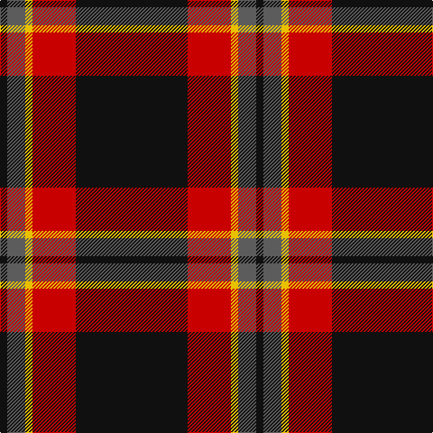

In pattern [KBYRK](/patterns/kbyrk/).

This was sourced from tartans-authority.  It is a [5 stripes tartan](/stripes/stripes5/).

Original link http://www.tartansauthority.com/tartan-ferret/display/11023/

## Thread count
K/8 N20 Y8 R48 K/124

## Palette
Each colour and its ΔE from the base-6 reference it is a variant of.

| Colour | Shade | Base | ΔE (OKLab) |
|---|---|---|---|
| K | <code style="background-color:#101010;">#101010</code> `#101010` | K <code style="background-color:#000000;">#000000</code> | 0.17 |
| N | <code style="background-color:#5C5C5C;">#5C5C5C</code> `#5C5C5C` | B <code style="background-color:#2A418A;">#2A418A</code> | 0.15 |
| R | <code style="background-color:#C80000;">#C80000</code> `#C80000` | R <code style="background-color:#CC0000;">#CC0000</code> | 0.01 |
| Y | <code style="background-color:#E8C000;">#E8C000</code> `#E8C000` | Y <code style="background-color:#F2BF00;">#F2BF00</code> | 0.02 |

# Sample pattern

## Nearest tartans

The nearest existing variants by ΔTartan distance.

1. [Perry (2014)](/setts/s5/k31r12y2b5k2x4~b505050-k101010-r880000-yffe600/) — ΔT 0.75
1. [Calgary Firefighters (Corporate)](/setts/s5/r4k48r16ra12b3x2~b2c2c80-k101010-r888888-rac80000/) — ΔT 0.91
1. [Calgary Firefighters](/setts/s5/g4k48g16r12b3x2~b4876ff-g696969-k101010-rdb2929/) — ΔT 0.94
1. [MacShimsi](/setts/s5/r11ra5g5k40y3x2~g006818-k101010-rb43448-ra901c38-ye8c000/) — ΔT 0.99
1. [Princess Margaret Rose](/setts/s6/g32r12g6r6k2w3x2~g003820-k101010-rc80000-wfcfcfc/) — ΔT 1.10
1. [Billy Apple](/setts/s4/g1r8k13y1x6~g006818-k101010-rc80000-yfccc00/) — ΔT 1.13
1. [Perry (Calgary), Alex (Personal)](/setts/s4/k62b24y5w3x2~b3f4441-k120a01-wf7f1e8-yef8f06/) — ΔT 1.18
1. [Perry Dress (Personal)](/setts/s5/k65r27w2k4y5x2~k101010-r880000-we0e0e0-ye8c000/) — ΔT 1.34
1. [Partick Thistle Football Club](/setts/s7/k53y4k7y2k4r30w3x2~k101010-rc80000-wf8f8f8-ye8c000/) — ΔT 1.35
1. [MacShimsi Personal Tartan Tartan Number: 7318. Earliest known date: 2007 Designed for the MacShimsi Clan in Dundee See products available Copyright © Blair Urquhart, Comrie, 2015](/setts/s5/r11b5g5k40y3x2~b601830-g285828-k101010-r882c4c-ydcd00c/) — ΔT 1.35

## Neighbour map

Every grey dot is one of 15726 variants placed by the first two principal components of the ΔTartan feature space (44% of its variance). Red is this tartan; blue dots are its nearest — click one to open its page.

<svg viewBox="0 0 640 380" role="img" style="max-width:100%;height:auto;border:1px solid #e0e0e0;border-radius:4px;display:block" xmlns="http://www.w3.org/2000/svg"><image href="/nn/cloud.v1.png" width="640" height="380"/><a href="/setts/s5/k31r12y2b5k2x4~b505050-k101010-r880000-yffe600/"><circle cx="399.7" cy="203.3" r="4" fill="#3465a4"><title>Perry (2014)</title></circle></a><a href="/setts/s5/r4k48r16ra12b3x2~b2c2c80-k101010-r888888-rac80000/"><circle cx="334.1" cy="191.9" r="4" fill="#3465a4"><title>Calgary Firefighters (Corporate)</title></circle></a><a href="/setts/s5/g4k48g16r12b3x2~b4876ff-g696969-k101010-rdb2929/"><circle cx="340.6" cy="195.1" r="4" fill="#3465a4"><title>Calgary Firefighters</title></circle></a><a href="/setts/s5/r11ra5g5k40y3x2~g006818-k101010-rb43448-ra901c38-ye8c000/"><circle cx="348.0" cy="181.6" r="4" fill="#3465a4"><title>MacShimsi</title></circle></a><a href="/setts/s6/g32r12g6r6k2w3x2~g003820-k101010-rc80000-wfcfcfc/"><circle cx="371.4" cy="184.4" r="4" fill="#3465a4"><title>Princess Margaret Rose</title></circle></a><a href="/setts/s4/g1r8k13y1x6~g006818-k101010-rc80000-yfccc00/"><circle cx="331.3" cy="212.2" r="4" fill="#3465a4"><title>Billy Apple</title></circle></a><a href="/setts/s4/k62b24y5w3x2~b3f4441-k120a01-wf7f1e8-yef8f06/"><circle cx="419.8" cy="206.3" r="4" fill="#3465a4"><title>Perry (Calgary), Alex (Personal)</title></circle></a><a href="/setts/s5/k65r27w2k4y5x2~k101010-r880000-we0e0e0-ye8c000/"><circle cx="456.0" cy="167.7" r="4" fill="#3465a4"><title>Perry Dress (Personal)</title></circle></a><a href="/setts/s7/k53y4k7y2k4r30w3x2~k101010-rc80000-wf8f8f8-ye8c000/"><circle cx="389.3" cy="139.4" r="4" fill="#3465a4"><title>Partick Thistle Football Club</title></circle></a><a href="/setts/s5/r11b5g5k40y3x2~b601830-g285828-k101010-r882c4c-ydcd00c/"><circle cx="364.6" cy="191.1" r="4" fill="#3465a4"><title>MacShimsi Personal Tartan Tartan Number: 7318. Earliest known date: 2007 Designed for the MacShimsi Clan in Dundee See products available Copyright © Blair Urquhart, Comrie, 2015</title></circle></a><circle cx="382.5" cy="192.6" r="5" fill="#c00000"/></svg>

ID: /setts/s5/k31r12y2b5k2x4~b5c5c5c-k101010-rc80000-ye8c000/
