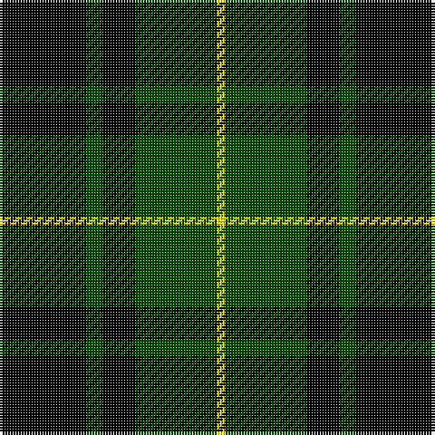

In pattern [KGKGY](/stripes/kgkgy/).

This was sourced from weddslist.  It is a [5 stripe tartan](/stripes/stripes5/).

Original link http://www.weddslist.com/cgi-bin/tartans/pg.pl?source=rb

## Attestations

This cloth appears in 2 source records; the oldest owns this page.

- undated — MacArthur (weddslist, [record](http://www.weddslist.com/cgi-bin/tartans/pg.pl?source=rb))
- undated — MacArthur (weddslist, [record](http://www.weddslist.com/cgi-bin/tartans/pg.pl?source=x))

## Thread count
K/32 G6 K12 G30 Y/3

## Palette
Each colour and the base-6 reference it is a variant of.

| Colour | Shade | Base |
|---|---|---|
| G | <code style="background-color:#004C00;">#004C00</code> `oklch(36.1% 0.123 142.5)` <small>#004C00</small> | G <code style="background-color:#006100;">#006100</code> |
| K | <code style="background-color:#000000;">#000000</code> `oklch(0.0% 0.000 0.0)` <small>#000000</small> | K <code style="background-color:#000000;">#000000</code> |
| Y | <code style="background-color:#FFFF00;">#FFFF00</code> `oklch(96.8% 0.211 109.8)` <small>#FFFF00</small> | Y <code style="background-color:#F2BF00;">#F2BF00</code> |

# Sample pattern

## Nearest tartans

The nearest existing variants by ΔTartan distance.

1. [MacArthur](/setts/s5/k32dg6k12dg30ly3~x2/) — ΔT 0.59
1. [Gunn](/setts/s6/r2g12k12g1k12g2~x2/) — ΔT 0.74
1. [Wallace Hunting](/setts/s4/k1dg8k8ly1/) — ΔT 0.81
1. [MacArthur](/setts/s5/k32g6k12g30ly3/) — ΔT 0.84
1. [Wallace Htg (Clan)](/setts/s4/k1g8k8ly1~x4/) — ΔT 0.91
1. [Wallace Hunting](/setts/s6/g8k8ly1k8g8k1~x4/) — ΔT 0.99
1. [Gunn VS](/setts/s6/dg1k8dg1k8dg15r1~x2/) — ΔT 1.11
1. [Douglas, (Black)](/setts/s5/k12db3g23k23r3~x2/) — ΔT 1.15
1. [Campbell of Lochawe](/setts/s5/k2db11k26g11k2~x2/) — ΔT 1.17
1. [Wallace, hunting](/setts/s4/k4g33k33ly4~x2/) — ΔT 1.24

## Neighbour map

Every grey dot is one of 14299 variants placed by the first two principal components of the ΔTartan feature space (44% of its variance). Red is this tartan; blue dots are its nearest — click one to open its page.

<svg viewBox="0 0 640 380" role="img" style="max-width:100%;height:auto;border:1px solid #e0e0e0;border-radius:4px;display:block" xmlns="http://www.w3.org/2000/svg"><image href="/nn/cloud.v1.png" width="640" height="380"/><a href="/setts/s5/k32dg6k12dg30ly3~x2/"><circle cx="327.8" cy="261.9" r="4" fill="#3465a4"><title>MacArthur</title></circle></a><a href="/setts/s6/r2g12k12g1k12g2~x2/"><circle cx="324.0" cy="233.3" r="4" fill="#3465a4"><title>Gunn</title></circle></a><a href="/setts/s4/k1dg8k8ly1/"><circle cx="302.7" cy="272.6" r="4" fill="#3465a4"><title>Wallace Hunting</title></circle></a><a href="/setts/s5/k32g6k12g30ly3/"><circle cx="292.6" cy="244.9" r="4" fill="#3465a4"><title>MacArthur</title></circle></a><a href="/setts/s4/k1g8k8ly1~x4/"><circle cx="280.8" cy="261.8" r="4" fill="#3465a4"><title>Wallace Htg (Clan)</title></circle></a><a href="/setts/s6/g8k8ly1k8g8k1~x4/"><circle cx="265.3" cy="268.1" r="4" fill="#3465a4"><title>Wallace Hunting</title></circle></a><a href="/setts/s6/dg1k8dg1k8dg15r1~x2/"><circle cx="343.8" cy="226.3" r="4" fill="#3465a4"><title>Gunn VS</title></circle></a><a href="/setts/s5/k12db3g23k23r3~x2/"><circle cx="258.9" cy="244.6" r="4" fill="#3465a4"><title>Douglas, (Black)</title></circle></a><a href="/setts/s5/k2db11k26g11k2~x2/"><circle cx="323.4" cy="233.8" r="4" fill="#3465a4"><title>Campbell of Lochawe</title></circle></a><a href="/setts/s4/k4g33k33ly4~x2/"><circle cx="273.4" cy="255.7" r="4" fill="#3465a4"><title>Wallace, hunting</title></circle></a><circle cx="311.0" cy="254.3" r="5" fill="#c00000"/></svg>

ID: /setts/s5/k32dg6k12dg30ly3/
