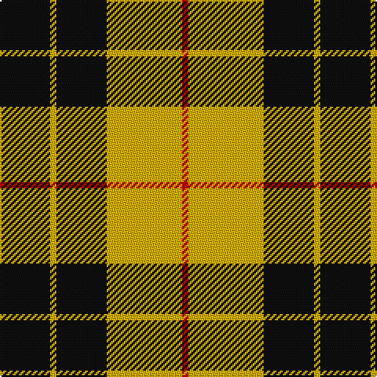

In pattern [KYKYR](/patterns/kykyr/).

This was sourced from register-of-tartans.  It is a [5 stripes tartan](/stripes/stripes5/).

Original link https://www.tartanregister.gov.uk/tartanDetails.aspx?ref=2640

## Attestations

This cloth appears in 2 source records; the oldest owns this page.

- 01/01/1842 — MacLeod of Lewis (Vestiarium Scoticum) (register-of-tartans, [record](https://www.tartanregister.gov.uk/tartanDetails.aspx?ref=2640))
- 1842 — MacLeod of Lewis (Clan) (tartans-authority, [record](http://www.tartansauthority.com/tartan-ferret/display/1272/))

## Thread count
K/32 Y4 K32 Y48 R/4

## Palette
Each colour and its ΔE from the base-6 reference it is a variant of.

| Colour | Shade | Base | ΔE (OKLab) |
|---|---|---|---|
| K | <code style="background-color:#101010;">#101010</code> `#101010` | K <code style="background-color:#000000;">#000000</code> | 0.17 |
| R | <code style="background-color:#C80000;">#C80000</code> `#C80000` | R <code style="background-color:#CC0000;">#CC0000</code> | 0.01 |
| Y | <code style="background-color:#D8B000;">#D8B000</code> `#D8B000` | Y <code style="background-color:#F2BF00;">#F2BF00</code> | 0.06 |

# Sample pattern

## Nearest tartans

The nearest existing variants by ΔTartan distance.

1. [MacLeod of Lewis](/setts/s5/k32y4k32y48r4-k000000-rc00000-yf0c000/) — ΔT 0.70
1. [MacLeod #3](/setts/s6/k12y2k12y18r2y4-k101010-r960028-ye8c000/) — ΔT 0.86
1. [MacLeod](/setts/s6/k12y2k12y18r2y4-k000000-r900030-yf0c000/) — ΔT 0.88
1. [MacLeod of Lewis](/setts/s5/k16y2k16y24r2-k000000-rc80000-yc8c800/) — ΔT 0.90
1. [Unnamed C21st - Fashion](/setts/s6/k8y64k32r6k32y8-k101010-re87878-yfccc00/) — ΔT 1.05
1. [MacLeod of Lewis](/setts/s5/k16y2k16y24r2-k000000-raa0000-yaaaa00/) — ΔT 1.13
1. [MacLeod of Lewis](/setts/s5/k8y1k8y12r1-k000000-raa0000-yaaaa00/) — ΔT 1.13
1. [Takla Makan #2 (Artefact)](/setts/s4/k8y30k8w4-k000000-we0e0e0-ya08858/) — ΔT 1.22
1. [Porter Drinkers', The](/setts/s6/k4y12k4y22k18r2-k101010-rff0000-yffcc33/) — ΔT 1.24
1. [Porter Drinkers (Commemorative)](/setts/s6/k4y12k4y22k18r2-k101010-rc80000-yfccc00/) — ΔT 1.25

## Neighbour map

Every grey dot is one of 15726 variants placed by the first two principal components of the ΔTartan feature space (44% of its variance). Red is this tartan; blue dots are its nearest — click one to open its page.

<svg viewBox="0 0 640 380" role="img" style="max-width:100%;height:auto;border:1px solid #e0e0e0;border-radius:4px;display:block" xmlns="http://www.w3.org/2000/svg"><image href="/nn/cloud.v1.png" width="640" height="380"/><a href="/setts/s5/k32y4k32y48r4-k000000-rc00000-yf0c000/"><circle cx="289.8" cy="222.2" r="4" fill="#3465a4"><title>MacLeod of Lewis</title></circle></a><a href="/setts/s6/k12y2k12y18r2y4-k101010-r960028-ye8c000/"><circle cx="256.7" cy="220.2" r="4" fill="#3465a4"><title>MacLeod #3</title></circle></a><a href="/setts/s6/k12y2k12y18r2y4-k000000-r900030-yf0c000/"><circle cx="253.2" cy="221.5" r="4" fill="#3465a4"><title>MacLeod</title></circle></a><a href="/setts/s5/k16y2k16y24r2-k000000-rc80000-yc8c800/"><circle cx="286.7" cy="225.5" r="4" fill="#3465a4"><title>MacLeod of Lewis</title></circle></a><a href="/setts/s6/k8y64k32r6k32y8-k101010-re87878-yfccc00/"><circle cx="267.9" cy="202.0" r="4" fill="#3465a4"><title>Unnamed C21st - Fashion</title></circle></a><a href="/setts/s5/k16y2k16y24r2-k000000-raa0000-yaaaa00/"><circle cx="291.8" cy="229.2" r="4" fill="#3465a4"><title>MacLeod of Lewis</title></circle></a><a href="/setts/s5/k8y1k8y12r1-k000000-raa0000-yaaaa00/"><circle cx="291.8" cy="229.2" r="4" fill="#3465a4"><title>MacLeod of Lewis</title></circle></a><a href="/setts/s4/k8y30k8w4-k000000-we0e0e0-ya08858/"><circle cx="309.0" cy="238.7" r="4" fill="#3465a4"><title>Takla Makan #2 (Artefact)</title></circle></a><a href="/setts/s6/k4y12k4y22k18r2-k101010-rff0000-yffcc33/"><circle cx="289.0" cy="206.2" r="4" fill="#3465a4"><title>Porter Drinkers', The</title></circle></a><a href="/setts/s6/k4y12k4y22k18r2-k101010-rc80000-yfccc00/"><circle cx="288.7" cy="207.1" r="4" fill="#3465a4"><title>Porter Drinkers (Commemorative)</title></circle></a><circle cx="297.5" cy="222.7" r="5" fill="#c00000"/></svg>

ID: /setts/s5/k32y4k32y48r4-k101010-rc80000-yd8b000/
