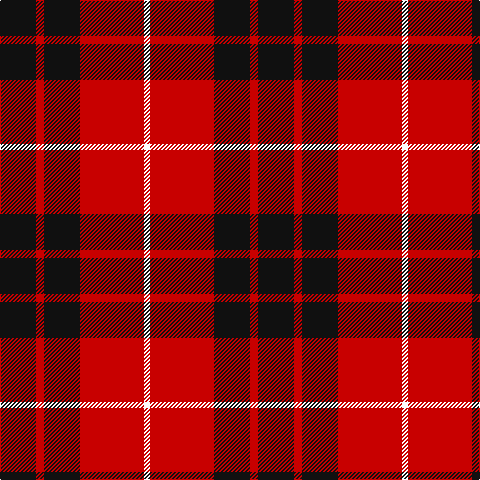

In pattern [KRKRW](/patterns/krkrw/).

This was sourced from register-of-tartans.  It is a [5 stripes tartan](/stripes/stripes5/).

Original link https://www.tartanregister.gov.uk/tartanDetails.aspx?ref=3049

## Thread count
K/36 R8 K36 R64 W/6

## Palette
Each colour and its ΔE from the base-6 reference it is a variant of.

| Colour | Shade | Base | ΔE (OKLab) |
|---|---|---|---|
| K | <code style="background-color:#101010;">#101010</code> `#101010` | K <code style="background-color:#000000;">#000000</code> | 0.17 |
| R | <code style="background-color:#C80000;">#C80000</code> `#C80000` | R <code style="background-color:#CC0000;">#CC0000</code> | 0.01 |
| W | <code style="background-color:#FCFCFC;">#FCFCFC</code> `#FCFCFC` | W <code style="background-color:#F7F7F7;">#F7F7F7</code> | 0.01 |

# Sample pattern

## Nearest tartans

The nearest existing variants by ΔTartan distance.

1. [Munro Black & Red Clan Tartan Tartan Number: 1204. Earliest known date: 1842 The design comes from the Vestiarium Scoticum (1842). The authors, the Sobieski Stuart brothers, enjoyed a popular following among the Scottish gentry in the early Victorian era, and in the spirit of the times, added mystery, romance and some spurious historical documentation to the subject of tartan. Of the better known tartans, the book offers some minor variation, but in other cases it provides the only recorded version of many tartans in use today. See products available Copyright © Blair Urquhart, Comrie, 2015](/setts/s5/k36r8k36r64w6-k101010-rc80000-we0e0e0/) — ΔT 0.11
1. [Bodog.com](/setts/s5/r6k50r50k20w6-k101010-rc80000-wc0c0c0/) — ΔT 0.67
1. [Brodie (Clan)](/setts/s6/k6r30k22y4k8r6-k101010-rc80000-ye8c000/) — ΔT 0.72
1. [Wallace](/setts/s4/k6r48k48y6-k101010-rc80000-ye8c000/) — ΔT 0.74
1. [Wallace (Clan)](/setts/s4/k4r32k32y4-k101010-rc80000-ye8c000/) — ΔT 0.74
1. [Swanstrom (Personal)](/setts/s6/k32r4k32r44y4r4-k101010-rc80000-ye8c000/) — ΔT 0.79
1. [Masai Shuka 01 (Artefact)](/setts/s4/w4k40r40w4-k101010-rc80000-wf8f8f8/) — ΔT 0.85
1. [MacDonald of Ardnamurchan (Clan?)](/setts/s7/r16k32r16k32r48k4y8-k101010-rc80000-ye8c000/) — ΔT 0.86
1. [MacKeane (MacIan) Clan Tartan Tartan Number: 1608. Earliest known date: 1842 The design comes from the Vestiarium Scoticum (1842). The authors, the Sobieski Stuart brothers, enjoyed a popular following among the Scottish gentry in the early Victorian era, and in the spirit of the times, added mystery, romance and some spurious historical documentation to the subject of tartan. Of the better known tartans, the book offers some minor variation, but in other cases it provides the only recorded version of many tartans in use today. See products available Copyright © Blair Urquhart, Comrie, 2015](/setts/s7/r8k16r8k16r24k2y4-k101010-rc80000-ye8c000/) — ΔT 0.86
1. [MacQueen](/setts/s6/k8r24k8r24k48y4-k101010-rc80000-ye8c000/) — ΔT 0.87

## Neighbour map

Every grey dot is one of 15726 variants placed by the first two principal components of the ΔTartan feature space (44% of its variance). Red is this tartan; blue dots are its nearest — click one to open its page.

<svg viewBox="0 0 640 380" role="img" style="max-width:100%;height:auto;border:1px solid #e0e0e0;border-radius:4px;display:block" xmlns="http://www.w3.org/2000/svg"><image href="/nn/cloud.v1.png" width="640" height="380"/><a href="/setts/s5/k36r8k36r64w6-k101010-rc80000-we0e0e0/"><circle cx="306.0" cy="231.1" r="4" fill="#3465a4"><title>Munro Black &amp; Red Clan Tartan Tartan Number: 1204. Earliest known date: 1842 The design comes from the Vestiarium Scoticum (1842). The authors, the Sobieski Stuart brothers, enjoyed a popular following among the Scottish gentry in the early Victorian era, and in the spirit of the times, added mystery, romance and some spurious historical documentation to the subject of tartan. Of the better known tartans, the book offers some minor variation, but in other cases it provides the only recorded version of many tartans in use today. See products available Copyright © Blair Urquhart, Comrie, 2015</title></circle></a><a href="/setts/s5/r6k50r50k20w6-k101010-rc80000-wc0c0c0/"><circle cx="318.6" cy="239.2" r="4" fill="#3465a4"><title>Bodog.com</title></circle></a><a href="/setts/s6/k6r30k22y4k8r6-k101010-rc80000-ye8c000/"><circle cx="289.0" cy="230.0" r="4" fill="#3465a4"><title>Brodie (Clan)</title></circle></a><a href="/setts/s4/k6r48k48y6-k101010-rc80000-ye8c000/"><circle cx="307.2" cy="245.1" r="4" fill="#3465a4"><title>Wallace</title></circle></a><a href="/setts/s4/k4r32k32y4-k101010-rc80000-ye8c000/"><circle cx="307.2" cy="245.1" r="4" fill="#3465a4"><title>Wallace (Clan)</title></circle></a><a href="/setts/s6/k32r4k32r44y4r4-k101010-rc80000-ye8c000/"><circle cx="337.2" cy="216.4" r="4" fill="#3465a4"><title>Swanstrom (Personal)</title></circle></a><a href="/setts/s4/w4k40r40w4-k101010-rc80000-wf8f8f8/"><circle cx="279.5" cy="225.3" r="4" fill="#3465a4"><title>Masai Shuka 01 (Artefact)</title></circle></a><a href="/setts/s7/r16k32r16k32r48k4y8-k101010-rc80000-ye8c000/"><circle cx="307.3" cy="217.7" r="4" fill="#3465a4"><title>MacDonald of Ardnamurchan (Clan?)</title></circle></a><a href="/setts/s7/r8k16r8k16r24k2y4-k101010-rc80000-ye8c000/"><circle cx="307.3" cy="217.7" r="4" fill="#3465a4"><title>MacKeane (MacIan) Clan Tartan Tartan Number: 1608. Earliest known date: 1842 The design comes from the Vestiarium Scoticum (1842). The authors, the Sobieski Stuart brothers, enjoyed a popular following among the Scottish gentry in the early Victorian era, and in the spirit of the times, added mystery, romance and some spurious historical documentation to the subject of tartan. Of the better known tartans, the book offers some minor variation, but in other cases it provides the only recorded version of many tartans in use today. See products available Copyright © Blair Urquhart, Comrie, 2015</title></circle></a><a href="/setts/s6/k8r24k8r24k48y4-k101010-rc80000-ye8c000/"><circle cx="343.2" cy="218.3" r="4" fill="#3465a4"><title>MacQueen</title></circle></a><circle cx="302.9" cy="229.7" r="5" fill="#c00000"/></svg>

ID: /setts/s5/k36r8k36r64w6-k101010-rc80000-wfcfcfc/
