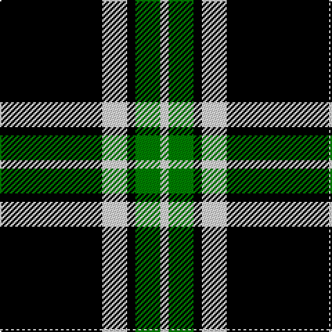

In pattern [KWKGW](/patterns/kwkgw/).

This was sourced from weddslist.  It is a [5 stripes tartan](/stripes/stripes5/).

Original link http://www.weddslist.com/cgi-bin/tartans/pg.pl?source=sts

## Thread count
K/74 LN18 K6 G18 LN/6

## Palette
Each colour and its ΔE from the base-6 reference it is a variant of.

| Colour | Shade | Base | ΔE (OKLab) |
|---|---|---|---|
| G | <code style="background-color:#008000;">#008000</code> `#008000` | G <code style="background-color:#006100;">#006100</code> | 0.10 |
| K | <code style="background-color:#000000;">#000000</code> `#000000` | K <code style="background-color:#000000;">#000000</code> | 0.00 |
| LN | <code style="background-color:#E0E0E0;">#E0E0E0</code> `#E0E0E0` | W <code style="background-color:#F7F7F7;">#F7F7F7</code> | 0.07 |

# Sample pattern

## Nearest tartans

The nearest existing variants by ΔTartan distance.

1. [Glen Coe Trade Tartan Tartan Number: 1243. Earliest known date: Modern Many new designs have been given district names to promote their Scottish connections. However, these names should not be confused with the District tartans which have earned their title through 'use and wont' and not a little history. See products available Copyright © Blair Urquhart, Comrie, 2015](/setts/s5/k37w9k3g9w3~g003820-k101010-we0e0e0~x2/) — ΔT 0.88
1. [Glen Coe #1 (Fashion)](/setts/s5/k37w9k3g9w3~g006818-k101010-wfcfcfc~x2/) — ΔT 1.03
1. [Moffat](/setts/s7/k39g3k3g3k14g28r3~g808080-k000000-rc00000~x2/) — ΔT 1.10
1. [Burberry Black](/setts/s5/y3k3y3k10r1~k000000-rc80000-yb0b0b0~x6/) — ΔT 1.15
1. [West Point](/setts/s8/k13g1k1g1k4g10y1g1~g808080-k000000-yf0c000~x6/) — ΔT 1.36
1. [Childers](/setts/s6/k88g17k8ga28k8r6~g30a010-ga008000-k000000-rc00000~x2/) — ΔT 1.37
1. [Lords, of Skye](/setts/s4/k46r7k8w20~k000000-r806050-we0e0e0~x2/) — ΔT 1.48
1. [Campbell of Lochawe](/setts/s5/k2b11k26g11k2~b304080-g008000-k000000~x2/) — ΔT 1.48
1. [Gunn](/setts/s6/g2k12g1k12g12r2~g008000-k000000-rc00000~x2/) — ΔT 1.48
1. [Lundy Reform](/setts/s7/k2w5k1w1k10r1k1~k101010-rc80000-wc0c0c0~x4/) — ΔT 1.51

## Neighbour map

Every grey dot is one of 15726 variants placed by the first two principal components of the ΔTartan feature space (44% of its variance). Red is this tartan; blue dots are its nearest — click one to open its page.

<svg viewBox="0 0 640 380" role="img" style="max-width:100%;height:auto;border:1px solid #e0e0e0;border-radius:4px;display:block" xmlns="http://www.w3.org/2000/svg"><image href="/nn/cloud.v1.png" width="640" height="380"/><a href="/setts/s5/k37w9k3g9w3~g003820-k101010-we0e0e0~x2/"><circle cx="370.7" cy="213.3" r="4" fill="#3465a4"><title>Glen Coe Trade Tartan Tartan Number: 1243. Earliest known date: Modern Many new designs have been given district names to promote their Scottish connections. However, these names should not be confused with the District tartans which have earned their title through 'use and wont' and not a little history. See products available Copyright © Blair Urquhart, Comrie, 2015</title></circle></a><a href="/setts/s5/k37w9k3g9w3~g006818-k101010-wfcfcfc~x2/"><circle cx="361.3" cy="208.9" r="4" fill="#3465a4"><title>Glen Coe #1 (Fashion)</title></circle></a><a href="/setts/s7/k39g3k3g3k14g28r3~g808080-k000000-rc00000~x2/"><circle cx="354.7" cy="201.5" r="4" fill="#3465a4"><title>Moffat</title></circle></a><a href="/setts/s5/y3k3y3k10r1~k000000-rc80000-yb0b0b0~x6/"><circle cx="346.2" cy="241.6" r="4" fill="#3465a4"><title>Burberry Black</title></circle></a><a href="/setts/s8/k13g1k1g1k4g10y1g1~g808080-k000000-yf0c000~x6/"><circle cx="334.9" cy="185.9" r="4" fill="#3465a4"><title>West Point</title></circle></a><a href="/setts/s6/k88g17k8ga28k8r6~g30a010-ga008000-k000000-rc00000~x2/"><circle cx="373.3" cy="190.2" r="4" fill="#3465a4"><title>Childers</title></circle></a><a href="/setts/s4/k46r7k8w20~k000000-r806050-we0e0e0~x2/"><circle cx="334.9" cy="264.3" r="4" fill="#3465a4"><title>Lords, of Skye</title></circle></a><a href="/setts/s5/k2b11k26g11k2~b304080-g008000-k000000~x2/"><circle cx="319.9" cy="236.7" r="4" fill="#3465a4"><title>Campbell of Lochawe</title></circle></a><a href="/setts/s6/g2k12g1k12g12r2~g008000-k000000-rc00000~x2/"><circle cx="320.8" cy="237.7" r="4" fill="#3465a4"><title>Gunn</title></circle></a><a href="/setts/s7/k2w5k1w1k10r1k1~k101010-rc80000-wc0c0c0~x4/"><circle cx="374.8" cy="202.4" r="4" fill="#3465a4"><title>Lundy Reform</title></circle></a><circle cx="360.2" cy="214.3" r="5" fill="#c00000"/></svg>

ID: /setts/s5/k37w9k3g9w3~g008000-k000000-we0e0e0~x2/
