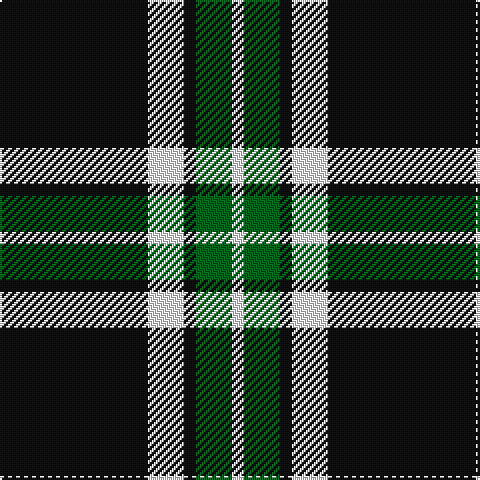

In pattern [KWKGW](/stripes/kwkgw/).

This was sourced from tartans-authority.  It is a [5 stripe tartan](/stripes/stripes5/).

Original link http://www.tartansauthority.com/tartan-ferret/display/1243/

## Also known as

This cloth is also recorded under:

- Glen Coe #1
- Glen Coe #2

## Attestations

This cloth appears in 2 source records; the oldest owns this page.

- pre 2002 — Glen Coe #1 (Fashion) (tartans-authority, [record](http://www.tartansauthority.com/tartan-ferret/display/1243/))
- undated — Glencoe (weddslist, [record](http://www.weddslist.com/cgi-bin/tartans/pg.pl?source=sts))

## Thread count
K/74 W18 K6 G18 W/6

## Palette
Each colour and the base-6 reference it is a variant of.

| Colour | Shade | Base |
|---|---|---|
| G | <code style="background-color:#006818;">#006818</code> `oklch(45.0% 0.142 145.0)` <small>#006818</small> | G <code style="background-color:#006100;">#006100</code> |
| K | <code style="background-color:#101010;">#101010</code> `oklch(17.3% 0.000 89.9)` <small>#101010</small> | K <code style="background-color:#000000;">#000000</code> |
| W | <code style="background-color:#FCFCFC;">#FCFCFC</code> `oklch(99.1% 0.000 89.9)` <small>#FCFCFC</small> | W <code style="background-color:#F7F7F7;">#F7F7F7</code> |

# Sample pattern

## Nearest tartans

The nearest existing variants by ΔTartan distance.

1. [Glen Coe Trade Tartan Tartan Number: 1243. Earliest known date: Modern Many new designs have been given district names to promote their Scottish connections. However, these names should not be confused with the District tartans which have earned their title through 'use and wont' and not a little history. See products available Copyright © Blair Urquhart, Comrie, 2015](/setts/s5/k37w9k3dg9w3~x2/) — ΔT 0.47
1. [Sligo Irish County Tartan Tartan Number: 2256. Earliest known date: 1995 One of a series of Irish District tartans designed by Polly Wittering of the House of Edgar, with colours reminiscent of the Country with soft warm colours dominating. See products available Copyright © Blair Urquhart, Comrie, 2015](/setts/s6/t50k4t12k23lo4k4~x2/) — ΔT 0.91
1. [Lundy Reform](/setts/s7/k2lb5k1lb1k10r1k1~x4/) — ΔT 1.04
1. [Northern Kentucky University](/setts/s7/w5k3ly6k5w3k30ly2~x2/) — ΔT 1.15
1. [DDB Canada (Fashion)](/setts/s7/k1o2k7o11k18ly2k1~x2/) — ΔT 1.24
1. [Shembe Zulu Church](/setts/s5/k5w25r6k45w4~x2/) — ΔT 1.29
1. [Moffat (1984)](/setts/s7/k39o3k3o3k14o28r3~x2/) — ΔT 1.32
1. [Perry, Alex (Personal)](/setts/s4/k62n24lo5w8~x2/) — ΔT 1.33
1. [Glasgow Warriors](/setts/s7/k16w30lb36k10lb10k83lb6/) — ΔT 1.38
1. [Lords of Skye (Fashion?)](/setts/s4/k46dy7k8w20~x2/) — ΔT 1.44

## Neighbour map

Every grey dot is one of 14299 variants placed by the first two principal components of the ΔTartan feature space (44% of its variance). Red is this tartan; blue dots are its nearest — click one to open its page.

<svg viewBox="0 0 640 380" role="img" style="max-width:100%;height:auto;border:1px solid #e0e0e0;border-radius:4px;display:block" xmlns="http://www.w3.org/2000/svg"><image href="/nn/cloud.v1.png" width="640" height="380"/><a href="/setts/s5/k37w9k3dg9w3~x2/"><circle cx="373.3" cy="207.1" r="4" fill="#3465a4"><title>Glen Coe Trade Tartan Tartan Number: 1243. Earliest known date: Modern Many new designs have been given district names to promote their Scottish connections. However, these names should not be confused with the District tartans which have earned their title through 'use and wont' and not a little history. See products available Copyright © Blair Urquhart, Comrie, 2015</title></circle></a><a href="/setts/s6/t50k4t12k23lo4k4~x2/"><circle cx="370.0" cy="197.4" r="4" fill="#3465a4"><title>Sligo Irish County Tartan Tartan Number: 2256. Earliest known date: 1995 One of a series of Irish District tartans designed by Polly Wittering of the House of Edgar, with colours reminiscent of the Country with soft warm colours dominating. See products available Copyright © Blair Urquhart, Comrie, 2015</title></circle></a><a href="/setts/s7/k2lb5k1lb1k10r1k1~x4/"><circle cx="377.0" cy="195.3" r="4" fill="#3465a4"><title>Lundy Reform</title></circle></a><a href="/setts/s7/w5k3ly6k5w3k30ly2~x2/"><circle cx="405.4" cy="167.7" r="4" fill="#3465a4"><title>Northern Kentucky University</title></circle></a><a href="/setts/s7/k1o2k7o11k18ly2k1~x2/"><circle cx="395.5" cy="187.5" r="4" fill="#3465a4"><title>DDB Canada (Fashion)</title></circle></a><a href="/setts/s5/k5w25r6k45w4~x2/"><circle cx="316.9" cy="198.2" r="4" fill="#3465a4"><title>Shembe Zulu Church</title></circle></a><a href="/setts/s7/k39o3k3o3k14o28r3~x2/"><circle cx="372.9" cy="198.0" r="4" fill="#3465a4"><title>Moffat (1984)</title></circle></a><a href="/setts/s4/k62n24lo5w8~x2/"><circle cx="342.7" cy="212.0" r="4" fill="#3465a4"><title>Perry, Alex (Personal)</title></circle></a><a href="/setts/s7/k16w30lb36k10lb10k83lb6/"><circle cx="291.1" cy="186.0" r="4" fill="#3465a4"><title>Glasgow Warriors</title></circle></a><a href="/setts/s4/k46dy7k8w20~x2/"><circle cx="335.8" cy="249.6" r="4" fill="#3465a4"><title>Lords of Skye (Fashion?)</title></circle></a><circle cx="364.0" cy="201.8" r="5" fill="#c00000"/></svg>

ID: /setts/s5/k37w9k3g9w3~x2/
