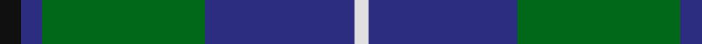
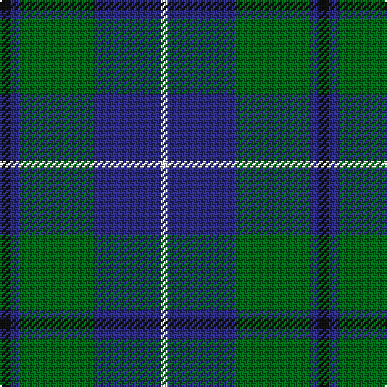

**Bands:** [KBGBW](/stripes/kbgbw/) · **Stripes:** [K DB G DB W](/stripes/stripes5/) K DB G DB W

This was sourced from house-of-tartan.  It is a [5 band tartan](/bands/bands5/).

Original link http://www.house-of-tartan.scotland.net/house/TartanViewjs.asp?colr=Def&tnam=1032

## Variants

Other setts woven to the same stripe pattern.

- [Douglas, Green (Wilsons)](/setts/s5/k1db1g8db8w1~x4/)

## Thread count
K/6 DBa6 G46 DB42 LN/4

## Palette
Each colour and its ΔE from the base-6 reference it is a variant of.

| Colour | Shade | Base | ΔE (OKLab) |
|---|---|---|---|
| B | <code style="background-color:#5C8CA8;">#5C8CA8</code> `#5C8CA8` | B <code style="background-color:#2A418A;">#2A418A</code> | 0.23 |
| DB | <code style="background-color:#2C2C80;">#2C2C80</code> `#2C2C80` | B <code style="background-color:#2A418A;">#2A418A</code> | 0.06 |
| DBa | <code style="background-color:#2C2C80;">#2C2C80</code> `#2C2C80` | B <code style="background-color:#2A418A;">#2A418A</code> | 0.06 |
| G | <code style="background-color:#006818;">#006818</code> `#006818` | G <code style="background-color:#006100;">#006100</code> | 0.02 |
| K | <code style="background-color:#101010;">#101010</code> `#101010` | K <code style="background-color:#000000;">#000000</code> | 0.17 |
| LN | <code style="background-color:#E0E0E0;">#E0E0E0</code> `#E0E0E0` | W <code style="background-color:#F7F7F7;">#F7F7F7</code> | 0.07 |

# Sample pattern

## Nearest tartans

The nearest existing variants by ΔTartan distance.

1. [Pride of Yorkland (Fashion)](/setts/s6/g35k3db26k4db4w3~x2/) — ΔT 0.77
1. [Turnbull Hunting](/setts/s5/r7ly3dg28db28w3~x2/) — ΔT 0.81
1. [Highlander Highland Laddie](/setts/s5/k7r3g30db28lb3~x2/) — ΔT 0.83
1. [DeLoughery (Personal)](/setts/s6/db20k6lo4db3g20w2~x2/) — ΔT 0.87
1. [Douglas, Green (Wilsons)](/setts/s5/k1db1g8db8w1~x4/) — ΔT 0.88
1. [MacThomas Clan Tartan Tartan Number: 407. Earliest known date: 1975 Designed by David Thomas - former director of the Strathmore Woollen Co. in Forfar who still (in 2011) weave this tartan. Adopted by Clan Society in 1975, and registered with Lord Lyon in 1979. See products available Copyright © Blair Urquhart, Comrie, 2015](/setts/s7/db3m2db22k11g24lp2g3~x2/) — ΔT 0.91
1. [Carmichael](/setts/s6/k5g32db32r3db3ly3~x2/) — ΔT 0.92
1. [MacThomas (Clan)](/setts/s7/b5m3b32k16dg32lp3dg5~x2/) — ΔT 0.94
1. [Turnbull Hunting (1983) #2](/setts/s5/k2ly1g10db10w1~x6/) — ΔT 0.96
1. [Ednie (Personal)](/setts/s7/b11k4g4m1g4k1r1~x4/) — ΔT 0.96

## Neighbour map

Every grey dot is one of 14313 variants placed by the first two principal components of the ΔTartan feature space (44% of its variance). Red is this tartan; blue dots are its nearest — click one to open its page.

<svg viewBox="0 0 640 380" role="img" style="max-width:100%;height:auto;border:1px solid #e0e0e0;border-radius:4px;display:block" xmlns="http://www.w3.org/2000/svg"><image href="/nn/cloud.v1.png" width="640" height="380"/><a href="/setts/s6/g35k3db26k4db4w3~x2/"><circle cx="252.7" cy="188.1" r="4" fill="#3465a4"><title>Pride of Yorkland (Fashion)</title></circle></a><a href="/setts/s5/r7ly3dg28db28w3~x2/"><circle cx="224.7" cy="218.4" r="4" fill="#3465a4"><title>Turnbull Hunting</title></circle></a><a href="/setts/s5/k7r3g30db28lb3~x2/"><circle cx="222.2" cy="213.8" r="4" fill="#3465a4"><title>Highlander Highland Laddie</title></circle></a><a href="/setts/s6/db20k6lo4db3g20w2~x2/"><circle cx="206.7" cy="203.1" r="4" fill="#3465a4"><title>DeLoughery (Personal)</title></circle></a><a href="/setts/s5/k1db1g8db8w1~x4/"><circle cx="219.1" cy="217.1" r="4" fill="#3465a4"><title>Douglas, Green (Wilsons)</title></circle></a><a href="/setts/s7/db3m2db22k11g24lp2g3~x2/"><circle cx="233.8" cy="194.7" r="4" fill="#3465a4"><title>MacThomas Clan Tartan Tartan Number: 407. Earliest known date: 1975 Designed by David Thomas - former director of the Strathmore Woollen Co. in Forfar who still (in 2011) weave this tartan. Adopted by Clan Society in 1975, and registered with Lord Lyon in 1979. See products available Copyright © Blair Urquhart, Comrie, 2015</title></circle></a><a href="/setts/s6/k5g32db32r3db3ly3~x2/"><circle cx="250.8" cy="188.5" r="4" fill="#3465a4"><title>Carmichael</title></circle></a><a href="/setts/s7/b5m3b32k16dg32lp3dg5~x2/"><circle cx="213.7" cy="200.7" r="4" fill="#3465a4"><title>MacThomas (Clan)</title></circle></a><a href="/setts/s5/k2ly1g10db10w1~x6/"><circle cx="215.5" cy="204.6" r="4" fill="#3465a4"><title>Turnbull Hunting (1983) #2</title></circle></a><a href="/setts/s7/b11k4g4m1g4k1r1~x4/"><circle cx="213.0" cy="194.5" r="4" fill="#3465a4"><title>Ednie (Personal)</title></circle></a><circle cx="258.6" cy="212.6" r="5" fill="#c00000"/></svg>

ID: /setts/s5/k3db3g23db21w2~x2/
