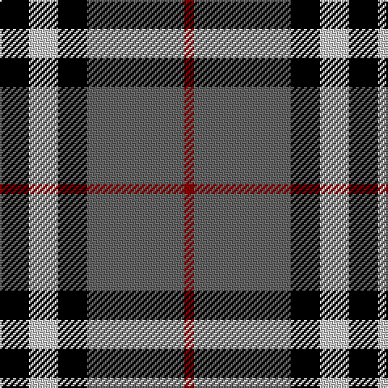

**Bands:** [KWKBR](/stripes/kwkbr/) · **Stripes:** [K LB K N R](/stripes/stripes5/) K LB K N R

This was sourced from register-of-tartans.  It is a [5 band tartan](/bands/bands5/).

Original link https://www.tartanregister.gov.uk/tartanDetails.aspx?ref=1549

## Attestations

This cloth appears in 2 source records; the oldest owns this page.

- 01/01/2002 — Greystone (Burberry Grey) (register-of-tartans, [record](https://www.tartanregister.gov.uk/tartanDetails.aspx?ref=1549))
- pre 2002 — Greystone (Fashion) (tartans-authority, [record](http://www.tartansauthority.com/tartan-ferret/display/5123/))

## Register references

External register numbers recorded for this tartan.

- Scottish Register of Tartans: [1549](https://www.tartanregister.gov.uk/tartanDetails.aspx?ref=1549)
- Scottish Tartans Authority (ITI): 5123

## Thread count
K/18 N18 K18 Na60 DR/6

## Palette
Each colour and its ΔE from the base-6 reference it is a variant of.

| Colour | Shade | Base | ΔE (OKLab) |
|---|---|---|---|
| DR | <code style="background-color:#8C0000;">#8C0000</code> `#8C0000` | R <code style="background-color:#CC0000;">#CC0000</code> | 0.14 |
| K | <code style="background-color:#000000;">#000000</code> `#000000` | K <code style="background-color:#000000;">#000000</code> | 0.00 |
| N | <code style="background-color:#C8C8C8;">#C8C8C8</code> `#C8C8C8` | W <code style="background-color:#F7F7F7;">#F7F7F7</code> | 0.14 |
| Na | <code style="background-color:#646464;">#646464</code> `#646464` | B <code style="background-color:#2A418A;">#2A418A</code> | 0.16 |

# Sample pattern

## Nearest tartans

The nearest existing variants by ΔTartan distance.

1. [Burberry Hunting](/setts/s5/k3w3k3y10r1~x6/) — ΔT 0.69
1. [Dunbog Primary (School)](/setts/s6/r12db3g5db16ly2g2~x2/) — ΔT 0.98
1. [Callaway](/setts/s6/r2k28y5w12y14r2~x2/) — ΔT 0.99
1. [Burberry, Check](/setts/s5/k6w6k6o21r2~x4/) — ΔT 1.05
1. [Loganair, Uniform Skirt](/setts/s4/r5y32k31w5~x2/) — ΔT 1.05
1. [Wcwm 759-3](/setts/s6/lb5o34k24o4r24o4~x2/) — ΔT 1.06
1. [Loganair](/setts/s4/r5o32k31w5~x2/) — ΔT 1.09
1. [Oban Grey](/setts/s5/k4w3k4y9r1~x4/) — ΔT 1.10
1. [Thom(p)son camel](/setts/s6/r4o30k6w13k13w3~x2/) — ΔT 1.11
1. [Loganair Uniform Skirt Corporate Tartan Tartan Number: 1629. Earliest known date: c.1985 Half actual count for display. Used until 1988 See products available Copyright © Blair Urquhart, Comrie, 2015](/setts/s4/r5o32k31w5/) — ΔT 1.11

## Neighbour map

Every grey dot is one of 14299 variants placed by the first two principal components of the ΔTartan feature space (44% of its variance). Red is this tartan; blue dots are its nearest — click one to open its page.

<svg viewBox="0 0 640 380" role="img" style="max-width:100%;height:auto;border:1px solid #e0e0e0;border-radius:4px;display:block" xmlns="http://www.w3.org/2000/svg"><image href="/nn/cloud.v1.png" width="640" height="380"/><a href="/setts/s5/k3w3k3y10r1~x6/"><circle cx="232.2" cy="210.5" r="4" fill="#3465a4"><title>Burberry Hunting</title></circle></a><a href="/setts/s6/r12db3g5db16ly2g2~x2/"><circle cx="223.9" cy="209.5" r="4" fill="#3465a4"><title>Dunbog Primary (School)</title></circle></a><a href="/setts/s6/r2k28y5w12y14r2~x2/"><circle cx="205.3" cy="175.3" r="4" fill="#3465a4"><title>Callaway</title></circle></a><a href="/setts/s5/k6w6k6o21r2~x4/"><circle cx="239.9" cy="196.7" r="4" fill="#3465a4"><title>Burberry, Check</title></circle></a><a href="/setts/s4/r5y32k31w5~x2/"><circle cx="197.4" cy="237.5" r="4" fill="#3465a4"><title>Loganair, Uniform Skirt</title></circle></a><a href="/setts/s6/lb5o34k24o4r24o4~x2/"><circle cx="190.9" cy="202.0" r="4" fill="#3465a4"><title>Wcwm 759-3</title></circle></a><a href="/setts/s4/r5o32k31w5~x2/"><circle cx="210.3" cy="241.0" r="4" fill="#3465a4"><title>Loganair</title></circle></a><a href="/setts/s5/k4w3k4y9r1~x4/"><circle cx="187.5" cy="223.6" r="4" fill="#3465a4"><title>Oban Grey</title></circle></a><a href="/setts/s6/r4o30k6w13k13w3~x2/"><circle cx="185.0" cy="187.3" r="4" fill="#3465a4"><title>Thom(p)son camel</title></circle></a><a href="/setts/s4/r5o32k31w5/"><circle cx="209.3" cy="239.4" r="4" fill="#3465a4"><title>Loganair Uniform Skirt Corporate Tartan Tartan Number: 1629. Earliest known date: c.1985 Half actual count for display. Used until 1988 See products available Copyright © Blair Urquhart, Comrie, 2015</title></circle></a><circle cx="231.0" cy="209.1" r="5" fill="#c00000"/></svg>

ID: /setts/s5/k3lb3k3n10r1~x6/
