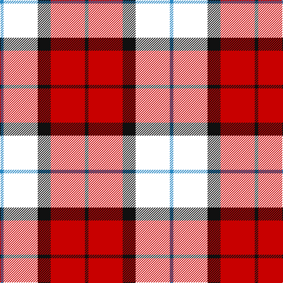

**Bands:** [BKKRK](/stripes/bkkrk/) · **Stripes:** [T K K R K](/stripes/stripes5/) T K K R K

This was sourced from house-of-tartan.  It is a [5 band tartan](/bands/bands5/).

Original link http://www.house-of-tartan.scotland.net/house/TartanViewjs.asp?colr=Def&tnam=8186

## Thread count
B/6 W58 K22 R58 K/6

## Palette
Each colour and its ΔE from the base-6 reference it is a variant of.

| Colour | Shade | Base | ΔE (OKLab) |
|---|---|---|---|
| B | <code style="background-color:#2888C4;">#2888C4</code> `#2888C4` | B <code style="background-color:#2A418A;">#2A418A</code> | 0.21 |
| K | <code style="background-color:#101010;">#101010</code> `#101010` | K <code style="background-color:#000000;">#000000</code> | 0.17 |
| LN | <code style="background-color:#E0E0E0;">#E0E0E0</code> `#E0E0E0` | W <code style="background-color:#F7F7F7;">#F7F7F7</code> | 0.07 |
| R | <code style="background-color:#C80000;">#C80000</code> `#C80000` | R <code style="background-color:#CC0000;">#CC0000</code> | 0.01 |

# Sample pattern

## Nearest tartans

The nearest existing variants by ΔTartan distance.

1. [Graham of Menteith, (Red)](/setts/s6/r26t3r4k16db16k4~x2/) — ΔT 1.00
1. [Dutch](/setts/s6/k4o19k19o2dp22w4~x2/) — ΔT 1.13
1. [Unidentified #65](/setts/s6/dg3k20k20r20k3r3~x2/) — ΔT 1.16
1. [Connel](/setts/s4/ly1k8r8w1~x2/) — ΔT 1.24
1. [Wcwm 759-2](/setts/s6/lb5r34k22r4o24r4~x2/) — ΔT 1.31
1. [LP Cover (Dance)](/setts/s7/ly3k9b1k1r6k2ly3~x4/) — ΔT 1.35
1. [Aitken](/setts/s8/lo5db2k2db12k16r20k2r4~x2/) — ΔT 1.37
1. [MacTavish](/setts/s6/b2r12db2b6k6b1~x2/) — ΔT 1.45
1. [MacTavish](/setts/s6/b2r12db2b6k6b1/) — ΔT 1.45
1. [Cetoloni (Personal)](/setts/s6/db1r12k6ly1k6db1~x4/) — ΔT 1.47

## Neighbour map

Every grey dot is one of 14313 variants placed by the first two principal components of the ΔTartan feature space (44% of its variance). Red is this tartan; blue dots are its nearest — click one to open its page.

<svg viewBox="0 0 640 380" role="img" style="max-width:100%;height:auto;border:1px solid #e0e0e0;border-radius:4px;display:block" xmlns="http://www.w3.org/2000/svg"><image href="/nn/cloud.v1.png" width="640" height="380"/><a href="/setts/s6/r26t3r4k16db16k4~x2/"><circle cx="205.8" cy="207.5" r="4" fill="#3465a4"><title>Graham of Menteith, (Red)</title></circle></a><a href="/setts/s6/k4o19k19o2dp22w4~x2/"><circle cx="152.6" cy="197.2" r="4" fill="#3465a4"><title>Dutch</title></circle></a><a href="/setts/s6/dg3k20k20r20k3r3~x2/"><circle cx="164.9" cy="226.6" r="4" fill="#3465a4"><title>Unidentified #65</title></circle></a><a href="/setts/s4/ly1k8r8w1~x2/"><circle cx="231.3" cy="218.1" r="4" fill="#3465a4"><title>Connel</title></circle></a><a href="/setts/s6/lb5r34k22r4o24r4~x2/"><circle cx="206.5" cy="202.7" r="4" fill="#3465a4"><title>Wcwm 759-2</title></circle></a><a href="/setts/s7/ly3k9b1k1r6k2ly3~x4/"><circle cx="210.4" cy="198.9" r="4" fill="#3465a4"><title>LP Cover (Dance)</title></circle></a><a href="/setts/s8/lo5db2k2db12k16r20k2r4~x2/"><circle cx="188.2" cy="189.3" r="4" fill="#3465a4"><title>Aitken</title></circle></a><a href="/setts/s6/b2r12db2b6k6b1~x2/"><circle cx="210.4" cy="195.6" r="4" fill="#3465a4"><title>MacTavish</title></circle></a><a href="/setts/s6/b2r12db2b6k6b1/"><circle cx="210.4" cy="195.6" r="4" fill="#3465a4"><title>MacTavish</title></circle></a><a href="/setts/s6/db1r12k6ly1k6db1~x4/"><circle cx="273.6" cy="187.6" r="4" fill="#3465a4"><title>Cetoloni (Personal)</title></circle></a><circle cx="204.4" cy="211.2" r="5" fill="#c00000"/></svg>

ID: /setts/s5/k3r29k11k29t3~x2/
