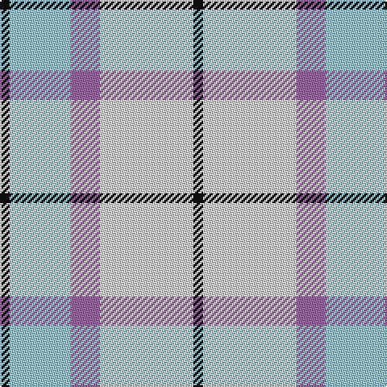

In pattern [KWRWK](/patterns/kwrwk/).

This was sourced from register-of-tartans.  It is a [5 stripes tartan](/stripes/stripes5/).

Original link https://www.tartanregister.gov.uk/tartanDetails.aspx?ref=10248

## Attestations

This cloth appears in 3 source records; the oldest owns this page.

- 01/06/2010 — Islander Dress (register-of-tartans, [record](https://www.tartanregister.gov.uk/tartanDetails.aspx?ref=10248))
- 1st June 2010 — Islander Dress (Dance) (tartans-authority, [record](http://www.tartansauthority.com/tartan-ferret/display/10248/))
- undated — Islander Dress Fancy Tartan Tartan Number: 10248. Earliest known date: 1st June 2010 This tartan was designed by Acacia Bingham based on the Manx Dress tartan to be used for her Highland dancing. Colours: turquoise is for the sea and sky around our island home; purple is for Mt Wellington which stands above our city; black is for the strength and white is for the grace needed for highland dancing. This tartan is only to be worn by permission of the designer. It is intended for those people who live on islands separate from the mainland of a country. (House of Tartan, Scotland) See products available Copyright © Blair Urquhart, Comrie, 2015 (house-of-tartan, [record](http://www.house-of-tartan.scotland.net/house/TartanViewjs.asp?colr=Def&tnam=10248))

## Thread count
K/6 LB38 LP18 LN58 K/6

## Palette
Each colour and its ΔE from the base-6 reference it is a variant of.

| Colour | Shade | Base | ΔE (OKLab) |
|---|---|---|---|
| K | <code style="background-color:#101010;">#101010</code> `#101010` | K <code style="background-color:#000000;">#000000</code> | 0.17 |
| LB | <code style="background-color:#98C8E8;">#98C8E8</code> `#98C8E8` | W <code style="background-color:#F7F7F7;">#F7F7F7</code> | 0.18 |
| LN | <code style="background-color:#E0E0E0;">#E0E0E0</code> `#E0E0E0` | W <code style="background-color:#F7F7F7;">#F7F7F7</code> | 0.07 |
| LP | <code style="background-color:#9C68A4;">#9C68A4</code> `#9C68A4` | R <code style="background-color:#CC0000;">#CC0000</code> | 0.21 |

# Sample pattern

## Nearest tartans

The nearest existing variants by ΔTartan distance.

1. [Lennox Turquoise Dress District Tartan Tartan Number: 8190. Earliest known date: pre 2003 Families with the surname 'Lennox' are usually considered related to Clans Stewart or MacFarlane. Some of this surname also choose to wear the distinctive and ancient 'Lennox' tartan. D W Stewart reproduced the sett from a 'lost' portrait of the Countess of Lennox dating from the 16th century./Threadcount and colours aren't 100% original. Generated manually./ See products available Copyright © Blair Urquhart, Comrie, 2015](/setts/s7/b8ba2b24ba5w26k2w8~b5c8ca8-ba2c2c80-k101010-we0e0e0~x2/) — ΔT 1.26
1. [Conquergood Family Tartan Tartan Number: 2095. Earliest known date: 1982 Designed to represent Canadian landscape in winter and sandy beaches in summer. Robert Conquergood, born in 1818 in Ormston, in the Parish of Roxburgh, Scotland, emigrated to Ontario, Canada with his father, also Robert, who was born in 1781. The Conquergood family in Canada approved this tartan at their 1990 biennial family reunion held at Kelowna, British Columbia. See products available Copyright © Blair Urquhart, Comrie, 2015](/setts/s8/b2ba2w11ba5r5w2b1ba2~b003c64-ba2888c4-r888888-we0e0e0~x2/) — ΔT 1.31
1. [Louise Beveridge (Personal)](/setts/s5/w40wa25b16w8b4~b003c64-w98c8e8-wae0e0e0~x2/) — ΔT 1.38
1. [O'Connor Dress](/setts/s5/g5r5w11r1g1~g604000-re87878-w98c8e8~x4/) — ΔT 1.52
1. [MacTavish of Dunardry (Clan)](/setts/s7/b8w28y3g3b8k9b4~b5c8ca8-g408060-k101010-we0e0e0-ya08858~x2/) — ΔT 1.55
1. [Shiel, Purple V2 (Dance)](/setts/s7/w8g5b10ba24w30g2wa2~b440044-ba5c8ca8-g006818-wf0e0c8-wac49cd8~x2/) — ΔT 1.59
1. [Thompson, D.C. (Personal)](/setts/s6/k4b28r6w12r12w3~b5c8ca8-k101010-rc80000-we0e0e0~x2/) — ΔT 1.60
1. [St. John's (Corporate)](/setts/s7/w2b1w15ba12w1y3b1~b1c0070-ba2888c4-we0e0e0-ye8c000~x6/) — ΔT 1.61
1. [Conquergood (Name)](/setts/s8/k4b2w11b5r5w2k1b2~b2888c4-k101010-r888888-we0e0e0~x2/) — ΔT 1.61
1. [Culloden, Blue dress](/setts/s8/y8b4ba23w3b22w25b3w6~b304080-ba5480b0-we0e0e0-yf0c000~x2/) — ΔT 1.63

## Neighbour map

Every grey dot is one of 15726 variants placed by the first two principal components of the ΔTartan feature space (44% of its variance). Red is this tartan; blue dots are its nearest — click one to open its page.

<svg viewBox="0 0 640 380" role="img" style="max-width:100%;height:auto;border:1px solid #e0e0e0;border-radius:4px;display:block" xmlns="http://www.w3.org/2000/svg"><image href="/nn/cloud.v1.png" width="640" height="380"/><a href="/setts/s7/b8ba2b24ba5w26k2w8~b5c8ca8-ba2c2c80-k101010-we0e0e0~x2/"><circle cx="247.4" cy="178.4" r="4" fill="#3465a4"><title>Lennox Turquoise Dress District Tartan Tartan Number: 8190. Earliest known date: pre 2003 Families with the surname 'Lennox' are usually considered related to Clans Stewart or MacFarlane. Some of this surname also choose to wear the distinctive and ancient 'Lennox' tartan. D W Stewart reproduced the sett from a 'lost' portrait of the Countess of Lennox dating from the 16th century./Threadcount and colours aren't 100% original. Generated manually./ See products available Copyright © Blair Urquhart, Comrie, 2015</title></circle></a><a href="/setts/s8/b2ba2w11ba5r5w2b1ba2~b003c64-ba2888c4-r888888-we0e0e0~x2/"><circle cx="205.5" cy="183.8" r="4" fill="#3465a4"><title>Conquergood Family Tartan Tartan Number: 2095. Earliest known date: 1982 Designed to represent Canadian landscape in winter and sandy beaches in summer. Robert Conquergood, born in 1818 in Ormston, in the Parish of Roxburgh, Scotland, emigrated to Ontario, Canada with his father, also Robert, who was born in 1781. The Conquergood family in Canada approved this tartan at their 1990 biennial family reunion held at Kelowna, British Columbia. See products available Copyright © Blair Urquhart, Comrie, 2015</title></circle></a><a href="/setts/s5/w40wa25b16w8b4~b003c64-w98c8e8-wae0e0e0~x2/"><circle cx="259.7" cy="234.4" r="4" fill="#3465a4"><title>Louise Beveridge (Personal)</title></circle></a><a href="/setts/s5/g5r5w11r1g1~g604000-re87878-w98c8e8~x4/"><circle cx="271.8" cy="220.2" r="4" fill="#3465a4"><title>O'Connor Dress</title></circle></a><a href="/setts/s7/b8w28y3g3b8k9b4~b5c8ca8-g408060-k101010-we0e0e0-ya08858~x2/"><circle cx="174.4" cy="163.1" r="4" fill="#3465a4"><title>MacTavish of Dunardry (Clan)</title></circle></a><a href="/setts/s7/w8g5b10ba24w30g2wa2~b440044-ba5c8ca8-g006818-wf0e0c8-wac49cd8~x2/"><circle cx="206.6" cy="146.6" r="4" fill="#3465a4"><title>Shiel, Purple V2 (Dance)</title></circle></a><a href="/setts/s6/k4b28r6w12r12w3~b5c8ca8-k101010-rc80000-we0e0e0~x2/"><circle cx="202.3" cy="197.7" r="4" fill="#3465a4"><title>Thompson, D.C. (Personal)</title></circle></a><a href="/setts/s7/w2b1w15ba12w1y3b1~b1c0070-ba2888c4-we0e0e0-ye8c000~x6/"><circle cx="285.2" cy="155.6" r="4" fill="#3465a4"><title>St. John's (Corporate)</title></circle></a><a href="/setts/s8/k4b2w11b5r5w2k1b2~b2888c4-k101010-r888888-we0e0e0~x2/"><circle cx="156.8" cy="179.7" r="4" fill="#3465a4"><title>Conquergood (Name)</title></circle></a><a href="/setts/s8/y8b4ba23w3b22w25b3w6~b304080-ba5480b0-we0e0e0-yf0c000~x2/"><circle cx="144.8" cy="189.3" r="4" fill="#3465a4"><title>Culloden, Blue dress</title></circle></a><circle cx="214.2" cy="201.7" r="5" fill="#c00000"/></svg>

ID: /setts/s5/k3w29r9wa19k3~k101010-r9c68a4-we0e0e0-wa98c8e8~x2/
