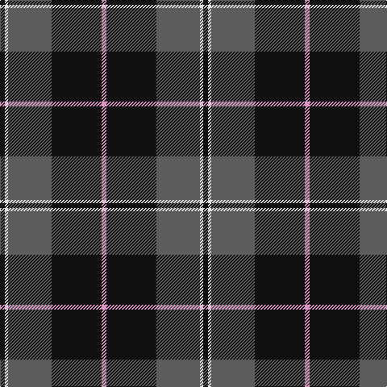

This page is one **sett** — a single exact thread-count. It belongs to the [tartan](/tartans/k3w2n27k31lr3/)
(the same proportion at any scale), whose colour order is pattern [KWBKY](/stripes/kwbky/).

Sourced from tartans-authority.  It is a [5 stripe tartan](/stripes/stripes5/).

Original link http://www.tartansauthority.com/tartan-ferret/display/10184/

## Thread count
K/6 LN4 N54 K62 LP/6

## Palette

Palette: <strong>Tartan Register</strong> <small style="color:#888">(2 of 4 colours)</small>
<table><thead><tr><th>Colour</th><th>Threads</th><th>Shade</th><th>Base</th><th>OKLCh</th></tr></thead><tbody><tr><td>K/</td><td style="text-align:right;font-variant-numeric:tabular-nums">6</td><td><code style="background-color:#101010;">#101010</code> <small style="color:#888">#101010</small></td><td>K <code style="background-color:#000000;">#000000</code></td><td><small style="color:#888">oklch(17.3% 0.000 89.9)</small></td></tr><tr><td>LN</td><td style="text-align:right;font-variant-numeric:tabular-nums">4</td><td><code style="background-color:#E0E0E0;">#E0E0E0</code> <small style="color:#888">#E0E0E0</small></td><td>W <code style="background-color:#F7F7F7;">#F7F7F7</code></td><td><small style="color:#888">oklch(90.7% 0.000 89.9)</small></td></tr><tr><td>N</td><td style="text-align:right;font-variant-numeric:tabular-nums">54</td><td><code style="background-color:#5C5C5C;">#5C5C5C</code> <small style="color:#888">#5C5C5C</small></td><td>B <code style="background-color:#2A418A;">#2A418A</code></td><td><small style="color:#888">oklch(47.5% 0.000 89.9)</small></td></tr><tr><td>K</td><td style="text-align:right;font-variant-numeric:tabular-nums">62</td><td><code style="background-color:#101010;">#101010</code> <small style="color:#888">#101010</small></td><td>K <code style="background-color:#000000;">#000000</code></td><td><small style="color:#888">oklch(17.3% 0.000 89.9)</small></td></tr><tr><td>LP/</td><td style="text-align:right;font-variant-numeric:tabular-nums">6</td><td><code style="background-color:#DC94C4;">#DC94C4</code> <small style="color:#888">#DC94C4</small></td><td>Y <code style="background-color:#F2BF00;">#F2BF00</code></td><td><small style="color:#888">oklch(75.3% 0.106 339.9)</small></td></tr></tbody></table>

# Sample pattern

## Nearest tartans

The nearest existing variants by ΔTartan distance, with this tartan at the top so the swatches line up against it.

ΔTartan

Tartan

Sett

—

<a href="/ttd/edit/#slug=k3w2n27k31lr3~x2">Kelley Oliphint (Commemorative)</a> <a class="nn-out" href="/setts/s5/k3w2n27k31lr3~x2/" title="open its dictionary page">↗</a>

0.45

<a href="/ttd/edit/#slug=k3w2n27k31p3~x2">Kelley Oliphint</a> <a class="nn-out" href="/setts/s5/k3w2n27k31p3~x2/" title="open its dictionary page">↗</a>

0.76

<a href="/ttd/edit/#slug=y4k48y16r12b3~x2">Calgary Firefighters</a> <a class="nn-out" href="/setts/s5/y4k48y16r12b3~x2/" title="open its dictionary page">↗</a>

0.85

<a href="/ttd/edit/#slug=o4k48o16r12db3~x2">Calgary Firefighters (Corporate)</a> <a class="nn-out" href="/setts/s5/o4k48o16r12db3~x2/" title="open its dictionary page">↗</a>

1.10

<a href="/ttd/edit/#slug=dr2dg14lb3dr13ly1dr2~x4">Swedish Para Whisky Club (Corporate</a> <a class="nn-out" href="/setts/s6/dr2dg14lb3dr13ly1dr2~x4/" title="open its dictionary page">↗</a>

1.10

<a href="/ttd/edit/#slug=o11db1o3db1db9r1~x4">Dege, of Saville Row</a> <a class="nn-out" href="/setts/s6/o11db1o3db1db9r1~x4/" title="open its dictionary page">↗</a>

1.10

<a href="/ttd/edit/#slug=r4g40k21lo2k21g2~x2">Unidentified Furnishing #2</a> <a class="nn-out" href="/setts/s6/r4g40k21lo2k21g2~x2/" title="open its dictionary page">↗</a>

1.22

<a href="/ttd/edit/#slug=k10y4k1t2r1~x10">Brotherhood of the Kilt</a> <a class="nn-out" href="/setts/s5/k10y4k1t2r1~x10/" title="open its dictionary page">↗</a>

1.23

<a href="/ttd/edit/#slug=dt14o1dt1o1dt6o14w1o1~x4">Corrie</a> <a class="nn-out" href="/setts/s8/dt14o1dt1o1dt6o14w1o1~x4/" title="open its dictionary page">↗</a>

1.24

<a href="/ttd/edit/#slug=k3n31k3n3k27ly3~x2">Scottish National Party (Corporate)</a> <a class="nn-out" href="/setts/s6/k3n31k3n3k27ly3~x2/" title="open its dictionary page">↗</a>

1.26

<a href="/ttd/edit/#slug=r2db32g14db5g16w2~x2">Connacht Irish District Tartan Tartan Number: 4485. Earliest known date: 1994 Phil Smith obtained in Perthshire from a swatch dated 1994 shown to him by Keith Lumsden of the Scottish Tartans Society. However www.uniq-orn.com shows this as Connaught Green. See products available Copyright © Blair Urquhart, Comrie, 2015</a> <a class="nn-out" href="/setts/s6/r2db32g14db5g16w2~x2/" title="open its dictionary page">↗</a>

## Neighbour map

Every grey dot is one of 14299 variants placed by the first two principal components of the ΔTartan feature space (44% of its variance). Red is this tartan; blue dots are its nearest — click one to open its page.

<svg viewBox="0 0 640 380" role="img" style="max-width:100%;height:auto;border:1px solid #e0e0e0;border-radius:4px;display:block" xmlns="http://www.w3.org/2000/svg"><image href="/nn/cloud.v1.png" width="640" height="380"/><a href="/setts/s5/k3w2n27k31p3~x2/"><circle cx="341.1" cy="206.8" r="4" fill="#3465a4"><title>Kelley Oliphint</title></circle></a><a href="/setts/s5/y4k48y16r12b3~x2/"><circle cx="342.5" cy="192.8" r="4" fill="#3465a4"><title>Calgary Firefighters</title></circle></a><a href="/setts/s5/o4k48o16r12db3~x2/"><circle cx="336.1" cy="188.8" r="4" fill="#3465a4"><title>Calgary Firefighters (Corporate)</title></circle></a><a href="/setts/s6/dr2dg14lb3dr13ly1dr2~x4/"><circle cx="312.8" cy="199.0" r="4" fill="#3465a4"><title>Swedish Para Whisky Club (Corporate</title></circle></a><a href="/setts/s6/o11db1o3db1db9r1~x4/"><circle cx="329.2" cy="208.3" r="4" fill="#3465a4"><title>Dege, of Saville Row</title></circle></a><a href="/setts/s6/r4g40k21lo2k21g2~x2/"><circle cx="298.8" cy="185.1" r="4" fill="#3465a4"><title>Unidentified Furnishing #2</title></circle></a><a href="/setts/s5/k10y4k1t2r1~x10/"><circle cx="357.1" cy="227.3" r="4" fill="#3465a4"><title>Brotherhood of the Kilt</title></circle></a><a href="/setts/s8/dt14o1dt1o1dt6o14w1o1~x4/"><circle cx="325.7" cy="166.1" r="4" fill="#3465a4"><title>Corrie</title></circle></a><a href="/setts/s6/k3n31k3n3k27ly3~x2/"><circle cx="341.9" cy="222.5" r="4" fill="#3465a4"><title>Scottish National Party (Corporate)</title></circle></a><a href="/setts/s6/r2db32g14db5g16w2~x2/"><circle cx="323.6" cy="202.1" r="4" fill="#3465a4"><title>Connacht Irish District Tartan Tartan Number: 4485. Earliest known date: 1994 Phil Smith obtained in Perthshire from a swatch dated 1994 shown to him by Keith Lumsden of the Scottish Tartans Society. However www.uniq-orn.com shows this as Connaught Green. See products available Copyright © Blair Urquhart, Comrie, 2015</title></circle></a><circle cx="328.9" cy="199.6" r="5" fill="#c00000"/></svg>

ID: /setts/s5/k3w2n27k31lr3~x2/
