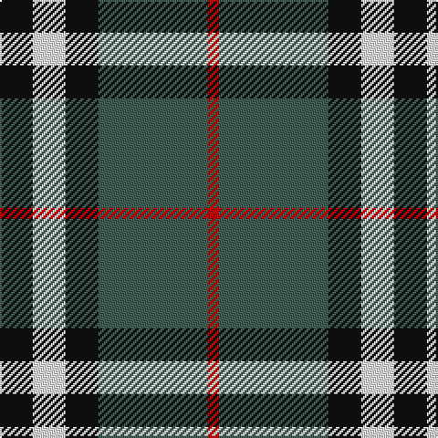

**Bands:** [KWKGR](/stripes/kwkgr/) · **Stripes:** [K W K Y R](/stripes/stripes5/) K W K Y R

This was sourced from register-of-tartans.  It is a [5 band tartan](/bands/bands5/).

Original link https://www.tartanregister.gov.uk/tartanDetails.aspx?ref=5071

## Register references

External register numbers recorded for this tartan.

- Scottish Register of Tartans: [5071](https://www.tartanregister.gov.uk/tartanDetails.aspx?ref=5071)
- Scottish Tartans Authority (ITI): 3863

## Variants

Other setts woven to the same stripe pattern.

- [Oban Grey](/setts/s5/k4w3k4y9r1~x4/)

## Thread count
K/18 W18 K18 N60 R/6

## Palette
Each colour and its ΔE from the base-6 reference it is a variant of.

| Colour | Shade | Base | ΔE (OKLab) |
|---|---|---|---|
| K | <code style="background-color:#101010;">#101010</code> `#101010` | K <code style="background-color:#000000;">#000000</code> | 0.17 |
| N | <code style="background-color:#406054;">#406054</code> `#406054` | G <code style="background-color:#006100;">#006100</code> | 0.11 |
| R | <code style="background-color:#C80000;">#C80000</code> `#C80000` | R <code style="background-color:#CC0000;">#CC0000</code> | 0.01 |
| W | <code style="background-color:#FCFCFC;">#FCFCFC</code> `#FCFCFC` | W <code style="background-color:#F7F7F7;">#F7F7F7</code> | 0.01 |

# Sample pattern

## Nearest tartans

The nearest existing variants by ΔTartan distance.

1. [Greystone (Burberry Grey)](/setts/s5/k3lb3k3n10r1~x6/) — ΔT 0.69
1. [Oban Grey (Fashion)](/setts/s5/k4lb4k4o15r2~x4/) — ΔT 0.89
1. [Oban Grey](/setts/s5/k4w3k4y9r1~x4/) — ΔT 0.97
1. [Oban Grey District Tartan Tartan Number: 1237. Earliest known date: pre 2003 Not an official district but a name chosen by the weavers. See products available Copyright © Blair Urquhart, Comrie, 2015](/setts/s5/k4w3k4o9r1~x4/) — ΔT 0.98
1. [New York State Police Pipe Band](/setts/s5/o5dp3o18k16ly3~x4/) — ΔT 1.00
1. [MacTavish / Thom(p)son, hunting](/setts/s6/t4o28g6t12k12t3~x2/) — ΔT 1.05
1. [MacTavish / Thom(p)son, hunting](/setts/s6/t3o26g4t13k13t2~x2/) — ΔT 1.09
1. [Burberry Check Corporate Tartan Tartan Number: 1239. Earliest known date: 1984 Nothing See products available Copyright © Blair Urquhart, Comrie, 2015](/setts/s5/k6w6k6lo21r2~x4/) — ΔT 1.09
1. [Loganair](/setts/s4/r5o32k31w5~x2/) — ΔT 1.10
1. [Loganair Uniform Skirt Corporate Tartan Tartan Number: 1629. Earliest known date: c.1985 Half actual count for display. Used until 1988 See products available Copyright © Blair Urquhart, Comrie, 2015](/setts/s4/r5o32k31w5/) — ΔT 1.11

## Neighbour map

Every grey dot is one of 14299 variants placed by the first two principal components of the ΔTartan feature space (44% of its variance). Red is this tartan; blue dots are its nearest — click one to open its page.

<svg viewBox="0 0 640 380" role="img" style="max-width:100%;height:auto;border:1px solid #e0e0e0;border-radius:4px;display:block" xmlns="http://www.w3.org/2000/svg"><image href="/nn/cloud.v1.png" width="640" height="380"/><a href="/setts/s5/k3lb3k3n10r1~x6/"><circle cx="231.0" cy="209.1" r="4" fill="#3465a4"><title>Greystone (Burberry Grey)</title></circle></a><a href="/setts/s5/k4lb4k4o15r2~x4/"><circle cx="242.6" cy="217.8" r="4" fill="#3465a4"><title>Oban Grey (Fashion)</title></circle></a><a href="/setts/s5/k4w3k4y9r1~x4/"><circle cx="187.5" cy="223.6" r="4" fill="#3465a4"><title>Oban Grey</title></circle></a><a href="/setts/s5/k4w3k4o9r1~x4/"><circle cx="185.8" cy="222.5" r="4" fill="#3465a4"><title>Oban Grey District Tartan Tartan Number: 1237. Earliest known date: pre 2003 Not an official district but a name chosen by the weavers. See products available Copyright © Blair Urquhart, Comrie, 2015</title></circle></a><a href="/setts/s5/o5dp3o18k16ly3~x4/"><circle cx="235.5" cy="233.9" r="4" fill="#3465a4"><title>New York State Police Pipe Band</title></circle></a><a href="/setts/s6/t4o28g6t12k12t3~x2/"><circle cx="202.5" cy="212.7" r="4" fill="#3465a4"><title>MacTavish / Thom(p)son, hunting</title></circle></a><a href="/setts/s6/t3o26g4t13k13t2~x2/"><circle cx="215.2" cy="195.4" r="4" fill="#3465a4"><title>MacTavish / Thom(p)son, hunting</title></circle></a><a href="/setts/s5/k6w6k6lo21r2~x4/"><circle cx="244.9" cy="197.7" r="4" fill="#3465a4"><title>Burberry Check Corporate Tartan Tartan Number: 1239. Earliest known date: 1984 Nothing See products available Copyright © Blair Urquhart, Comrie, 2015</title></circle></a><a href="/setts/s4/r5o32k31w5~x2/"><circle cx="210.3" cy="241.0" r="4" fill="#3465a4"><title>Loganair</title></circle></a><a href="/setts/s4/r5o32k31w5/"><circle cx="209.3" cy="239.4" r="4" fill="#3465a4"><title>Loganair Uniform Skirt Corporate Tartan Tartan Number: 1629. Earliest known date: c.1985 Half actual count for display. Used until 1988 See products available Copyright © Blair Urquhart, Comrie, 2015</title></circle></a><circle cx="232.2" cy="210.5" r="5" fill="#c00000"/></svg>

ID: /setts/s5/k3w3k3y10r1~x6/
