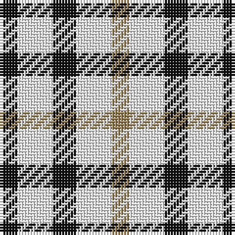

In pattern [KWKWY](/stripes/kwkwy/).

This was sourced from register-of-tartans.  It is a [5 stripe tartan](/stripes/stripes5/).

Original link https://www.tartanregister.gov.uk/tartanDetails.aspx?ref=869

## Register references

External register numbers recorded for this tartan.

- Scottish Register of Tartans: [869](https://www.tartanregister.gov.uk/tartanDetails.aspx?ref=869)
- Scottish Tartans Authority (ITI): 2506
- Scottish Tartans World Register: 2506

## Thread count
K/6 W12 K8 W12 LT/6

## Palette
Each colour and the base-6 reference it is a variant of.

| Colour | Shade | Base |
|---|---|---|
| K | <code style="background-color:#101010;">#101010</code> `oklch(17.3% 0.000 89.9)` <small>#101010</small> | K <code style="background-color:#000000;">#000000</code> |
| LG | <code style="background-color:#C4BC68;">#C4BC68</code> `oklch(78.4% 0.107 103.7)` <small>#C4BC68</small> | Y <code style="background-color:#F2BF00;">#F2BF00</code> |
| LT | <code style="background-color:#A08858;">#A08858</code> `oklch(63.7% 0.071 84.0)` <small>#A08858</small> | Y <code style="background-color:#F2BF00;">#F2BF00</code> |
| W | <code style="background-color:#FCFCFC;">#FCFCFC</code> `oklch(99.1% 0.000 89.9)` <small>#FCFCFC</small> | W <code style="background-color:#F7F7F7;">#F7F7F7</code> |

# Sample pattern

## Nearest tartans

The nearest existing variants by ΔTartan distance, with this tartan at the top so the swatches line up against it.

ΔTartan

Tartan

Sett

—

<a href="/ttd/edit/#slug=k3w6k4w6lo3~x2">Daks (House Check)</a> <a class="nn-out" href="/setts/s5/k3w6k4w6lo3~x2/" title="open its dictionary page">↗</a>

0.98

<a href="/ttd/edit/#slug=k3w7k4w6o3~x2">Daks - House Check, C.6700.03</a> <a class="nn-out" href="/setts/s5/k3w7k4w6o3~x2/" title="open its dictionary page">↗</a>

1.40

<a href="/ttd/edit/#slug=dy1w2db1~x12">Aquascutum</a> <a class="nn-out" href="/setts/s3/dy1w2db1~x12/" title="open its dictionary page">↗</a>

1.57

<a href="/ttd/edit/#slug=w4k4w4k4w4db3w2r2~x2">Scott, Sir Walter - 1971 (Fashion)</a> <a class="nn-out" href="/setts/s8/w4k4w4k4w4db3w2r2~x2/" title="open its dictionary page">↗</a>

2.02

<a href="/ttd/edit/#slug=w6k6w6k6w6k6w4y3g2y2~x3">Burns Check (District)</a> <a class="nn-out" href="/setts/s10/w6k6w6k6w6k6w4y3g2y2~x3/" title="open its dictionary page">↗</a>

2.09

<a href="/ttd/edit/#slug=w2k2w2k2w2k2w1y1g1y1~x8">Burns Check</a> <a class="nn-out" href="/setts/s10/w2k2w2k2w2k2w1y1g1y1~x8/" title="open its dictionary page">↗</a>

2.12

<a href="/ttd/edit/#slug=r21k21w10k10w21~x2">Havel</a> <a class="nn-out" href="/setts/s5/r21k21w10k10w21~x2/" title="open its dictionary page">↗</a>

2.12

<a href="/ttd/edit/#slug=k4w4k4w4k4w4db3w2r2">Scott, Sir Walter #3</a> <a class="nn-out" href="/setts/s9/k4w4k4w4k4w4db3w2r2/" title="open its dictionary page">↗</a>

2.18

<a href="/ttd/edit/#slug=y5k2r2ly2y5~x10">Ikelman No 3</a> <a class="nn-out" href="/setts/s5/y5k2r2ly2y5~x10/" title="open its dictionary page">↗</a>

2.26

<a href="/ttd/edit/#slug=w3r2w1dt2r2~x4">Oakland Centre</a> <a class="nn-out" href="/setts/s5/w3r2w1dt2r2~x4/" title="open its dictionary page">↗</a>

2.28

<a href="/ttd/edit/#slug=db10w3db12ly14r4~x2">MacLeod, of Argentina</a> <a class="nn-out" href="/setts/s5/db10w3db12ly14r4~x2/" title="open its dictionary page">↗</a>

## Neighbour map

Every grey dot is one of 14299 variants placed by the first two principal components of the ΔTartan feature space (44% of its variance). Red is this tartan; blue dots are its nearest — click one to open its page.

<svg viewBox="0 0 640 380" role="img" style="max-width:100%;height:auto;border:1px solid #e0e0e0;border-radius:4px;display:block" xmlns="http://www.w3.org/2000/svg"><image href="/nn/cloud.v1.png" width="640" height="380"/><a href="/setts/s5/k3w7k4w6o3~x2/"><circle cx="168.2" cy="308.5" r="4" fill="#3465a4"><title>Daks - House Check, C.6700.03</title></circle></a><a href="/setts/s3/dy1w2db1~x12/"><circle cx="143.1" cy="336.2" r="4" fill="#3465a4"><title>Aquascutum</title></circle></a><a href="/setts/s8/w4k4w4k4w4db3w2r2~x2/"><circle cx="84.0" cy="289.5" r="4" fill="#3465a4"><title>Scott, Sir Walter - 1971 (Fashion)</title></circle></a><a href="/setts/s10/w6k6w6k6w6k6w4y3g2y2~x3/"><circle cx="97.3" cy="253.0" r="4" fill="#3465a4"><title>Burns Check (District)</title></circle></a><a href="/setts/s10/w2k2w2k2w2k2w1y1g1y1~x8/"><circle cx="55.5" cy="275.2" r="4" fill="#3465a4"><title>Burns Check</title></circle></a><a href="/setts/s5/r21k21w10k10w21~x2/"><circle cx="75.6" cy="305.9" r="4" fill="#3465a4"><title>Havel</title></circle></a><a href="/setts/s9/k4w4k4w4k4w4db3w2r2/"><circle cx="63.0" cy="294.2" r="4" fill="#3465a4"><title>Scott, Sir Walter #3</title></circle></a><a href="/setts/s5/y5k2r2ly2y5~x10/"><circle cx="224.7" cy="289.2" r="4" fill="#3465a4"><title>Ikelman No 3</title></circle></a><a href="/setts/s5/w3r2w1dt2r2~x4/"><circle cx="109.9" cy="292.5" r="4" fill="#3465a4"><title>Oakland Centre</title></circle></a><a href="/setts/s5/db10w3db12ly14r4~x2/"><circle cx="187.0" cy="255.1" r="4" fill="#3465a4"><title>MacLeod, of Argentina</title></circle></a><circle cx="142.7" cy="315.4" r="5" fill="#c00000"/></svg>

ID: /setts/s5/k3w6k4w6lo3~x2/
