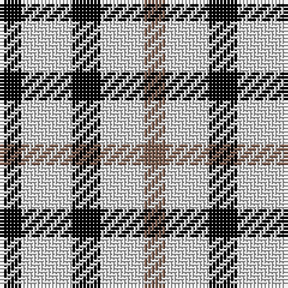

In pattern [KWKWR](/patterns/kwkwr/).

This was sourced from weddslist.  It is a [5 stripes tartan](/stripes/stripes5/).

Original link http://www.weddslist.com/cgi-bin/tartans/pg.pl?source=sts

## Thread count
K/6 LN14 K8 LN12 LTa/6

## Palette
Each colour and its ΔE from the base-6 reference it is a variant of.

| Colour | Shade | Base | ΔE (OKLab) |
|---|---|---|---|
| K | <code style="background-color:#000000;">#000000</code> `#000000` | K <code style="background-color:#000000;">#000000</code> | 0.00 |
| LN | <code style="background-color:#E0E0E0;">#E0E0E0</code> `#E0E0E0` | W <code style="background-color:#F7F7F7;">#F7F7F7</code> | 0.07 |
| LT | <code style="background-color:#906030;">#906030</code> `#906030` | R <code style="background-color:#CC0000;">#CC0000</code> | 0.15 |
| LTa | <code style="background-color:#806050;">#806050</code> `#806050` | R <code style="background-color:#CC0000;">#CC0000</code> | 0.17 |

# Sample pattern

## Nearest tartans

The nearest existing variants by ΔTartan distance.

1. [Daks (House Check)](/setts/s5/k3w6k4w6y3~k101010-wfcfcfc-ya08858~x2/) — ΔT 0.97
1. [Aquascutum](/setts/s3/b1w2g1~b202060-g604000-we0e0e0~x12/) — ΔT 1.44
1. [Ikelman No 3](/setts/s5/g5k2r2y2g5~g808080-k000000-rc00000-yf0c000~x10/) — ΔT 1.72
1. [Scott, Sir Walter - 1971 (Fashion)](/setts/s8/w4k4w4k4w4b3w2r2~b2800a8-k101010-rc80000-wfcfcfc~x2/) — ΔT 1.75
1. [Jahore](/setts/s5/b20k5b18y26k6~b304080-k000000-yf0c000~x2/) — ΔT 1.90
1. [MacLeod, of Argentina](/setts/s5/b10w3b12y14r4~b304080-rc00000-we0e0e0-yf0c000~x2/) — ΔT 1.90
1. [Burns Check (District)](/setts/s10/w6k6w6k6w6k6w4g3ga2g2~g7c5400-ga408060-k101010-wfcfcfc~x3/) — ΔT 1.93
1. [Scott, Sir Walter #3](/setts/s9/k4w4k4w4k4w4b3w2r2~b2c4084-k101010-rdc0000-we0e0e0/) — ΔT 2.01
1. [Scott B/W (Sir Walter..) Tartan Tartan Number: 1241. Earliest known date: pre 2003 Also known as Dress Scott but seldom seen today. See products available Copyright © Blair Urquhart, Comrie, 2015](/setts/s9/k4w4k4w4k4w4b3w2r2~b2c2c80-k101010-rc80000-we0e0e0/) — ΔT 2.02
1. [Havel (Fashion)](/setts/s5/r21k21w10k10w21~k101010-rc80000-we0e0e0~x2/) — ΔT 2.05

## Neighbour map

Every grey dot is one of 15726 variants placed by the first two principal components of the ΔTartan feature space (44% of its variance). Red is this tartan; blue dots are its nearest — click one to open its page.

<svg viewBox="0 0 640 380" role="img" style="max-width:100%;height:auto;border:1px solid #e0e0e0;border-radius:4px;display:block" xmlns="http://www.w3.org/2000/svg"><image href="/nn/cloud.v1.png" width="640" height="380"/><a href="/setts/s5/k3w6k4w6y3~k101010-wfcfcfc-ya08858~x2/"><circle cx="141.0" cy="323.8" r="4" fill="#3465a4"><title>Daks (House Check)</title></circle></a><a href="/setts/s3/b1w2g1~b202060-g604000-we0e0e0~x12/"><circle cx="141.1" cy="343.3" r="4" fill="#3465a4"><title>Aquascutum</title></circle></a><a href="/setts/s5/g5k2r2y2g5~g808080-k000000-rc00000-yf0c000~x10/"><circle cx="223.5" cy="294.9" r="4" fill="#3465a4"><title>Ikelman No 3</title></circle></a><a href="/setts/s8/w4k4w4k4w4b3w2r2~b2800a8-k101010-rc80000-wfcfcfc~x2/"><circle cx="81.9" cy="296.0" r="4" fill="#3465a4"><title>Scott, Sir Walter - 1971 (Fashion)</title></circle></a><a href="/setts/s5/b20k5b18y26k6~b304080-k000000-yf0c000~x2/"><circle cx="203.9" cy="270.8" r="4" fill="#3465a4"><title>Jahore</title></circle></a><a href="/setts/s5/b10w3b12y14r4~b304080-rc00000-we0e0e0-yf0c000~x2/"><circle cx="185.2" cy="260.0" r="4" fill="#3465a4"><title>MacLeod, of Argentina</title></circle></a><a href="/setts/s10/w6k6w6k6w6k6w4g3ga2g2~g7c5400-ga408060-k101010-wfcfcfc~x3/"><circle cx="95.0" cy="258.6" r="4" fill="#3465a4"><title>Burns Check (District)</title></circle></a><a href="/setts/s9/k4w4k4w4k4w4b3w2r2~b2c4084-k101010-rdc0000-we0e0e0/"><circle cx="60.7" cy="299.4" r="4" fill="#3465a4"><title>Scott, Sir Walter #3</title></circle></a><a href="/setts/s9/k4w4k4w4k4w4b3w2r2~b2c2c80-k101010-rc80000-we0e0e0/"><circle cx="60.7" cy="299.6" r="4" fill="#3465a4"><title>Scott B/W (Sir Walter..) Tartan Tartan Number: 1241. Earliest known date: pre 2003 Also known as Dress Scott but seldom seen today. See products available Copyright © Blair Urquhart, Comrie, 2015</title></circle></a><a href="/setts/s5/r21k21w10k10w21~k101010-rc80000-we0e0e0~x2/"><circle cx="79.9" cy="320.2" r="4" fill="#3465a4"><title>Havel (Fashion)</title></circle></a><circle cx="166.2" cy="316.9" r="5" fill="#c00000"/></svg>

ID: /setts/s5/k3w7k4w6r3~k000000-r806050-we0e0e0~x2/
